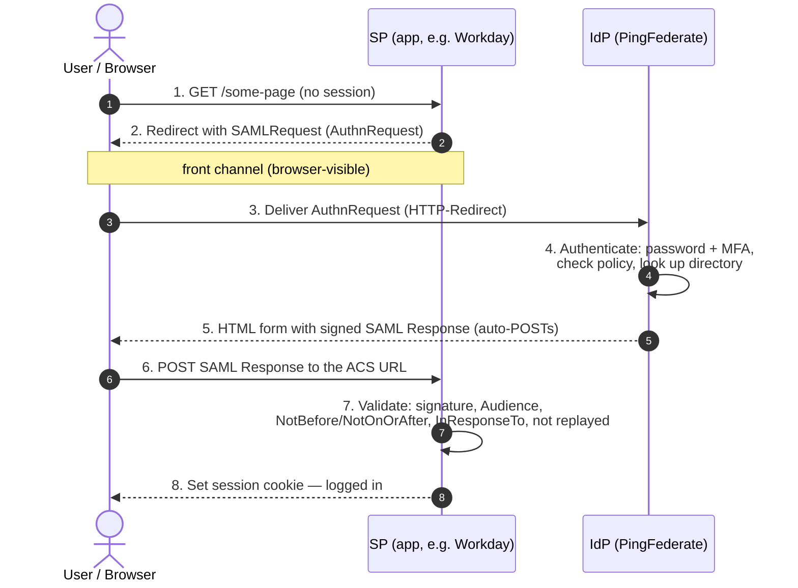
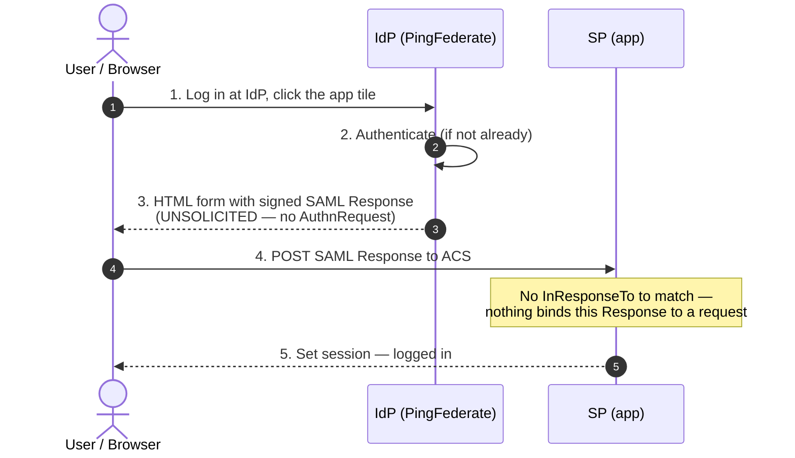
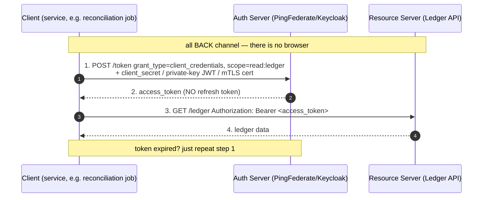
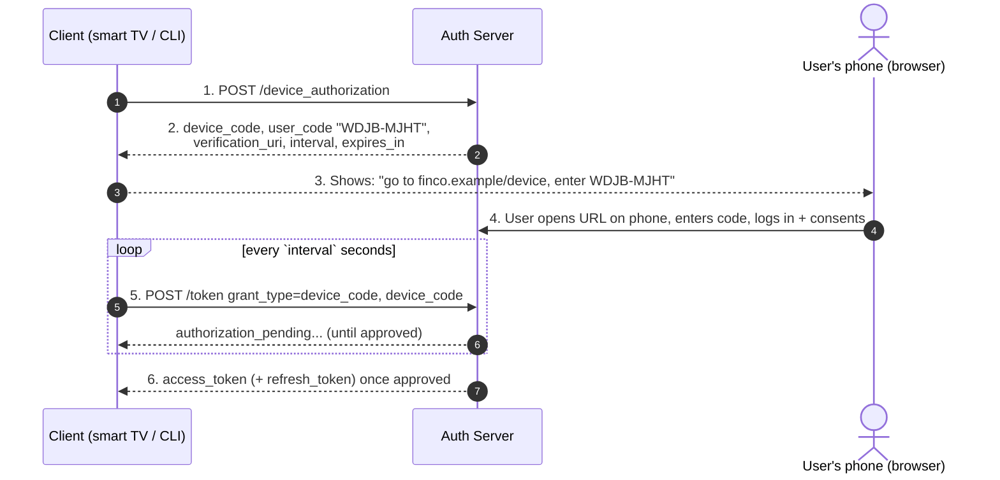
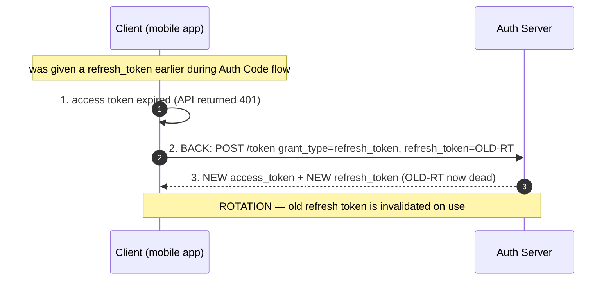
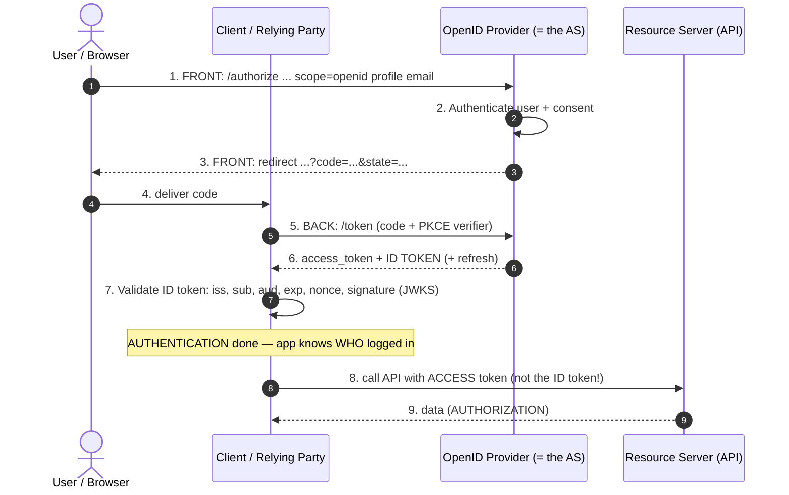

# Reverse KT — your slide-by-slide guide (IAM · SAML · OAuth/OIDC)

> **Janus's presentation kit.** This is *your teaching deck*, Farhaan. In a reverse KT **you** are the one at the whiteboard — so this note gives you both the **slide content** (what goes on screen) and the **talk track** (what you actually say out loud), end to end, for **IAM fundamentals, SAML 2.0, and OAuth 2.0 + OIDC**.
>
> **How to use it:** each slide has three parts — **On the slide** (the bullets/diagram to paste into your deck), **Talk track** (first-person, ready to speak), and a **Presenter note / gotcha** where the room is likely to poke. Build the slides from the "On the slide" blocks; rehearse from the talk tracks.
>
> **Depth lives elsewhere — cross-link, don't cram:** landscape [note 01](01-iam-protocol-landscape.md) · SAML [note 02](02-saml-deep-dive.md) · OAuth/OIDC [note 03](03-oauth-oidc-deep-dive.md) · OAuth reference card [note 21](21-oauth2-complete-reference.md) · every grant walked [note 22](22-oauth2-grant-types-and-scenarios.md) · PingFederate [note 18](18-pingfederate-explained.md).
>
> **The live demos** (Section 5) run on **Keycloak** + **SAML-tracer** + browser DevTools. The step-by-step lab is at [`../labs/03-kt-demo-saml-oauth/README.md`](../labs/03-kt-demo-saml-oauth/README.md) — point the room there, don't type commands into slides.
>
> **Deck length:** 33 slides. Comfortable in ~45–60 min with demos; ~30 min slides-only.

---

## Slide 1 — Title + Agenda

**On the slide**
- **Title:** *Identity is the new perimeter — IAM, SAML & OAuth/OIDC, end to end*
- Presenter: Farhaan · IAM Team · FinCo
- Agenda:
  1. IAM foundations — the two questions
  2. SAML 2.0 — the enterprise SSO workhorse
  3. OAuth 2.0 + OIDC — the modern stack
  4. How it all maps to **PingFederate** (our stack)
  5. Live demos (Keycloak + SAML-tracer)
  6. Q&A

**Talk track**
> "Thanks for coming. Over the next hour I'm going to walk us through the three protocols that every login at FinCo runs on — SAML, OAuth, and OIDC — and tie each one back to PingFederate, the box our team actually operates. I'll keep it beginner-safe but we'll go deep enough that by the end you'll be able to *read* a SAML assertion and a JWT, and know which grant type belongs to which app. We'll finish with live captures so you see the real messages on the wire."

**Presenter note**
- Set the frame early: *"One sentence to hold onto all session — authentication is 'who are you?', authorization is 'what may you do?'. Every protocol today is one, the other, or both."*

---

# Section 1 — IAM foundations

## Slide 2 — The two questions (AuthN vs AuthZ) + AAA

**On the slide**
- **Every IAM system answers two questions about a request:**
  - **Who are you?** → **Authentication (AuthN)** — *proving identity*
  - **What may you do?** → **Authorization (AuthZ)** — *granting access*
- Auditors add a third: **What did you do?** → **Accounting / Audit**
- Together = **AAA**
- Trap: *"we log in with OAuth"* — OAuth is **authZ**, not authN

**Talk track**
> "This is the whole mental model. Authentication is the bouncer checking your ID at the door. Authorization is the wristband that says which rooms you can enter. They're different jobs, and half of all IAM confusion comes from mixing them up. In fintech we care about a third A too — accounting, the audit trail — because SOX and PCI-DSS require us to prove *who did what, when*. Keep AAA in your head and every acronym I say next slots into one of these buckets."

**Presenter note**
- If someone says "isn't login just OAuth?" — flag it and promise: *"Hold that — it's the single most important correction in this whole deck, and I'll get to exactly why in Section 3."*

---

## Slide 3 — Identity vs Account vs Credential vs Entitlement

**On the slide**

| Term | Plain meaning | FinCo example |
|---|---|---|
| **Identity** | The real person/thing | Farhaan, the human |
| **Account** | A representation of that identity in *one* system | `farhaan@finco` in AD; his Workday user |
| **Credential** | The secret that proves control of an account | password, TOTP, passkey, client secret |
| **Entitlement** | A specific permission attached to an account | "can view payments (read-only)" |

- One **identity** → many **accounts** → each has **credentials** → each carries **entitlements**

**Talk track**
> "These four words get used interchangeably and they shouldn't be. There's one *me* — that's my identity. I have many *accounts* — one in Active Directory, one in Workday, one in Salesforce. Each account has *credentials*, the secret I use to prove it's mine. And each account carries *entitlements* — the actual permissions. Why does the distinction matter? Because when someone leaves FinCo, we disable the *identity* and every account should die with it. When an auditor asks 'who can initiate payments?', they're asking about *entitlements*. Precise words let us ask precise questions."

**Presenter note**
- Tie to the job: *"This vocabulary is exactly what an access-review spreadsheet is built on — accounts in the rows, entitlements in the columns."*

---

## Slide 4 — The identity lifecycle: Joiner / Mover / Leaver (JML)

**On the slide**
- **Joiner** — new hire → provision accounts + baseline access
- **Mover** — role change → *add new* access **and remove old** (the step everyone forgets)
- **Leaver** — exit → deprovision **everything**, promptly
- **Why fintech cares:** JML + access reviews directly satisfy **SOX ITGC** and **PCI-DSS Req 7 & 8**
- The classic failure: **access creep** — a Mover keeps every permission they ever had

**Talk track**
> "Identity isn't a moment, it's a lifecycle. Joiner, Mover, Leaver. The Joiner and Leaver ends are obvious — give access on day one, remove it on the last day. The dangerous one is the Mover: someone changes teams, we grant the new access but forget to strip the old, and over years they accumulate permissions they should never hold. That's 'access creep', and it's exactly what a bank auditor hunts for. Our Leaver process is a security control, not paperwork — a Leaver who keeps access is a live account nobody's watching."

**Presenter note**
- Expect: *"who owns JML — us or HR?"* Answer: *"HR triggers it, we automate it — usually via SCIM provisioning from the IdP. IGA tools like SailPoint orchestrate the whole thing."*

---

## Slide 5 — IdP, SP, Federation, and SSO

**On the slide**
- **IdP (Identity Provider)** — vouches for you (PingFederate, Keycloak, Okta, Entra)
- **SP (Service Provider)** — the app that trusts the vouch (Workday, Salesforce, internal apps)
- **Federation** — two parties *agreeing in advance to trust* each other's identity statements
- **SSO (Single Sign-On)** — the *user-facing result*: log in once, reach many apps
- **Passport analogy:** IdP = passport office · SP = border control · assertion/token = the passport · federation = countries agreeing to honour each other's passports

**Talk track**
> "Here's the pattern under everything else today. The IdP is the passport office — it verifies who you are and issues a stamped, tamper-proof document. The app is the border guard. The guard doesn't re-investigate your birth certificate; it just trusts the passport, because the countries agreed in advance to honour each other's documents and exchanged the security features to verify them. That agreement is *federation*. The convenient result you feel as a user — one login opens many apps — is *SSO*. The critical security point: the app never sees your password. You authenticate to the IdP only, and the app trusts a signed statement. Deep dive is in [note 01](01-iam-protocol-landscape.md)."

**Presenter note**
- Pre-empt the mix-up: *"Federation is the pattern; SSO is the outcome. SAML and OIDC are two languages that implement federation. Same idea, different eras."*

---

# Section 2 — SAML 2.0, end to end

## Slide 6 — Why SAML exists + the three actors

**On the slide**
- **The problem SAML solved (2005):** enterprises needed browser SSO *between organizations* without every app storing passwords
- **SAML = XML-based federated authentication**, carried by the browser, secured by **XML digital signatures**
- **Three actors:**
  - **Principal** — the user (you)
  - **IdP** — authenticates, issues a signed **assertion**
  - **SP** — the app; trusts the assertion instead of asking for a password
- **The assertion** = a signed XML statement: *"I authenticated this user; here are their attributes."*
- You meet SAML in: Workday, Salesforce, ServiceNow, SAP, thousands of B2B/legacy apps

**Talk track**
> "SAML is old — 2005 — verbose XML, and full of sharp edges. But it's *everywhere* in enterprise, so it's the protocol we debug most. The idea is simple: three players. The user, the IdP that proves who they are, and the SP — the app — that trusts the IdP's word. The 'word' is the *assertion*: a chunk of signed XML that says 'this is Farhaan, I checked, here's his email and groups.' The whole security model rests on one thing — the IdP signs that assertion, and the SP verifies the signature. That's the hologram on the passport. Full breakdown lives in [note 02](02-saml-deep-dive.md)."

**Presenter note**
- Common misconception: *"the IdP and SP talk directly."* They usually **don't** during login — **the browser is the courier**. Trust was set up out-of-band, ahead of time, via metadata + certs.

---

## Slide 7 — SAML SP-initiated SSO (the flow you'll see 95% of the time)

**On the slide** — *the user starts at the app*



**Talk track**
> "This is the everyday flow — the user starts at the app. Step by step: I hit Workday, it has no session for me, so it bounces my browser back to PingFederate with an *AuthnRequest* — 'please authenticate this person.' I authenticate at Ping — password plus MFA — and Ping builds a *signed SAML Response*, drops it into a hidden HTML form, and my browser auto-POSTs it to Workday's ACS — the Assertion Consumer Service URL. Workday validates the signature and a handful of fields, and sets my session. Notice the browser carries every message — the two servers never talk directly. And notice step 7: the SP's validation checklist is where nearly every SAML ticket is born."

**Presenter note**
- Call out **RelayState**: *"there's an extra parameter, RelayState, that remembers the page I was originally trying to reach, so I land back there after login."*
- Gotcha to name: **wrong ACS URL** = a huge fraction of SAML tickets; the assertion lands nowhere.

---

## Slide 8 — SAML IdP-initiated SSO (and why it's more replay-prone)

**On the slide** — *the user starts at the IdP (clicks an app tile)*



**On the slide (why it's weaker)**
- No **AuthnRequest** → the Response is **unsolicited**
- No **`InResponseTo`** to bind the Response to a prior request → **easier to replay / CSRF**
- Convenient (portal tiles) but **modern best practice prefers SP-initiated**

**Talk track**
> "There's a second variant. Instead of starting at the app, I start at the IdP — think the tile grid in a portal — and click the app. The IdP sends the app an *unsolicited* assertion, with no prior request. It's convenient, but it's weaker: in SP-initiated flow the assertion echoes the request's ID in a field called InResponseTo, so the app can prove 'yes, I asked for this.' IdP-initiated has nothing to echo, so a captured assertion is easier to replay, and it's more exposed to login-CSRF. When we onboard an app, one of my first questions is always 'SP-init or IdP-init?' — it changes both the debugging and the risk."

**Presenter note**
- Tie to Ping: *"In PingFederate we actually use IdP-initiated as a smoke test — `/idp/startSSO.ping?PartnerSpId=<EntityID>` — to prove a new connection works before wiring the app's own login."* (See [note 18 §7](18-pingfederate-explained.md).)

---

## Slide 9 — Anatomy of an assertion, part 1: who & where

**On the slide** — *reading the top half of a SAML Response*

```xml
<samlp:Response InResponseTo="_abc123" ...>       <!-- echoes the request ID -->
  <saml:Issuer>https://idp.finco.com/metadata</saml:Issuer>   <!-- WHO issued it -->
  <samlp:Status>
    <samlp:StatusCode Value="...:status:Success"/>            <!-- Success or an error -->
  </samlp:Status>
  <saml:Assertion ID="_assert789" ...>
    <ds:Signature> ... </ds:Signature>            <!-- the "hologram" -->
    <saml:Subject>
      <saml:NameID Format="...emailAddress">farhaan@finco.com</saml:NameID>  <!-- WHO this is -->
      <saml:SubjectConfirmationData
          Recipient="https://sp.finco.com/acs"     <!-- must equal my ACS URL -->
          NotOnOrAfter="...10:08:05Z"               <!-- bearer assertion expires fast -->
          InResponseTo="_abc123"/>                  <!-- ties it to my request -->
    </saml:Subject>
```

| Field | What it's FOR |
|---|---|
| `Issuer` / **entityID** | unique name of the IdP — "who is vouching" |
| `Status` | did auth succeed? |
| `Signature` | proves authenticity + integrity |
| `NameID` | **who** the user is — the primary identifier |
| `Recipient` | **which** ACS this is meant for |

**Talk track**
> "Let's actually read one. Top to bottom: the Issuer names the IdP that signed this — Ping. The Status says Success or an error code. Then the Assertion itself, wrapped in a Signature — that's the part we verify. Inside, the Subject's NameID is *who this is* — usually an email or an opaque ID. And SubjectConfirmationData pins it down: Recipient must equal our ACS URL, and it carries a short expiry. Every one of these fields is something an app checks, and when one doesn't match, we get a ticket."

**Presenter note**
- Stress: *"Prefer keying accounts on a stable NameID, not email — emails change and get reassigned."* (Same lesson as OIDC's `sub` later — call the callback.)

---

## Slide 10 — Anatomy of an assertion, part 2: when & what

**On the slide**

```xml
    <saml:Conditions NotBefore="...10:02:35Z"           <!-- CLOCK SKEW lives here -->
                     NotOnOrAfter="...10:08:05Z">
      <saml:AudienceRestriction>
        <saml:Audience>https://sp.finco.com/metadata</saml:Audience>  <!-- FOR this SP only -->
      </saml:AudienceRestriction>
    </saml:Conditions>
    <saml:AuthnStatement AuthnInstant="...10:03:04Z">
      <saml:AuthnContextClassRef>...PasswordProtectedTransport</saml:AuthnContextClassRef>  <!-- HOW they authed -->
    </saml:AuthnStatement>
    <saml:AttributeStatement>                            <!-- the "claims": what the SP learns -->
      <saml:Attribute Name="email">farhaan@finco.com</saml:Attribute>
      <saml:Attribute Name="groups">iam-team, payments-ro</saml:Attribute>
    </saml:AttributeStatement>
```

**The 5 fields that cause most tickets**

| Field | Ticket when wrong |
|---|---|
| `Issuer` / entityID | "Unknown issuer" |
| `Recipient` / ACS URL | response lands nowhere |
| `Audience` | "not intended for this SP" |
| `NotBefore` / `NotOnOrAfter` | **"assertion not yet valid / expired"** = clock skew |
| `AttributeStatement` | user logs in but has **no permissions** |

**Talk track**
> "Second half. Conditions sets the validity window — usually about five minutes — and this is where the sneakiest SAML bug lives: clock skew. If Ping's clock and the app's clock disagree by more than the allowed tolerance, a perfectly good login is rejected as 'not yet valid' or 'expired.' The fix is NTP on both sides. AudienceRestriction says 'this assertion is *only* for this app' — it stops a token minted for app A being replayed to app B. AuthnStatement records *how* they authenticated — that's how we prove MFA happened to an auditor. And the AttributeStatement is the payload: email, groups — the stuff the app maps to permissions. When someone logs in fine but has no access, it's almost always an attribute-mapping problem."

**Presenter note**
- Memorable one-liner: *"Clock skew produces intermittent, un-reproducible 'sometimes login fails' tickets. Recognizing that pattern in ten seconds makes you look sharp."*

---

## Slide 11 — Bindings: how the XML travels

**On the slide**

| Binding | How it moves | Used for |
|---|---|---|
| **HTTP-Redirect** | XML deflated → base64 → in a URL query string | the small **AuthnRequest** |
| **HTTP-POST** | base64 XML in an auto-submitting HTML form | the large, signed **Response** (the workhorse) |
| **HTTP-Artifact** | browser carries only a small reference; SP fetches the real assertion over a **back-channel** SOAP call | high-security, less common |

- Rule of thumb: **small request → Redirect · big signed response → POST**

**Talk track**
> "A 'binding' is just the transport — how the XML physically travels. The request is small, so it's compressed into a URL: that's HTTP-Redirect, and it's why you can't read it by eye — it's deflated and base64'd. The response is big and signed, so it rides in a hidden form your browser auto-submits: HTTP-POST, the one you'll see most. There's a third, Artifact, where the browser only carries a reference number and the app fetches the real assertion server-to-server — more secure because the assertion never touches the browser, but more moving parts, so it's rarer."

**Presenter note**
- If asked why Redirect isn't used for the response: *"URLs have length limits, and a signed assertion is too big — plus you don't want it sitting in browser history and server logs."*

---

## Slide 12 — Signing vs encryption (the trust anchor)

**On the slide**
- **Signing** = *authenticity + integrity* — IdP signs with its **private key**; SP verifies with the IdP's **public cert** (shared ahead of time via metadata)
  - **Sign the Assertion**, not just the outer Response (best practice)
- **Encryption** = *confidentiality* — assertion encrypted to the **SP's public key** so intermediaries (incl. the browser) can't read attributes
- They're **independent**: signing ≠ encryption
- **Certificate expiry is a top-3 SAML outage cause** — an expired IdP signing cert breaks **every SP at once**

**Talk track**
> "Two different crypto jobs, and people conflate them. *Signing* proves the assertion really came from us and wasn't tampered with — we sign with our private key, the app verifies with our public certificate that we exchanged during setup. *Encryption* is separate: it hides the contents so nobody in the middle, not even the user's browser, can read the attributes. You can sign without encrypting, and vice versa. Best practice is to sign the *assertion* itself, not just the outer envelope — I'll show why on the attacks slide. And the operational reality: our signing cert expires, usually yearly, and when it does, *every* app breaks simultaneously. In a bank we track cert expiry like a hawk."

**Presenter note**
- Ping tie-in: *"PingFederate lets us stage a new signing cert alongside the old one and publish both, so partners trust the new key before the old expires — zero-downtime rotation."* ([note 18 §5e](18-pingfederate-explained.md))

---

## Slide 13 — SAML attacks + defenses (pair every attack with its fix)

**On the slide**

| Attack | What it does | Defense |
|---|---|---|
| **XML Signature Wrapping (XSW)** | injects a forged assertion; SP verifies the *real* signature but reads the *forged* data | hardened SAML library; verify the signed element is the one processed; reject multiple assertions |
| **Unsigned / partially-signed assertion** | SP accepts an assertion with no signature, or only the outer Response signed | **require the Assertion itself to be signed**; reject unsigned |
| **Assertion replay** | resend a captured, still-valid assertion | short `NotOnOrAfter`, one-time-use (cache IDs), require `InResponseTo` |
| **Audience/Recipient not checked** | assertion for SP-A replayed to SP-B | strictly validate `Audience` + `Recipient` |
| **KeyInfo / cert injection** | attacker embeds their own cert and signs with it | verify only against the **pre-configured** IdP cert, never a cert in the message |

- **Golden SAML (nightmare tier):** steal the IdP **signing key** → forge assertions for anyone, bypass MFA, minimal trace → **HSM the key, monitor for assertions with no matching login**

**Talk track**
> "Every mechanism I've shown has an abuse. The famous one is XML Signature Wrapping — the attacker adds a second, forged assertion and tricks the app into checking the signature on the genuine one while *reading the data* from the forged one. The defense is a hardened library that guarantees the element it validated is the exact element it processes. The simpler, more common bug is accepting an unsigned or only-partly-signed assertion — that's why we insist the assertion itself is signed. Replay, audience confusion, cert injection — each has a clean defense on the right. And the doomsday scenario is Golden SAML: steal our signing key and you can mint a valid assertion for *anyone* — MFA doesn't even enter the picture. That's why the signing key is crown-jewel material, ideally in an HSM."

**Presenter note**
- Purple-team framing (repo habit): *"For each of these, ask Heimdall 'what would we detect in the SIEM?' and only ever practice the offensive side against our own Keycloak lab, never production."*

---

# Section 3 — OAuth 2.0 + OIDC, end to end

## Slide 14 — Why OAuth exists + OAuth ≠ login

**On the slide**
- **The problem (pre-OAuth):** to let App X read your data on Service Y, you gave X your **Y password** → full access, forever, unrevocable
- **OAuth 2.0 (RFC 6749) = delegated authorization:** grant an app **scoped, expiring, revocable** access **without your password**
- **The valet-key analogy:** hand the app a *valet key* (a scoped **access token**), never the *master key* (your password)
- **The correction that matters:** **OAuth is authorization, not login.** Proving *access* ≠ proving *who you are*. The login layer is **OIDC** (next section).

**Talk track**
> "Here's the problem OAuth was invented for. Say a budgeting app wants to read your bank transactions. The old way: you hand it your bank password. Now it can do *everything*, forever, and you can't revoke just that app. Insane. OAuth's fix is the valet key. Your car has a master key that opens everything and a valet key that only starts the engine. OAuth hands apps a valet key — a scoped, expiring, revocable *access token* — never your master key. Now, the correction I promised in slide 2: OAuth answers 'is this app *allowed to do X*?' — that's authorization. It does *not* reliably answer 'who is the user?' People bolted 'login with OAuth' on for years and it caused real holes. The proper login layer is OIDC, and I'll get there."

**Presenter note**
- If pushed: *"An access token proves access, not identity — it can be a token minted for a *different* app and replayed. That token-substitution hole is exactly why OIDC was created in 2014."*

---

## Slide 15 — The 4 roles, front vs back channel, the 3 tokens

**On the slide**

**The four roles**
| Role | Plain words | At FinCo |
|---|---|---|
| **Resource Owner** | the user who owns the data | Farhaan |
| **Client** | the app that wants access | web/SPA/mobile/backend |
| **Authorization Server (AS)** | issues tokens | **PingFederate** |
| **Resource Server (RS)** | the API holding the data | `api.finco.example` |

**Front vs back channel** — *the idea that explains every flow's shape*
- **Front channel** = through the **browser** (redirects, URLs) → assume hostile → carries only **one-time, useless-alone** artifacts (a `code`)
- **Back channel** = **direct server-to-server HTTPS** → where the **tokens and secrets** move

**The three tokens**
| Token | Format | Consumed by | Purpose |
|---|---|---|---|
| **Access token** | opaque *or* JWT | **the API (RS)** | "bearer may call the API within these scopes" |
| **Refresh token** | opaque | **the AS** | get a new access token without re-login |
| **ID token** (OIDC) | **always JWT** | **the client** | "here's *who* logged in" |

**Talk track**
> "Four roles: me the user, the client app, the Authorization Server — that's PingFederate — and the Resource Server, the API. Now the single idea that makes every OAuth flow make sense: front channel versus back channel. The front channel goes through my browser — redirects and URLs — and we assume an attacker can see it, so it only ever carries a one-time code that's useless on its own. The back channel is a direct server-to-server call the browser never sees, and *that's* where the real tokens move. Remember that and 80% of 'why is this flow shaped like this?' answers itself. Three tokens: access token goes to the API, refresh token gets you a new access token, and the ID token — OIDC only — tells your app who logged in. Sending the wrong one to the wrong place is the number-one OAuth bug."

**Presenter note**
- The three rules (say them slowly): *"Access token → APIs. ID token → your app only, never to an API. Refresh token → treat like a password."*

---

## Slide 16 — Grant #1: Authorization Code + PKCE (the default)

**On the slide** — *any app with a user: web, SPA, mobile*

```mermaid
sequenceDiagram
    autonumber
    actor U as User / Browser
    participant C as Client (app)
    participant AS as Auth Server (PingFederate/Keycloak)
    participant API as Resource Server (API)
    Note over C: makes code_verifier (secret),<br/>code_challenge = SHA256(verifier), state, nonce
    U->>AS: 1. FRONT: GET /authorize?response_type=code&client_id&<br/>redirect_uri&scope=openid...&state&code_challenge=S256
    AS->>AS: 2. Authenticate user (password + MFA) + consent
    AS-->>U: 3. FRONT: redirect to redirect_uri?code=SHORTCODE&state
    U->>C: 4. Browser delivers code; client checks state matches
    C->>AS: 5. BACK: POST /token grant_type=authorization_code,<br/>code, code_verifier (+ client_secret if confidential)
    AS-->>C: 6. BACK: access_token + id_token (+ refresh_token)
    C->>API: 7. GET /api  Authorization: Bearer <access_token>
    API-->>C: 8. protected data
```

- **Front channel:** steps 1, 3, 4 (the code) · **Back channel:** steps 5–6 (the tokens)
- **PKCE** protects the code: a thief who steals the `code` can't use it without the `code_verifier`

**Talk track**
> "This is the flow to know cold — every app with a human uses it. I click login; the client sends me to the AS's `/authorize` endpoint on the front channel, carrying a `state`, a `nonce`, and a PKCE `code_challenge`. The AS authenticates me — password, MFA, whatever it likes — and redirects back with a short-lived, one-time `code`. Now the important bit: the client takes that code and, on the *back channel* my browser can't see, exchanges it at `/token` for the actual tokens. Why two steps? Because the code travels through the exposed browser, but the valuable tokens come back over a direct channel. And PKCE seals it: the client proved it knows a secret — the code_verifier — that a code-thief never saw. Walked step-by-step in [note 22 §2](22-oauth2-grant-types-and-scenarios.md)."

**Presenter note**
- **PKCE in one breath:** *"Client invents a random secret, sends only its SHA-256 hash up front, and reveals the original when it swaps the code. A thief with just the code can't complete the exchange."*
- Public vs confidential: *"A server app can also hold a client secret; a SPA or mobile app can't, so PKCE *is* its protection. RFC 9700 now says use PKCE for everyone."*

---

## Slide 17 — Grant #2: Client Credentials (machine-to-machine)

**On the slide** — *no user, no browser — the app IS the identity*



- **No `/authorize`, no browser, no consent** — there's no human to consent
- **No refresh token** — the service holds its own credentials, it can just re-authenticate
- **Strongest client auth:** private-key JWT or **mTLS**, not a shared secret

**Talk track**
> "Now flip it — no human at all. Our nightly reconciliation job needs to read the ledger API. There's nobody to show a login screen to, so we skip `/authorize` entirely and go straight to `/token`. The service proves *itself* — ideally with an mTLS certificate or a signed JWT rather than a shared secret — and gets an access token scoped to exactly what it needs. Notice: no refresh token. Why would there be? The service already holds its own credentials; when the token expires it just asks again. This flow is *everywhere* in our Kubernetes estate for service-to-service calls, and the service's credential is the crown jewel — which is exactly why PAM and secret rotation exist."

**Presenter note**
- Layering point for a senior room: *"In k8s, transport identity — which pod is this — is service-mesh mTLS; API-level authorization — may this service read the ledger — is client credentials. They stack, they don't replace each other."*

---

## Slide 18 — Grant #3: Device Authorization (Device Code)

**On the slide** — *devices with no keyboard: smart TV, CLI, IoT*



- The **sensitive login happens on the trusted device (phone)**, never the awkward one (TV)
- The TV **polls** `/token` because it can't receive a redirect

**Talk track**
> "Some devices have no real keyboard — a smart TV, a CLI on a headless server. You should never type a corporate password into a TV remote. So the device asks the AS for a short code, shows you 'go to this URL on your phone and enter WDJB-MJHT,' and you do the real login on your phone — which has a password manager and MFA. Meanwhile the TV just polls the token endpoint, 'done yet? done yet?', until you approve. The clever part is the split: the sensitive credentials only ever touch your trusted device. You've all done this — `az login`, `gh auth login`, logging into Netflix on a new TV."

**Presenter note**
- Pair the attack immediately (Law 9): *"There's a phishing version — an attacker starts the flow and messages you 'enter this code to fix your account.' You complete your own MFA, but the token is minted for *their* device. MFA doesn't stop it. Defense: never enter a code someone sent you; short expiry; restrict the device flow to devices that need it."*

---

## Slide 19 — Grant #4: Refresh Token (stay logged in silently)

**On the slide** — *a renewal flow, not a login flow — rides on top of Auth Code*



- **Refresh token = password-equivalent** — protected storage, never in a URL, never logged
- **Rotation on every use** + **reuse detection**: if an old, already-rotated token reappears → **revoke the whole family** (a thief is present)

**Talk track**
> "Access tokens are deliberately short — maybe 15 minutes — so a stolen one dies fast. But we don't want to nag the user to log in every 15 minutes. Enter the refresh token: when the access token expires, the app quietly trades the refresh token for a fresh access token on the back channel. The user sees nothing — that seamlessness *is* the refresh token doing its job. The critical modern rule is rotation: every refresh returns a *new* refresh token and kills the old one. So if the AS ever sees an old, already-used refresh token show up again, it knows two copies exist — one's a thief — and it revokes the entire family, forcing a real re-login. That reuse-detection trap is what catches stolen refresh tokens."

**Presenter note**
- Why attackers love tokens: *"A stolen token bypasses MFA — the auth already happened — and often survives a password reset. Modern attackers steal *sessions and tokens*, not passwords. That's why short lifetimes and refresh rotation matter."*

---

## Slide 20 — The deprecated grants (and why they died)

**On the slide**

| Grant | What it did | Why it died |
|---|---|---|
| **Implicit** (`response_type=token`) | AS returned the **access token directly in the URL fragment** | token in the URL → leaks via **history, referrer, logs, extensions**; **no PKCE possible**; no safe refresh |
| **ROPC / Password** (`grant_type=password`) | the app **collects the user's actual password** and sends it to `/token` | resurrects the exact anti-pattern OAuth exists to kill; **breaks MFA/passkeys**; trains users to type passwords into apps |

- **Both removed in OAuth 2.1.** Replacement for both: **Authorization Code + PKCE** (or Client Credentials if there was never really a user)
- **Interview one-liner:** *"Implicit put the token in the URL; ROPC put the password in the app. Both break OAuth's core promise, so 2.1 removes them."*

**Talk track**
> "Two flows you'll still find in old configs, and your job is to recognize and migrate them. Implicit returned the access token *directly in the URL* — which means it leaked into browser history, referrer headers, server logs, everywhere. And you can't protect it with PKCE because there's no code. Dead. ROPC is worse: the app collects your actual username and password and forwards them. That's the exact thing OAuth was invented to eliminate, and it breaks MFA entirely — there's nowhere in the flow for a second factor. Both are removed in OAuth 2.1. If you see either at FinCo, it's on the migration list, and the answer is almost always Authorization Code plus PKCE."

**Presenter note**
- OAuth 2.1 framing: *"OAuth 2.1 isn't a new protocol — it's OAuth 2.0 minus the dangerous parts, plus the safe defaults made mandatory: PKCE everywhere, exact-match redirects, no tokens in URLs."*

---

## Slide 21 — The OIDC layer: the `openid` scope switch

**On the slide**
- **OIDC = the authentication layer on top of OAuth.** Same flow, same endpoints — three additions:
  1. **The `openid` scope** — add `scope=openid` and the AS also returns an **ID token**. *That single word turns OAuth authorization into OIDC authentication.*
  2. **The ID token (a JWT)** — a signed statement of *who logged in, when, and how*
  3. **Standard plumbing** — no more hand-wired metadata:
     - `/.well-known/openid-configuration` — **discovery** (every endpoint + key location)
     - **JWKS URI** — the AS's **public signing keys** (verify signatures, auto-pick-up rotation)
     - `/userinfo` — call with the access token for more claims
- **Vocabulary swap:** Client → **Relying Party (RP)** · AS → **OpenID Provider (OP)**

**ID token claims you must validate**
| Claim | Meaning | Gotcha |
|---|---|---|
| `iss` | issuer | must exactly match discovery `issuer` |
| `sub` | stable user ID | **key on `sub`, never email** |
| `aud` | = your `client_id` | reject if not you → stops token substitution |
| `exp` / `iat` | expiry / issued-at | short; consumed once at login |
| `nonce` | echoes what you sent | must match → blocks replay/injection |
| `acr` / `amr` | assurance / methods (`mfa`, `pwd`) | **how you prove MFA happened** — auditors ask |

**Talk track**
> "So how do we do *login* properly? OpenID Connect. It's a thin layer on the exact same OAuth flow, and the magic switch is one scope: add `openid` to the request and the AS hands back an *ID token* alongside the access token. The ID token is a signed JWT that says who authenticated, when, and how — and crucially it's minted *for your app*, not for an API. OIDC also standardizes the plumbing SAML made you hand-wire: a discovery document lists every endpoint, and a JWKS URL publishes the public keys so your app can verify signatures and even pick up key rotation automatically. The claims on the right are what your app must validate — and note `sub` is the stable ID you key on, and `amr`/`acr` are how you *prove* MFA happened to an auditor."

**Presenter note**
- Same-machine point: *"OIDC just renames the roles — Client becomes Relying Party, AS becomes OpenID Provider. It's the same PingFederate box."*

---

## Slide 22 — OIDC on top of OAuth (one picture)

**On the slide**



- **Same OAuth flow** — the only differences: the `openid` scope (step 1), the **ID token** back (step 6), and its **validation** (step 7)
- **ID token → authentication (who)** · **Access token → authorization (what)**

**Talk track**
> "Here's OIDC and OAuth in one picture so you see they're the *same flow*. Everything is identical to the Authorization Code diagram from earlier, except three things: I asked for the `openid` scope, I got an *ID token* back alongside the access token, and my app validates that ID token — signature via JWKS, plus `iss`, `aud`, `nonce`. After step 7 my app *knows who logged in* — that's authentication. Then in step 8 it calls the API with the *access* token — that's authorization. Two tokens, two jobs, never crossed."

**Presenter note**
- The reinforced rule: *"If you remember one thing — the ID token is for your app to learn who the user is; the access token is for the API. Never send an ID token to an API, never parse an access token to identify the user."*

---

## Slide 23 — ID token vs access token (the #1 confusion)

**On the slide**

|  | **ID token** | **Access token** |
|---|---|---|
| Answers | *"who is the user?"* | *"what may the bearer do?"* |
| For | **your client app** | **the API (RS)** |
| Format | always a **JWT** | JWT **or** opaque |
| Never | send it to an API | parse it in the client to ID the user |

- **JWT anatomy:** `header.payload.signature` — three base64url parts
  - Header: `alg` (algorithm), `kid` (which key signed it)
  - Payload: the **claims**
  - **Signed, not encrypted** — anyone can *read* a JWT; only the AS's private key can *forge* one → **never put secrets in claims**

**Talk track**
> "Let me hammer the confusion that causes the most bugs *and* the most vulnerabilities. The ID token tells *your app* who logged in. The access token tells *the API* what you may do. Mix them up — use the ID token as an API credential, or crack open the access token to figure out who the user is — and you've written both a bug and often a security hole. One more thing everyone gets wrong: a JWT is *signed, not encrypted*. Anyone can base64-decode it and read every claim. The signature stops forgery, not reading. So never put a secret in a JWT."

**Presenter note**
- Live tie: *"In Demo B I'll paste a real access token and ID token into a decoder so you *see* the claims — and see that they're readable, which is exactly why we don't put secrets in them."*
- Ping tie-in: *"PingFederate's Access Token Manager decides whether the access token is a JWT or an opaque 'reference' token — a real architecture choice we make per API."* ([note 18 §6b](18-pingfederate-explained.md))

---

## Slide 24 — OAuth/OIDC attacks + defenses

**On the slide**

| Attack | Mechanism | Defense |
|---|---|---|
| **redirect_uri manipulation** | attacker bends the redirect so the code lands on *their* server | **exact-match** registered redirect URIs; no wildcards |
| **CSRF on the callback** | attacker splices their login into your session | random **`state`**, verified on return |
| **Code interception** | code stolen in the browser/mobile handoff | **PKCE** — thief lacks the `code_verifier` |
| **`alg:none` / algorithm confusion** | forged/undermined JWT signature (strip sig, or RS256→HS256 using the public key as HMAC secret) | **allowlist algorithms**; verify against JWKS by `kid`; don't let the token's header pick the verify path |
| **`kid` / JWKS injection** | token header points verification at attacker's key | resolve keys **only** from the pre-configured `jwks_uri`; ignore `jku`/`x5u` |
| **Token leakage** | tokens in URLs, logs, referrers, browser storage | code flow (not implicit); short lifetimes; careful storage; never log tokens |
| **Refresh-token theft** | long-lived token stolen → silent persistent access | **rotation + reuse detection**; sender-constrain (DPoP/mTLS) |
| **Consent phishing** | a *legitimate-looking* app asks users to approve broad scopes — MFA doesn't help, the user approves | admin consent for risky scopes; publisher verification; review app grants |

**Talk track**
> "Same discipline as SAML — every mechanism has an abuse, every abuse has a defense. The front-channel trio: redirect_uri manipulation is beaten by exact-match registered URIs, CSRF by the `state` parameter, code interception by PKCE. On the token side, the classic JWT attacks are `alg:none` — strip the signature and claim none is needed — and algorithm confusion, where the attacker swaps RS256 for HS256 and signs with your *public* key as the HMAC secret. Defense is the same idea both times: allowlist your algorithms and verify against the published JWKS key, don't let the token's own header choose how it's verified. And the one that scares me most in fintech is consent phishing — a slick-looking app asks a user to approve broad scopes, the user clicks allow, and now the attacker has a standing grant that MFA never stopped and a password reset won't kill. Full 15-attack table in [note 21 §9](21-oauth2-complete-reference.md)."

**Presenter note**
- The attacker-economics hook: *"Tokens beat passwords for attackers — they bypass MFA, survive password resets, and work quietly over APIs. The Storm-0558 and Heroku/Travis-CI incidents are real-world versions of the bottom rows."*

---

## Slide 25 — SAML vs OIDC (one-slide comparison)

**On the slide**

|  | **SAML 2.0** | **OIDC** |
|---|---|---|
| Era / format | 2005, **XML** | 2014, **JSON / JWT** |
| Built on | standalone | **OAuth 2.0** |
| Transport | browser POST/redirect, XML-DSig | HTTPS + JWT (JOSE) |
| The token | `<Assertion>` | **ID token** (JWT) |
| Discovery | metadata XML (hand-exchanged) | `/.well-known/openid-configuration` (auto) |
| Best for | enterprise SaaS, B2B, legacy | modern web, **mobile**, SPAs, APIs |
| Signature keys | X.509 in metadata | **JWKS** (auto key rotation) |
| Common pain | clock skew, cert rotation, XML | redirect-URI config, token storage |
| Roles | IdP / SP | OP / RP |

- **Same job** (federated authentication) — OIDC is the modern, lighter successor. **Many shops run both for years** (we do).

**Talk track**
> "So why do we have two? Because they do the *same job* — federated login — from two different eras. SAML is 2005, XML, heavy, and it's what enterprise SaaS standardized on, so it's not going anywhere. OIDC is 2014, JSON and JWT, built on OAuth, and it's what mobile apps and SPAs use. Notice the discovery row: SAML makes you hand-exchange metadata XML and manually swap certs; OIDC auto-discovers everything and rotates keys through JWKS. That's the biggest day-to-day difference in operating them. At FinCo, PingFederate speaks *both* — which is the whole point of a federation hub: one login server, legacy apps on SAML and modern apps on OIDC, side by side."

**Presenter note**
- Pre-empt "why not just move everything to OIDC?": *"Because migrating a working SAML integration on a critical SaaS is risk with little reward — 'if it isn't broken.' We migrate opportunistically, not wholesale."*

---

# Section 4 — How this maps to PingFederate

## Slide 26 — Every concept, in Ping terms

**On the slide**

**Roles → Ping objects**
| Generic term | In PingFederate |
|---|---|
| IdP (for an app) | **SP connection** — "*we* log people *into* this app" |
| SP (trusting a partner) | **IdP connection** — "*we* trust logins *from* that IdP" |
| Authorization Server / OpenID Provider | **PingFederate itself** (it's the AS *and* the SAML IdP) |
| How you authenticate the user | **Adapters** (HTML Form, Kerberos/IWA, PingID MFA) |
| Where users live | **Datastores** (AD/LDAP, JDBC, REST) |
| Routing logic (which adapter/MFA when) | **Authentication policy tree** |
| What the assertion/token carries + from where | **Attribute contract + fulfillment** |
| JWT vs opaque access token | **Access Token Manager (ATM)** |
| What goes in the ID token | **OIDC policy** |
| The authZ reverse-proxy PEP | **PingAccess** (in front of apps) |

**Endpoints**
- SAML SSO: `/idp/SSO.saml2` · smoke test `/idp/startSSO.ping?PartnerSpId=<EntityID>`
- OAuth/OIDC: `/as/authorization.oauth2` · `/as/token.oauth2` · `/as/introspect.oauth2` · `/idp/userinfo.openid` · `/.well-known/openid-configuration`
- **Where the truth lives:** `audit.log` (did it happen / succeed?) · `server.log` (why it broke)

**Talk track**
> "Now let's ground all of this in the box we actually run. In PingFederate, the core mental model is *connections*, and the connection is named after the other guy: an *SP connection* means we're the IdP logging people into an app; an *IdP connection* means we're the SP trusting a partner's IdP. Everything I called 'authenticate the user' is an *adapter* — HTML form, Kerberos for seamless desktop SSO, PingID for MFA. The attributes I showed in the assertion come from the *attribute contract and fulfillment* — contract says *what*, fulfillment says *from where*, and that mapping is where a huge share of our tickets are born. On the OAuth side, the Access Token Manager decides JWT versus opaque, and PingAccess is the reverse proxy that enforces 'may this user reach this URL' after Ping says who they are. Full field guide is [note 18](18-pingfederate-explained.md)."

**Presenter note**
- The debugging reflex worth saying out loud: *"For any SSO ticket — check `audit.log`, grab a SAML-tracer capture, verify cert expiry and clock skew, confirm the attribute mapping. That four-step reflex is what makes you the person tickets get handed to."*
- Fintech judgment call: *"Payment scopes often favour opaque *reference* tokens so we can revoke instantly; high-volume read APIs favour JWTs for speed. Expect to defend that tradeoff in a review."*

---

# Section 5 — Live demo cues

> **Demo setup:** all demos run against **Keycloak** (our free stand-in for PingFederate) using **SAML-tracer** + browser DevTools. Steps are in the lab: [`../labs/03-kt-demo-saml-oauth/README.md`](../labs/03-kt-demo-saml-oauth/README.md) (the demos below are its Demo A–E). These slides are **cue cards** — tell the room what they're about to see and what to look for. **Authorized-lab-only; no real FinCo tokens on screen.**

## Slide 27 — DEMO A — SAML SSO round trip

**On the slide**
- 🔴 **LIVE:** log into a sample app via **SAML**, capture with **SAML-tracer**
- **Watch for:**
  1. The **AuthnRequest** leaving the SP (deflated/base64 in the URL)
  2. The **signed SAML Response** POSTed to the ACS
  3. Live-read the assertion: `Issuer` → `NameID` → `Audience` → `NotBefore/NotOnOrAfter` → `Signature` → `AttributeStatement`
- **Map it back to:** Slides 7, 9, 10

**Talk track**
> "Let's stop talking and *look at one*. I'll open SAML-tracer, log into this sample app, and we'll catch the two messages live. First the AuthnRequest going out — see how it's unreadable because it's deflated and base64'd. Then the signed Response coming back, and I'll walk the exact fields from slide 9 and 10 on a *real* assertion: who issued it, who it's for, the validity window, and the attributes. This is the thing you'll actually stare at in a ticket."

**Presenter note**
- If a capture is empty: *"SAML-tracer only shows SAML-tagged POSTs — make sure the extension panel is open *before* you click login."*

---

## Slide 28 — DEMO B — OAuth Authorization Code + PKCE

**On the slide**
- 🔴 **LIVE:** log into a browser **SPA**; open DevTools → Network
- **Watch for:**
  1. The `/authorize` request with `code_challenge` + `state`
  2. The redirect back with **`?code=...`** in the URL (front channel)
  3. The **`/token`** POST (back channel) exchanging code + `code_verifier`
  4. Decode the **access token** and the **ID token** — read the claims live (`sub`, `aud`, `exp`, `nonce`, `amr`)
- **Map it back to:** Slides 16, 22, 23

**Talk track**
> "Now the modern flow. Watch the Network tab: you'll see the `/authorize` call with the PKCE challenge, then the redirect back carrying the one-time `code` right there in the URL — that's the front channel. Then the `/token` POST where the app swaps the code plus the verifier for tokens. Finally I'll decode both tokens so you see the difference is *real*: the ID token has `sub` and `nonce` and `amr`, the access token has scopes and an audience. And notice — both decode in plain sight. That's why we never put secrets in them."

**Presenter note**
- Use a decoder locally/offline for hygiene: *"Never paste a *production* token into a website — decode sensitive ones offline. These are throwaway lab tokens."*

---

## Slide 29 — DEMO C — Client Credentials (machine-to-machine)

**On the slide**
- 🔴 **LIVE:** get a token with **`curl`** — **no user, no browser**
- **Watch for:**
  1. A single `POST /token` with `grant_type=client_credentials`
  2. An access token comes back — **no refresh token, no ID token**
  3. Use the token to call a protected API → 200
- **Map it back to:** Slide 17

**Talk track**
> "This one has no human, so there's nothing to click — I'll run it from the terminal. One curl to the token endpoint with `grant_type=client_credentials`, and we get an access token back. Notice what's *missing*: no refresh token, no ID token, because there's no user session to maintain and no user to identify. Then I use that token to hit a protected API. This is exactly what our nightly batch jobs and microservices do thousands of times a day."

**Presenter note**
- Security aside: *"In the lab this uses a client secret for simplicity; in production we'd prefer mTLS or a private-key JWT so there's no shared secret to leak."*

---

## Slide 30 — DEMO D — Device Authorization

**On the slide**
- 🔴 **LIVE:** the **"go to URL, enter code"** flow
- **Watch for:**
  1. `POST /device_authorization` → back comes a **`user_code`** + `verification_uri`
  2. Enter the code on a second device/tab, log in, approve
  3. The device's **polling** `/token` calls flip from `authorization_pending` → an access token
- **Map it back to:** Slide 18

**Talk track**
> "The smart-TV flow. I'll kick off a device authorization and it hands me a short code and a URL. I'll open that on a second tab — pretend it's my phone — enter the code, and approve. Meanwhile watch the device polling the token endpoint: it keeps getting 'authorization_pending' until I approve, then suddenly it gets a real token. Two channels, one login — and the password only ever touched the trusted device."

**Presenter note**
- Reinforce the attack from slide 18: *"This is exactly the flow being abused in device-code phishing right now — which is why we don't enable it on apps that don't need it."*

---

## Slide 31 — DEMO E — Refresh Token

**On the slide**
- 🔴 **LIVE:** silently get a **new access token**
- **Watch for:**
  1. Take the `refresh_token` from Demo B
  2. `POST /token` with `grant_type=refresh_token`
  3. A **new access token** *and a new refresh token* come back — **rotation**
  4. (If enabled) present the **old** refresh token again → rejected → reuse detection
- **Map it back to:** Slide 19

**Talk track**
> "Last one — the silent renewal. I'll take the refresh token from Demo B and trade it for a fresh access token, no login screen. Watch that I also get a *new* refresh token back — that's rotation. And if reuse detection is on, when I try the *old* refresh token again, it's rejected — because the AS assumes a second copy means a thief. That's the machinery keeping you logged into the mobile banking app all day without re-authenticating, safely."

**Presenter note**
- Close the demos: *"That's all five living grants on the wire. If you only remember one, remember Authorization Code + PKCE — it's 90% of what we run."*

---

# Section 6 — Q&A prep

## Slide 32 — Likely questions (with crisp answers)

**On the slide** — *keep this slide sparse; the answers are your script*

- Why not just use SAML for everything?
- Is a JWT encrypted?
- What stops someone replaying a stolen token?
- PKCE vs client secret — which, and why?
- Where does MFA fit in all this?
- OAuth vs OIDC — the one-line difference?

**Talk track (model answers — say the one that's asked):**

> **"Why not just use SAML for everything?"** — *Because modern clients — mobile apps, SPAs, APIs — are painful in SAML's XML/browser-POST world, and OAuth/OIDC were built for them with JSON, JWTs, and auto-discovery. SAML has no good answer for 'let this app call an API on your behalf' — that's OAuth's whole job. So we run both: SAML for legacy enterprise SaaS, OIDC/OAuth for anything new.*

> **"Is a JWT encrypted?"** — *No, by default it's signed, not encrypted. Anyone can base64-decode it and read every claim. The signature stops forgery, not reading. So never put a secret in a JWT. There is an encrypted variant — JWE — but the common case is a signed JWS.*

> **"What stops someone replaying a stolen token?"** — *Layers. Short access-token lifetimes so a stolen one dies fast; refresh-token rotation with reuse detection; audience and issuer checks so a token for app A won't work on API B; and for high-value APIs, sender-constrained tokens — DPoP or mTLS — that bind the token to the client's key so a stolen copy is useless off the original device.*

> **"PKCE vs client secret?"** — *A client secret proves the app is who it says — but only a server-side app can keep one; a SPA or mobile app ships its code to the user and can't hide a secret. PKCE solves that: it proves the app that redeems the code is the same one that started the flow, no stored secret needed. Modern guidance — RFC 9700, OAuth 2.1 — says use PKCE for everyone, even confidential clients that also have a secret.*

> **"Where does MFA fit?"** — *It's the AS's business, deliberately outside the protocol. In the flows, MFA happens in the 'authenticate the user' step at the Authorization Server or IdP — OAuth and SAML don't specify how you prove you're human, which is exactly why one AS can require a password, then a push, then a passkey without changing the flow. In OIDC, the `amr` and `acr` claims are how we *prove* MFA happened to an auditor. In Ping, MFA is the PingID adapter in the policy tree.*

> **"OAuth vs OIDC, one line?"** — *OAuth gets an app scoped access to an API on your behalf — authorization. OIDC tells the app who you are via a signed ID token — authentication, riding on OAuth. The `openid` scope is the switch between them.*

**Presenter note**
- If you don't know something: *"Great question — let me check `audit.log`/the spec and follow up"* is a perfectly senior answer. Don't bluff a spec detail.

---

## Slide 33 — Closing: what we covered + next steps

**On the slide**

**What we covered**
- **AAA** — authN (who), authZ (what), audit (what did you do)
- **SAML** — assertions, SP-init vs IdP-init, the fields that cause tickets, attacks + defenses
- **OAuth** — 4 roles, front vs back channel, 4 living grants (Code+PKCE, Client Creds, Device, Refresh)
- **OIDC** — the `openid` switch, ID token vs access token
- **PingFederate** — connections, adapters, ATMs, `audit.log`

**The five things to walk away with**
1. AuthN ≠ AuthZ; OAuth is authZ, OIDC is authN
2. Codes travel the front channel; tokens travel the back channel
3. Sign the assertion / validate every JWT claim
4. Every attack has a paired defense
5. When in doubt: `audit.log`, then SAML-tracer

**Next / where to go deeper**
- Notes: [01](01-iam-protocol-landscape.md) · [02](02-saml-deep-dive.md) · [03](03-oauth-oidc-deep-dive.md) · [18](18-pingfederate-explained.md) · [21](21-oauth2-complete-reference.md) · [22](22-oauth2-grant-types-and-scenarios.md)
- Hands-on lab: [`../labs/03-kt-demo-saml-oauth/README.md`](../labs/03-kt-demo-saml-oauth/README.md)

**Talk track**
> "To bring it home: everything today is authentication or authorization — who you are, and what you may do. SAML and OIDC prove *who*; OAuth grants *what*. Codes go out front where it's dangerous, tokens come back out back where it's safe. Sign your assertions, validate your JWTs, and remember every attack we saw had a defense sitting right next to it. And when a login breaks — start at `audit.log`, then grab a capture. Thanks — I've dropped the deeper notes and the demo lab on the last slide. Questions?"

**Presenter note — pre-presentation checklist (run this the day before):**
- [ ] Keycloak lab up; all five demos rehearsed end to end at least once
- [ ] SAML-tracer installed and pinned; DevTools Network tab tested
- [ ] A **throwaway** token ready to decode — **no real FinCo tokens on screen**
- [ ] Mermaid diagrams render in your slide tool (export to PNG as a fallback)
- [ ] Timer set — slides ~30 min, +15–30 for demos + Q&A
- [ ] Backup: screenshots of each demo in case live capture fails
- [ ] Water, and a paste-ready `curl` snippet for Demo C

---

## What you learned (building this deck)

- How to **teach** the three protocols, not just use them — each slide pairs *what's on screen* with *what you say*.
- The through-lines that make a room trust you: **AAA**, **front vs back channel**, **sign/validate everything**, **attack ↔ defense**.
- How every generic concept **maps to PingFederate** — the box you'll defend in the room.

## Next

- Rehearse against the lab at [`../labs/03-kt-demo-saml-oauth/README.md`](../labs/03-kt-demo-saml-oauth/README.md) until the demos are muscle memory.
- Skim [note 21 §9](21-oauth2-complete-reference.md) (15 attacks) and [note 02 §13](02-saml-deep-dive.md) (the 60-second SAML checklist) the morning of — they're your Q&A insurance.
- After the session, fold the best audience questions back into Slide 32.

*— Janus 🔐*
