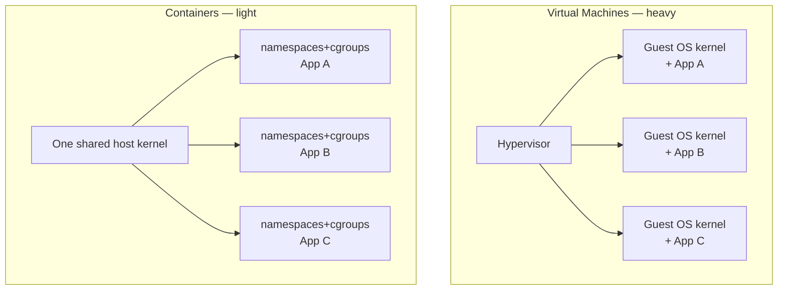
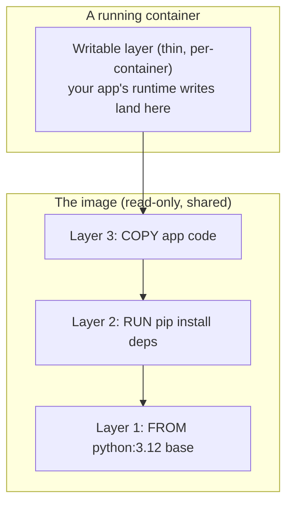
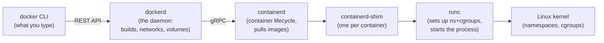
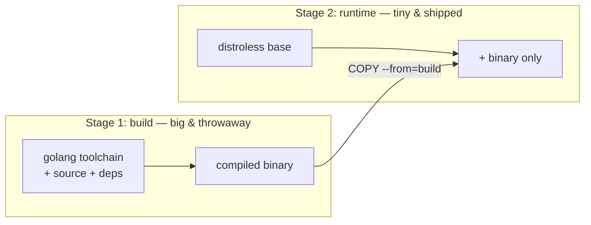
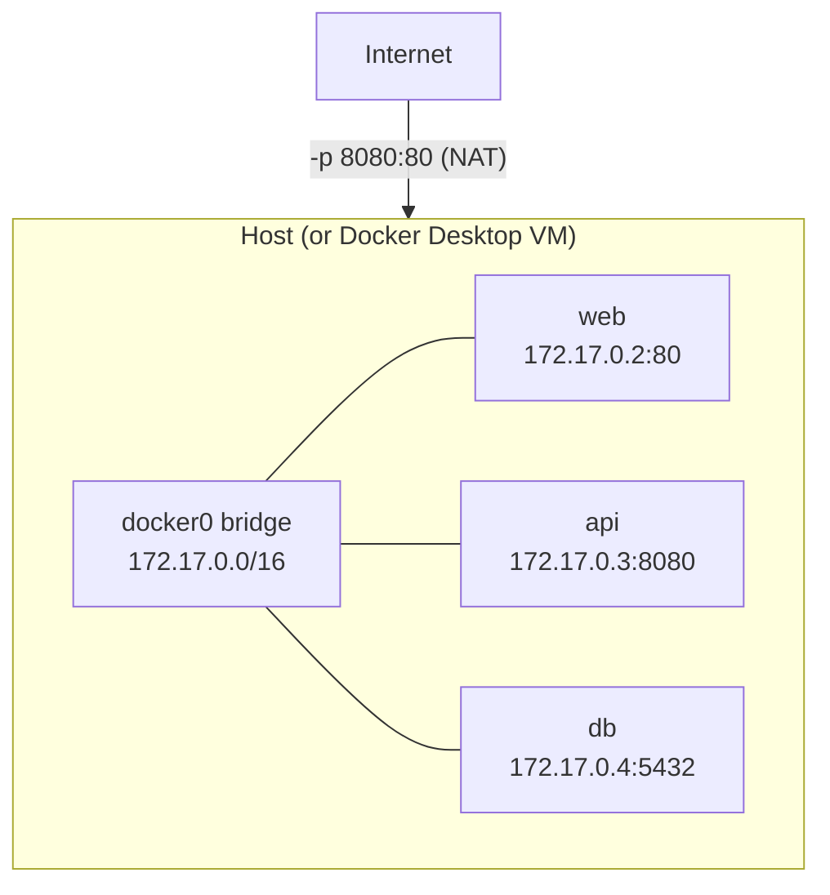
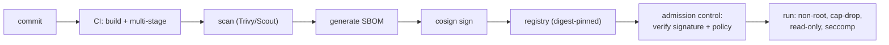
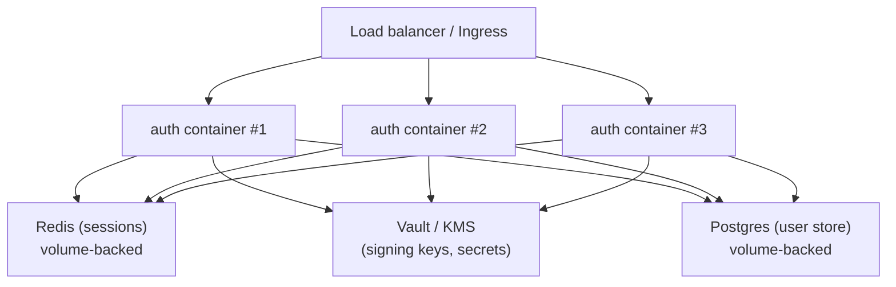

# Docker — the complete reference, from scratch to advanced

> **Lefler's build note.** Farhaan asked for an **end-to-end** Docker reference — *why containers exist*, what actually happens inside the kernel, and how to run them safely in a **fintech / IAM** shop. This is a **teaching reference**: read it top-to-bottom once to build the mental model, then keep it open to look things up.
>
> **Prereq:** you can open a terminal and run a command. Nothing else. **Companion:** [Kubernetes reference](27-kubernetes-complete-reference.md) (Docker's big sibling) and the [Docker + Kubernetes question bank](28-docker-kubernetes-question-bank.md) to test yourself.
>
> **Level:** medium → advanced. **Platform note:** Farhaan is on **Windows 11**, so Docker runs inside **Docker Desktop → a small Linux VM (WSL2)**. Every "Linux kernel" statement below is true *inside that VM*, not on Windows directly. PowerShell and Bash `docker` commands are identical.

---

## TL;DR (read this first)

- A **container is just a normal Linux process** that the kernel has been told to *lie to*: "you have your own filesystem, your own network, your own process list." It is **not** a tiny virtual machine — there is no second OS inside.
- Three kernel features do all the magic: **namespaces** (what a process can *see*), **cgroups** (what a process can *use*), and a **union filesystem** (how images stack cheaply).
- An **image** is a stack of **read-only layers** + metadata. A **container** is that stack plus **one thin writable layer** on top. Ship the image; throw the container away.
- The daily commands are `build` (Dockerfile → image), `run` (image → container), `push`/`pull` (image ↔ registry).
- **Security is the whole game in fintech:** don't run as root, use minimal/distroless bases, drop capabilities, scan images, sign them, and never bake secrets into layers.
- **Docker ≠ Kubernetes.** Docker builds and runs *one* container on *one* host. Kubernetes *orchestrates thousands* across many hosts. Docker is the brick; K8s is the building.

---

## 1. Why containers exist (first principles)

Start with the problem, because the design falls out of it.

**The problem: "it works on my machine."** An app depends on a specific Python version, three system libraries, an environment variable, and a folder that must exist. Move it to another machine and one of those is different — it breaks. Multiply by dozens of services and you have a permanent, expensive class of outage.

**The obvious-but-heavy fix: give each app its own computer.** That's a **virtual machine (VM)** — a full guest OS (kernel + userland) running on a hypervisor. It works, but each VM carries a whole operating system: gigabytes of RAM and disk, a minute to boot. You can't run 50 of them on a laptop.

**The insight that makes containers:** the apps on one machine already **share one Linux kernel** perfectly well. The only reason they interfere is that they *see the same filesystem, the same process list, the same network*. What if we kept **one shared kernel** but gave each app its **own private view** of those things?

That's a container. **Same kernel, isolated view.** You get most of a VM's isolation at almost none of the cost — megabytes, not gigabytes; milliseconds to start, not a minute.



**The trade-off (say this in an interview ★):** a VM has a **hardware** boundary (its own kernel) — strong isolation, big cost. A container has a **kernel** boundary (shared kernel, isolated view) — cheap, but a kernel bug is a shared blast radius. That single fact drives *every* container-security control later in this doc.

**Why you care at FinCo:** the whole reason your IAM stack (Keycloak, PingFederate, the demo apps in `../labs/`) ships as containers is this: reproducible, fast, dense. But "shared kernel" is exactly why auditors ask about container escape, image provenance, and least privilege. Containers move the security conversation from *the box* to *the image and the kernel*.

---

## 2. What a container actually is (the three kernel primitives)

A container = **namespaces** (isolation) + **cgroups** (limits) + a **root filesystem** (the image). Let's derive each.

### 2.1 Namespaces — "what can this process see?"

A **namespace** partitions one kind of kernel resource so a process only sees its own slice. Linux has several; a container uses most of them at once:

| Namespace | Isolates | Effect inside the container |
|---|---|---|
| **PID** | process IDs | your app is **PID 1**; it can't see host processes |
| **Mount (mnt)** | filesystem mounts | its own `/`, `/etc`, `/usr` — the image |
| **Network (net)** | interfaces, routes, ports | its own `eth0`, its own `localhost` |
| **UTS** | hostname / domain | `hostname` returns the container's name |
| **IPC** | shared memory, semaphores | can't see host IPC |
| **User** | UID/GID mapping | root *inside* (UID 0) can map to a **non-root** UID *outside* |
| **cgroup** | the cgroup hierarchy view | hides the host's cgroup tree |
| **Time** *(newer)* | system clock offset | its own idea of boot time |

**The user namespace is the security crown jewel.** It lets a process be **root inside** the container while being an **unprivileged user outside**. If the app is compromised, "root" only means root over its own private view — not your host. This is the foundation of **rootless Docker** (§9).

**See it yourself (empirical check, Law 12):**

```bash
# Run a container and look at its process list
docker run --rm -it alpine sh
# inside the container:
ps aux         # -> you'll see almost nothing; your shell is PID 1
hostname       # -> a random container id, not the host
exit
```

✅ **Checkpoint:** `ps` inside shows a nearly empty process table and your shell as PID 1. That emptiness *is* the PID namespace working. Compare with `ps aux` on the host — hundreds of processes it cannot see.

### 2.2 cgroups v2 — "how much can this process use?"

Namespaces control *visibility*. **Control groups (cgroups)** control *consumption* — CPU, memory, disk I/O, PIDs. Without them, one greedy container starves the host.

- **cgroups v2** (the modern unified hierarchy — one tree instead of v1's separate trees per resource) is the default on all current distros and is *required* by newer Kubernetes.
- A **memory limit** is the one that bites people: exceed it and the kernel's **OOM killer** kills the process. In containers that shows up as **exit code 137** — memorize that number, it's the single most common "why did my container die?" answer.

```bash
# Give a container half a CPU and 256 MB, then watch it get OOM-killed
docker run --rm --memory=256m --cpus=0.5 alpine \
  sh -c "yes | tr \\n x | head -c 400m | grep n"
echo "exit code: $?"   # -> 137 == OOMKilled
```

✅ **Checkpoint:** exit code `137`. That's `128 + 9` (SIGKILL) — the kernel enforcing your cgroup memory limit. This exact scenario reappears in Kubernetes as `OOMKilled`.

### 2.3 The root filesystem & union layers — "what does it see as `/`?"

The container's `/` comes from the **image**, mounted read-only, with a thin **writable layer** on top via a **union / overlay filesystem** (`overlay2` is Docker's default driver).

**Why layers?** So images are cheap to store and ship. Ten images built `FROM python:3.12` **share** the identical base layers on disk and over the wire — you download the shared bytes once.



**Copy-on-write (CoW):** the container reads straight from the shared read-only layers. The moment it *modifies* a file, the union FS copies that file up into the writable layer and edits the copy. That's why containers start instantly (no copying) and stay small (only changes are stored).

**The consequence you must internalize:** the writable layer **dies with the container**. `docker rm` = data gone. Anything that must survive lives in a **volume** (§7), not the container. In fintech this is a compliance point: audit logs written *inside* a container are lost on restart — they must go to a volume or a log pipeline.

---

## 3. The Docker architecture (who does what)

"Docker" is not one program. When you type `docker run`, a chain of components hands off down to the kernel:



| Component | Job | Why it's separate |
|---|---|---|
| **docker CLI** | turns your command into an API call | thin client; can talk to a remote daemon |
| **dockerd** | the engine: build, network, volume, image mgmt | the "batteries included" layer |
| **containerd** | core runtime: pull images, manage lifecycle | a **CNCF standard**; Kubernetes uses it *directly*, no dockerd |
| **containerd-shim** | keeps a container alive if the daemon restarts | so upgrading dockerd doesn't kill your apps |
| **runc** | the low-level **OCI runtime**: actually calls the kernel | tiny, swappable (e.g. `gVisor`, `Kata` for stronger isolation) |

**The OCI (Open Container Initiative)** standardizes two things so this ecosystem interoperates: the **image spec** (what an image *is*) and the **runtime spec** (how to *run* one). This is why an image you build with Docker runs on Kubernetes, Podman, or CRI-O unchanged — that's the whole point.

**Interview-grade takeaway ★:** "Kubernetes removed the Docker *daemon* (the 'dockershim' removal in v1.24), but it never removed Docker *images*. K8s talks to `containerd`/`CRI-O` directly through the **CRI**. Your `docker build` output still runs fine — the image format is the contract, not the daemon."

**Podman aside:** Podman is a daemonless, rootless-by-default drop-in (`alias docker=podman` mostly works). Worth knowing because many hardened/regulated shops prefer "no root daemon running as a fat attack surface."

---

## 4. Images, layers, tags & digests

### 4.1 Anatomy of an image reference

```
registry.example.com/team/app:1.4.2@sha256:9b2c...   (full form)
└── registry ──────┘└─ repo ─┘└tag┘└──── digest ────┘
```

- **Tag** (`:1.4.2`, `:latest`) is a **movable label** — it can be re-pointed to different bytes tomorrow. Convenient, **not** trustworthy.
- **Digest** (`@sha256:...`) is the **content hash** — immutable. The same digest is *always* the same bytes.

**Rule for fintech ★:** pin **by digest** in production, not `:latest`. `:latest` is a reproducibility and supply-chain hole — the image under it can change without your knowing, which fails change-control and makes an incident impossible to reconstruct. This is the same "identity must be verifiable and stable" principle you enforce in IAM, applied to artifacts.

### 4.2 Where layers come from

Each `RUN`, `COPY`, `ADD` in a Dockerfile creates **one layer**. `FROM`, `ENV`, `CMD`, `LABEL` set metadata. The build **caches** each layer: if an instruction and its inputs are unchanged, Docker reuses the cached layer instead of rebuilding — which is why **instruction order matters enormously** (§5.2).

```bash
docker image history python:3.12-slim   # see the layers and their sizes
docker inspect --format '{{.RootFS.Layers}}' python:3.12-slim
```

---

## 5. The Dockerfile — from basic to production-grade

### 5.1 The instructions you actually use

| Instruction | Does | Gotcha |
|---|---|---|
| `FROM` | base image (start every build) | pin a specific tag/digest, not `:latest` |
| `RUN` | run a command at **build** time | each `RUN` = a layer; chain with `&&` to keep it slim |
| `COPY` | copy files from build context into image | prefer over `ADD` (ADD also untars & fetches URLs — surprising) |
| `ADD` | like COPY + auto-extract/URL | avoid unless you *want* auto-extract |
| `ENV` | environment variable (persists at runtime) | **never** put secrets here — it's baked into the image |
| `ARG` | build-time variable | not present at runtime; still visible in build history |
| `WORKDIR` | set/create working directory | use it instead of `RUN cd` |
| `EXPOSE` | document a port | **documentation only** — does not publish; `-p` does |
| `USER` | drop to a non-root user | **do this** — see §9 |
| `ENTRYPOINT` | the fixed executable | the "what this image *is*" |
| `CMD` | default args (or default command) | overridable at `docker run` |
| `HEALTHCHECK` | how Docker tests liveness | maps to K8s probes conceptually |

**ENTRYPOINT vs CMD (the classic confusion):** `ENTRYPOINT` is the thing that always runs; `CMD` is the default arguments you can override. `ENTRYPOINT ["nginx"]` + `CMD ["-g","daemon off;"]` → runs `nginx -g "daemon off;"`, but `docker run img -v` runs `nginx -v`.

**Shell vs exec form (a real gotcha ⚠):** `CMD nginx` (shell form) runs under `/bin/sh -c`, so your process is a **child of `sh`** and **won't receive `SIGTERM`** on shutdown — leading to 10-second kill delays and lost graceful shutdown. Always use **exec form**: `CMD ["nginx","-g","daemon off;"]`. This matters doubly in Kubernetes, which sends SIGTERM to stop pods.

### 5.2 Layer caching & ordering — the #1 build-speed lever

Put **what changes least** at the top, **what changes most** at the bottom. Your source code changes every commit; your dependencies rarely do. So copy the dependency manifest and install *before* copying the code:

```dockerfile
# ❌ slow: any code change busts the pip cache and reinstalls everything
COPY . .
RUN pip install -r requirements.txt

# ✅ fast: deps layer is cached until requirements.txt itself changes
COPY requirements.txt .
RUN pip install --no-cache-dir -r requirements.txt
COPY . .
```

✅ **Checkpoint:** change one line of app code and rebuild. The ✅ version skips the `pip install` layer ("CACHED" in the output) and finishes in seconds; the ❌ version reinstalls every dependency.

### 5.3 Multi-stage builds — small, clean, secure images

**The problem:** to *build* a Go/Java/Node app you need compilers and a toolchain (hundreds of MB, full of CVEs). To *run* it you need only the compiled artifact. Shipping the toolchain is bloat **and** attack surface.

**The fix:** a **build stage** with all the tools, then a tiny **runtime stage** that copies out only the finished artifact.

```dockerfile
# ---- Stage 1: build (has the whole toolchain) ----
FROM golang:1.23 AS build
WORKDIR /src
COPY go.mod go.sum ./
RUN go mod download
COPY . .
RUN CGO_ENABLED=0 go build -o /app ./cmd/server

# ---- Stage 2: runtime (tiny, no shell, no compiler) ----
FROM gcr.io/distroless/static-debian12:nonroot
COPY --from=build /app /app
USER nonroot
ENTRYPOINT ["/app"]
```

The final image contains **only** your binary and the minimal files to run it — often <20 MB vs >800 MB. **Distroless** = no shell, no package manager, no `curl` — so even if attackers land inside, they have almost no tools to pivot with. This is the single highest-leverage security + size win in Docker.



### 5.4 BuildKit — the modern builder

Modern Docker uses **BuildKit** by default: parallel stage builds, better caching, and **build secrets that never land in a layer**:

```dockerfile
# syntax=docker/dockerfile:1
RUN --mount=type=secret,id=npmtoken \
    NPM_TOKEN=$(cat /run/secrets/npmtoken) npm ci
```

```bash
docker build --secret id=npmtoken,src=./npm_token.txt -t app .
```

The token is mounted *only during that RUN*, is **never** written to a layer, and never appears in `docker history`. This is the correct answer to "how do I use a private-registry credential at build time without leaking it" — a question that comes up constantly in regulated CI/CD.

---

## 6. Container networking

### 6.1 The four built-in network modes

| Driver | What it does | Use when |
|---|---|---|
| **bridge** (default) | private virtual network on the host; NAT to outside | most single-host containers |
| **host** | share the host's network stack directly (no isolation) | max performance, you accept no net isolation |
| **none** | no networking at all | batch jobs that need zero network |
| **overlay** | one virtual network spanning **multiple hosts** | Swarm / multi-host (K8s uses its own CNI instead) |

**The default bridge in one picture:** each container gets a private IP on a `docker0` bridge; to reach it from outside you **publish** a port (`-p host:container`), which sets up NAT.



**User-defined bridges give you DNS.** On the default bridge, containers reach each other only by IP. Create your own network and Docker runs an embedded DNS server so containers resolve each other **by name** — this is how Compose services find each other:

```bash
docker network create appnet
docker run -d --name db  --network appnet postgres
docker run -d --name api --network appnet myapi   # can now reach "db:5432" by name
```

✅ **Checkpoint:** `docker exec api ping db` resolves — name-based service discovery, no hardcoded IPs. That's the same idea Kubernetes formalizes with cluster DNS.

### 6.2 EXPOSE vs publish (a persistent confusion ⚠)

- `EXPOSE 80` in a Dockerfile is **documentation** — it opens nothing.
- `-p 8080:80` at `docker run` actually **publishes** the port (host 8080 → container 80).
- Forgetting `-p` is the classic "my server runs but I can't reach it" bug.

---

## 7. Storage & volumes

The writable layer is ephemeral (§2.3). For data that must **outlive** the container, use one of:

| Type | What | Use for |
|---|---|---|
| **Named volume** | Docker-managed storage (`/var/lib/docker/volumes/...`) | databases, persistent app data — **preferred** |
| **Bind mount** | a host directory mapped in (`-v /host/path:/in/container`) | local dev (live-edit code), config files |
| **tmpfs** | in-memory, never touches disk | secrets/scratch you *want* to vanish |

```bash
docker volume create pgdata
docker run -d --name db -v pgdata:/var/lib/postgresql/data postgres
# blow away the container; data survives in the volume
docker rm -f db
docker run -d --name db2 -v pgdata:/var/lib/postgresql/data postgres   # same data
```

**Fintech angle:** a `tmpfs` mount is a legitimate place to stage a decrypted secret so it *never* hits disk — it dies with the container and leaves no forensic residue. Bind-mounting the host's Docker socket (`-v /var/run/docker.sock:...`) is the opposite: it's effectively **handing root of the host** to the container. Treat "who can mount the Docker socket" like a privileged-access grant in your IAM model.

---

## 8. Docker Compose — many containers, one file

Real apps are several containers (web + api + db + cache). **Compose** declares them all in one YAML file and wires their network automatically. It's the on-ramp to the *declarative* thinking Kubernetes takes to the extreme.

```yaml
# compose.yaml  ->  docker compose up -d
services:
  api:
    build: ./api
    ports: ["8080:8080"]
    environment:
      DB_HOST: db            # resolves by service name via Compose's DNS
    depends_on:
      db:
        condition: service_healthy
    read_only: true          # harden: read-only root FS
    cap_drop: ["ALL"]        # harden: drop all Linux capabilities
    user: "10001:10001"      # harden: run as non-root
  db:
    image: postgres:16
    volumes: ["pgdata:/var/lib/postgresql/data"]
    environment:
      POSTGRES_PASSWORD_FILE: /run/secrets/db_pw   # secret via file, not env
    secrets: ["db_pw"]
    healthcheck:
      test: ["CMD-SHELL", "pg_isready -U postgres"]
      interval: 10s
      timeout: 5s
      retries: 5
volumes:
  pgdata:
secrets:
  db_pw:
    file: ./secrets/db_pw.txt     # gitignored; placeholder in repo
```

Notice this file already contains, in miniature, the concepts K8s scales up: **declared desired state**, **service discovery by name**, **health checks**, **secrets by reference**, and **security hardening**. Your `../labs/01-keycloak-idp/docker-compose.yml` is exactly this pattern.

---

## 9. Container security (the fintech-critical section)

Because containers **share the host kernel** (§1), security is about **shrinking blast radius**: if the app is popped, how little can the attacker do? Every control below is defense-in-depth. **Pair each with detection** (Law 9).

### 9.1 Don't run as root

By default a container's process runs as **root (UID 0)**. If it escapes a misconfiguration, it's root-ish on the host. Root-in-container was **~28% of common attack vectors in 2025** — the single most impactful thing to fix.

```dockerfile
RUN addgroup -S app && adduser -S -G app app
USER app          # everything after runs unprivileged
```

- **Detect:** scan running containers / manifests for `runAsUser: 0` or missing `USER`; alert on any container whose PID 1 is UID 0.
- **Mitigate further:** **rootless mode** (the whole daemon runs as a non-root user via the **user namespace**), so even a container "root" maps to an unprivileged host UID.

### 9.2 Drop capabilities & add `no-new-privileges`

Linux **capabilities** slice up root's powers (e.g. `NET_BIND_SERVICE`, `SYS_ADMIN`). Containers start with a default set; most apps need **none**. Drop everything, add back only what's required:

```bash
docker run --cap-drop=ALL --cap-add=NET_BIND_SERVICE \
  --security-opt no-new-privileges \
  --read-only --tmpfs /tmp \
  myimage
```

- `--cap-drop=ALL` — remove every capability, re-add the minimum.
- `--security-opt no-new-privileges` — the process can never *gain* privileges (blocks setuid-binary escalation).
- `--read-only` — root filesystem is immutable; attacker can't drop a webshell. Give it a small writable `tmpfs` for scratch.

### 9.3 seccomp & the syscall wall

**seccomp** filters which **system calls** a container may make. Docker's **default seccomp profile** already blocks ~44 dangerous syscalls (like `mount`, `reboot`, `ptrace` in ways that enable escape). Don't run `--privileged` or `--security-opt seccomp=unconfined` — that **removes this wall** and is a top finding in any container audit. `--privileged` is essentially "container = root on host"; treat it as a break-glass, logged, exceptional grant.

### 9.4 Minimal & trusted base images

- Prefer **distroless** or **`-slim`/`alpine`** bases — fewer packages = fewer CVEs. (Package counts in images jumped ~300% in 2025; every extra package is attack surface.)
- **Scan** every image in CI (`docker scout cves`, Trivy, Grype) and fail the build on high/critical CVEs.
- **Pin base images by digest** so a poisoned upstream tag can't slip in.

### 9.5 Supply-chain: sign, attest, SBOM

Modern regulated pipelines require you to **prove** what's in an image and **who** built it:

- **SBOM** (Software Bill of Materials) — a machine-readable list of everything in the image (`docker sbom` / Syft). Auditors and vuln-management want this.
- **Signing** — sign images with **Sigstore/cosign**; at deploy time, **admission control** refuses unsigned images.
- **Provenance / SLSA** — attest *how* the image was built (which CI, which commit), so a tampered artifact is detectable.



### 9.6 Never bake secrets into images

Secrets in `ENV`, `ARG`, or `COPY`'d files are **permanently in the image layers and `docker history`** — even if a later layer deletes the file. Use **BuildKit `--mount=type=secret`** at build time (§5.4) and **runtime secret injection** (Compose/K8s secrets, a vault) at run time. This is directly your IAM wheelhouse: an image is an *identity-bearing artifact*; a leaked secret in a layer is a credential in cleartext, forever, in every copy of that image.

### 9.7 The hardening checklist (copy into every review)

- [ ] Runs as a **non-root** `USER` (no `runAsUser: 0`)
- [ ] `--cap-drop=ALL`, minimal `--cap-add`
- [ ] `--security-opt no-new-privileges`
- [ ] `--read-only` root FS (+ `tmpfs` for scratch)
- [ ] Default **seccomp** on; **never** `--privileged`
- [ ] **Minimal/distroless** base, **pinned by digest**
- [ ] Image **scanned** in CI; high/critical CVEs block release
- [ ] **SBOM** produced; image **signed**; provenance attested
- [ ] **No secrets** in layers, `ENV`, or `ARG`
- [ ] Docker socket **not** mounted into app containers

---

## 10. System design with containers (putting it together)

**Scenario:** design a containerized login-service (an OIDC token endpoint) for FinCo — realistic for your day job.

**Requirements → design decisions:**

1. **Stateless service, state in backing stores.** The token service holds no session on local disk — signing keys come from a vault/KMS, sessions/refresh tokens go to a shared store (Redis/DB). *Why:* containers are cattle, not pets; any instance must be replaceable. This is what makes horizontal scaling and zero-downtime deploys possible.
2. **One concern per container.** Auth service, database, and cache are **separate** containers/images — independent scaling, patching, and blast radius. (The "sidecar" pattern — a helper container for logging/proxy alongside the main one — is the same idea; K8s formalizes it.)
3. **Config in, secrets injected.** Non-secret config via env/ConfigMap; secrets via a secret store mounted at runtime, never in the image.
4. **Health surfaces.** A `HEALTHCHECK`/readiness endpoint so the orchestrator only routes traffic to ready instances and restarts dead ones.
5. **Graceful shutdown.** Exec-form entrypoint, handle `SIGTERM`, drain in-flight requests — so rolling deploys don't drop live logins.
6. **Immutable, signed images pinned by digest**, minimal base, non-root, scanned.



**The punchline:** once your service is stateless, replaceable, health-reporting, and config-injected, you've stopped designing "a container" and started designing for an **orchestrator**. That's the exact handoff into Kubernetes — continue in the [K8s reference](27-kubernetes-complete-reference.md).

---

## 11. Command quick-reference

```bash
# Images & build
docker build -t app:1.0 .                 # build from ./Dockerfile
docker build --secret id=tok,src=t.txt .  # BuildKit build secret (no leak)
docker images                             # list local images
docker history app:1.0                    # inspect layers (audit for secrets!)
docker scout cves app:1.0                 # scan for vulnerabilities

# Run & inspect
docker run -d --name web -p 8080:80 nginx # run detached, publish port
docker ps        / docker ps -a           # running / all containers
docker logs -f web                        # follow logs
docker exec -it web sh                     # shell into a running container
docker inspect web                         # full JSON: mounts, net, config
docker stats                               # live CPU/mem per container

# Lifecycle & cleanup
docker stop web && docker rm web           # graceful stop + remove
docker system df                           # what's eating disk
docker system prune -a --volumes           # reclaim everything unused (careful!)

# Networking & volumes
docker network create appnet               # user-defined bridge (gives DNS)
docker volume create pgdata                # persistent named volume

# Registry
docker pull registry/app@sha256:...        # pull by digest (immutable)
docker push registry/team/app:1.0          # push a tag
```

---

## What you learned

- A container is a **process with a private view** (namespaces) and **enforced limits** (cgroups) on a **shared kernel** — cheap isolation, which is *why* container security is about kernel boundary + image provenance.
- **Images are stacked read-only layers**; ordering and multi-stage builds control speed, size, and attack surface.
- The **Docker → containerd → runc** chain (with **OCI**/**CRI** as the contracts) is why your images run unchanged on Kubernetes.
- **Networking, volumes, and Compose** give you service discovery, persistence, and declarative multi-container apps — the on-ramp to orchestration.
- **Security = shrinking blast radius**: non-root, cap-drop, read-only, seccomp, minimal/distroless, scan, sign, SBOM, no secrets in layers — each paired with detection.

## Next

- **[Kubernetes — the complete reference](27-kubernetes-complete-reference.md)** — orchestrate these containers at scale (this doc's payoff).
- **[Docker + Kubernetes question bank](28-docker-kubernetes-question-bank.md)** — drill the edge cases (OOMKilled, CrashLoopBackOff, networking gotchas) until they're reflex.
- **Hands-on:** revisit [`../labs/01-keycloak-idp/docker-compose.yml`](../labs/01-keycloak-idp/) and re-read it with §8–§9 in mind — spot what's hardened and what you'd add.

---

### Sources & further reading

- [Kubernetes v1.33 "Octarine" release](https://kubernetes.io/blog/2025/04/23/kubernetes-v1-33-release/) · [v1.36 sneak peek](https://www.kubernetes.io/blog/2026/03/30/kubernetes-v1-36-sneak-peek/) (Docker image format is the durable contract across versions)
- [Sysdig — Top Dockerfile best practices for container security](https://www.sysdig.com/learn-cloud-native/dockerfile-best-practices)
- [BellSoft — Docker image security: SBOM, non-root, provenance](https://bell-sw.com/blog/docker-image-security-best-practices-for-production/)
- [ZeonEdge — Docker security best practices 2026: build to runtime](https://zeonedge.com/blog/docker-security-best-practices-2026-hardening-containers-build-runtime)
- [Running Docker containers as non-root](https://oneuptime.com/blog/post/2026-02-20-docker-rootless-containers/view)
- [Atlantbh — How Docker containers work: namespaces and cgroups](https://atlantbh.com/blog/how-docker-containers-work-under-the-hood-namespaces-and-cgroups/)
- [dev.to — How Docker actually works: namespaces & cgroups](https://dev.to/doogal/how-docker-actually-works-a-deep-dive-into-namespaces-and-cgroups-5h3e)

*Curated with Lefler ⚙️ — beginner-first, derive-the-why, prove-it-yourself.*
