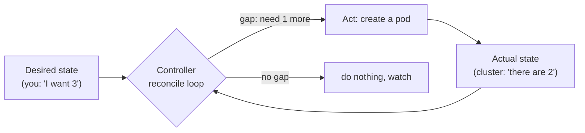
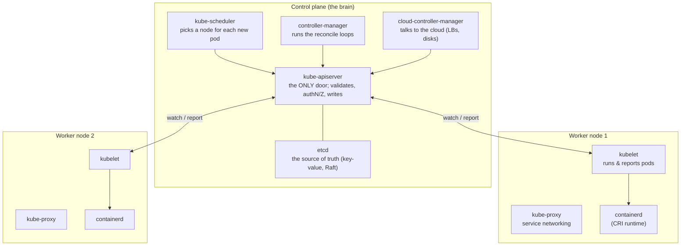
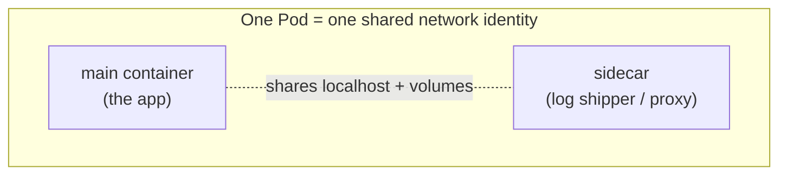
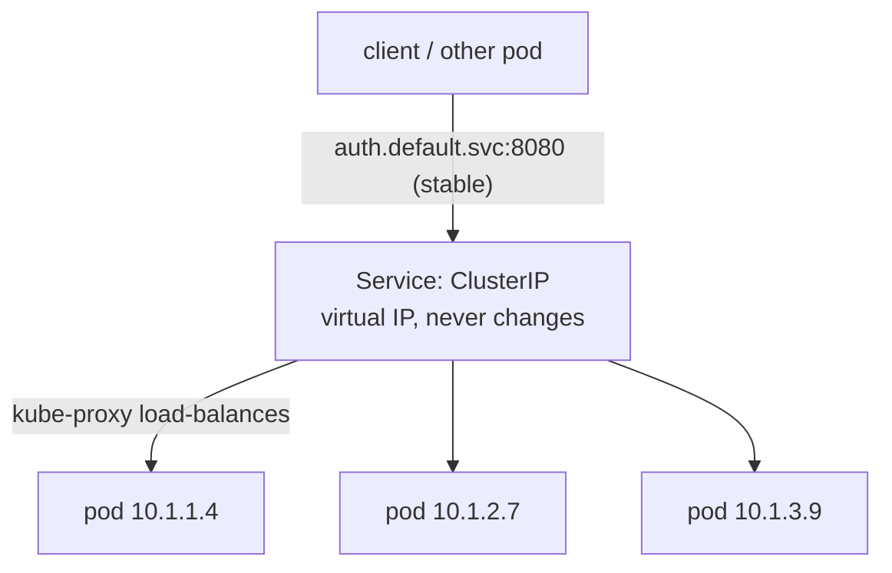
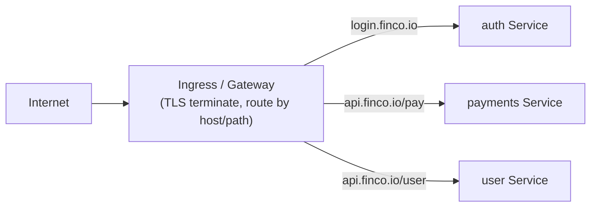
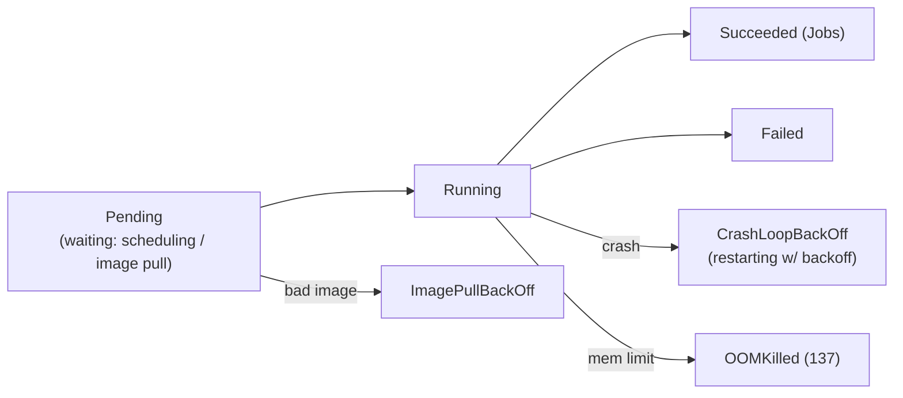
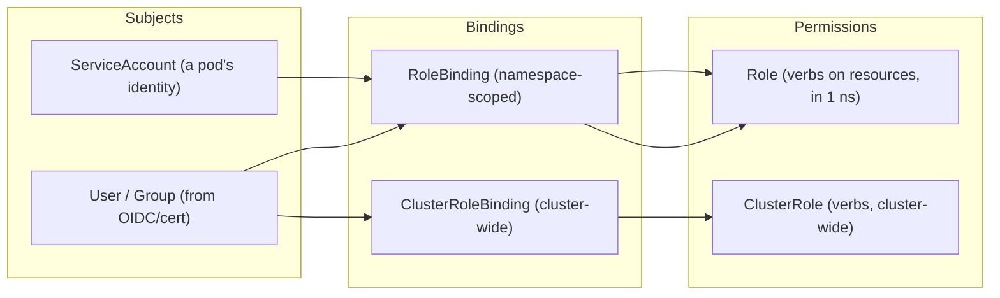
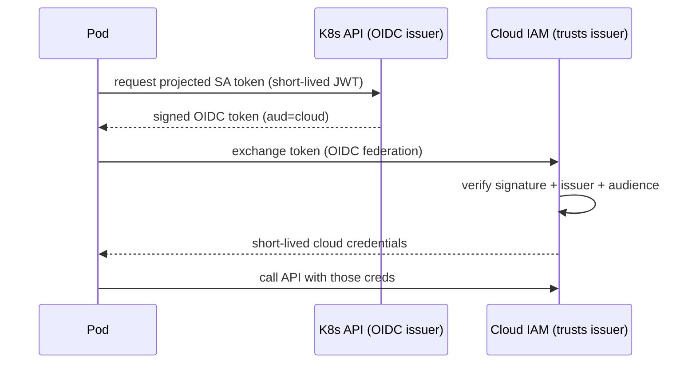
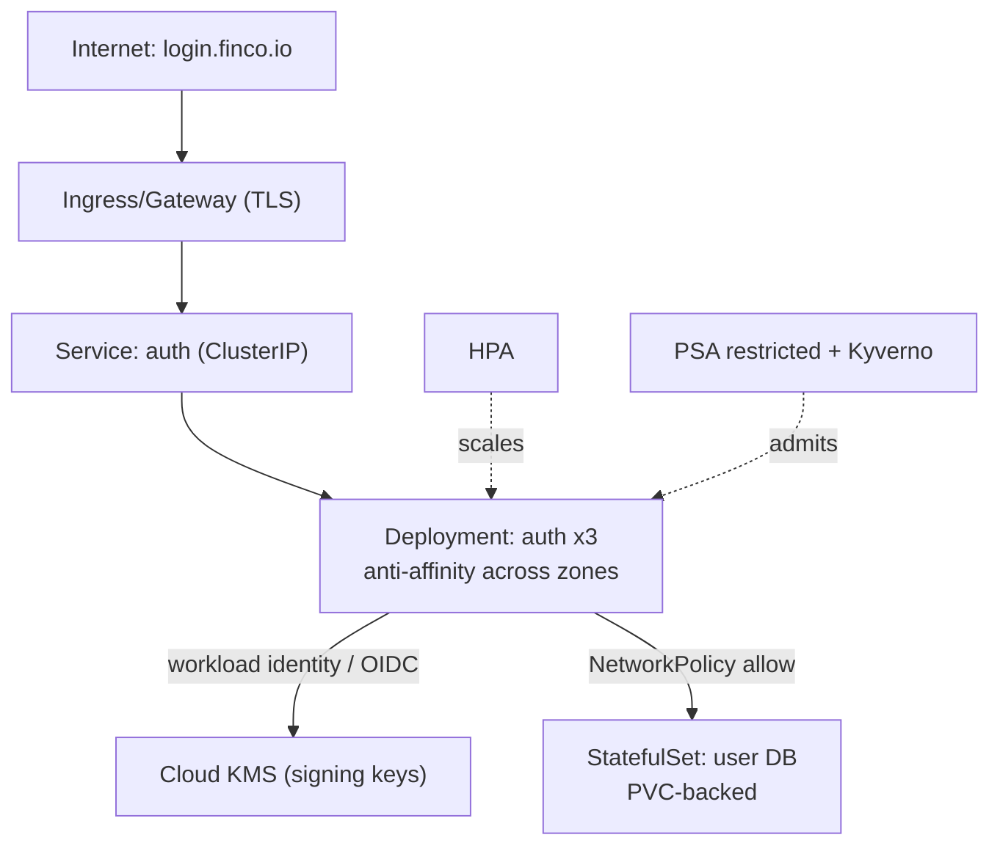

# Kubernetes — the complete reference, from scratch to advanced

> **Lefler's build note.** The [Docker reference](26-docker-complete-reference.md) ended where one host stops being enough. **Kubernetes (K8s)** is what runs your containers across *many* hosts, keeps them alive, scales them, and heals them — declaratively. This doc derives K8s **from the problem it solves**, walks every core component and object, and lands hard on the parts that matter to a **fintech / IAM** engineer: RBAC, secrets, workload identity, and policy.
>
> **Prereq:** read the [Docker reference](26-docker-complete-reference.md) first — you must be comfortable with images, containers, ports, and volumes. **Test yourself:** [Docker + Kubernetes question bank](28-docker-kubernetes-question-bank.md).
>
> **Level:** medium → advanced. **Note on "Kubernetes":** the name is Greek for *helmsman*; "K8s" = K + 8 letters + s. It's a **CNCF** project, currently on the ~1.34/1.35 release line (§13).

---

## TL;DR (read this first)

- Kubernetes is a **control loop that makes reality match a declared desired state.** You say "I want 3 copies of this image, reachable at this name"; K8s continuously *makes and keeps* that true. That one idea — **declarative + reconciliation** — explains almost everything else.
- The **control plane** (API server, etcd, scheduler, controllers) is the brain; **nodes** (kubelet, kube-proxy, container runtime) are the muscle.
- The **Pod** is the smallest unit — one or more containers that share a network identity. You almost never make Pods directly; you make **Deployments** (stateless) or **StatefulSets** (stateful) that manage them.
- **Everything is an object** in etcd, reached through **one door: the API server.** Secure that door (authN, RBAC, admission) and you've secured the cluster.
- **For IAM/fintech the crown jewels are:** RBAC (who can do what), Pod Security Admission (what pods may do), NetworkPolicy (who talks to whom), Secrets + KMS encryption, and **Workload Identity** — the biggest non-human-identity story in modern infra, and squarely your domain.
- **Docker builds the brick; Kubernetes builds and operates the building.**

---

## 1. Why Kubernetes exists (first principles)

You containerized your services (Docker reference §10). Now run them for real:

- You need **3 copies** of the auth service for availability. Who starts the 3rd if a host dies at 3 a.m.?
- Copies come and go, each with a **new IP**. How does the frontend find them?
- You must **deploy a new version with zero downtime**. Who drains and replaces them one at a time?
- One host fills up. Who decides **where** each container runs?
- A container crashes. Who **restarts** it — and stops routing traffic to it until it's healthy?

Doing this by hand — SSH-ing into hosts, editing load balancers, restarting processes — is **imperative** and doesn't survive contact with scale or 3 a.m. The insight:

> **Don't script the steps. Declare the goal, and let a machine hold reality to it — forever.**

That is Kubernetes. You submit **desired state** ("3 replicas of image X, exposed as service Y"). A set of **controllers** run an endless **reconciliation loop**: *observe* actual state → *compare* to desired → *act* to close the gap → repeat. Kill a pod and the loop notices the gap and recreates it — not because someone scripted "if dead, restart," but because "3" ≠ "2" and the controller's job is to erase that difference.



**The mental unlock ★:** Kubernetes is not "a way to start containers." It's a **feedback control system for infrastructure**. Once you see every feature as "a controller reconciling a spec," the whole platform stops being a pile of YAML and becomes one idea repeated.

**Why you care at FinCo:** self-healing and declarative state aren't just convenience — they're **audit and compliance wins**. The desired state *is* the documentation; Git holds it (GitOps); every change is reviewable and reversible. "Show me exactly what's running and who approved it" becomes a `git log`, not a forensic archaeology dig across servers.

---

## 2. Architecture — the control plane & the nodes

A cluster = **control plane** (the brain, usually replicated 3× for HA) + **worker nodes** (where your containers actually run).



### 2.1 Control-plane components

| Component | Plain words | Deeper truth |
|---|---|---|
| **kube-apiserver** | the front desk — *everything* goes through it | the **only** component that talks to etcd; does authN, authZ (RBAC), admission, validation. Secure this and you've secured the cluster. |
| **etcd** | the cluster's memory | a distributed key-value store using the **Raft** consensus protocol; holds *all* state — pods, secrets, config. **Back it up; encrypt it.** Whoever reads etcd reads every secret. |
| **kube-scheduler** | the seating host | watches for pods with no node, scores every eligible node (resources, affinity, taints), assigns the best. Only *decides*; kubelet *executes*. |
| **kube-controller-manager** | the reconcile engine | bundles many controllers (ReplicaSet, Node, Job, Endpoint…), each running the observe→compare→act loop. |
| **cloud-controller-manager** | the cloud liaison | provisions cloud load balancers, disks, routes on AWS/GCP/Azure. |

### 2.2 Node components

| Component | Plain words | Deeper truth |
|---|---|---|
| **kubelet** | the node's foreman | the agent on every node; takes pod specs from the API server and makes the container runtime run them; reports health back. |
| **container runtime** | the muscle | **containerd** or **CRI-O**, spoken to via the **CRI** (Container Runtime Interface). Docker's *daemon* was dropped in v1.24 ("dockershim removal") — Docker *images* still run fine. |
| **kube-proxy** | the traffic cop | programs `iptables`/**IPVS** (or is replaced by **eBPF** in Cilium) so a Service's virtual IP load-balances to the right pod IPs. |

**The one-sentence flow ★:** *you* `kubectl apply` → **API server** validates & writes to **etcd** → **controller** sees a new Deployment and creates Pods → **scheduler** assigns each Pod a node → that node's **kubelet** tells **containerd** to pull the image and run it → **kube-proxy** wires up Service networking so traffic reaches it.

**IAM lens:** the API server is a textbook **policy enforcement point**. Every request is *authenticated* (who are you — cert, token, OIDC), *authorized* (RBAC — may you do this), then run through *admission controllers* (should this be allowed / mutated). That's the same authN → authZ → policy pipeline you build for applications, applied to the infrastructure itself. If you understand PingFederate's request pipeline, you already understand the API server's.

---

## 3. The core objects (the nouns you'll use daily)

Everything is a declarative object with `apiVersion`, `kind`, `metadata`, `spec` (desired), and `status` (actual, filled in by K8s).

### 3.1 Pod — the atom

The **smallest deployable unit**: one or more containers that **share a network namespace** (same IP, same `localhost`) and can share volumes. Multiple containers in a pod = the **sidecar pattern** (a helper alongside the main app — a log shipper, a proxy, a secrets agent).

**Key truth:** a Pod is **mortal and disposable.** It gets an IP, but when it dies its replacement gets a *new* IP. You never rely on a pod's IP — that's what Services are for (§4). You rarely create bare Pods; a controller creates them for you.



### 3.2 The workload controllers

| Object | Manages | Use for |
|---|---|---|
| **ReplicaSet** | keeps N identical pods running | rarely used directly — a Deployment owns it |
| **Deployment** | ReplicaSets + **rolling updates/rollback** | **stateless** apps (web, API, auth service) — your default |
| **StatefulSet** | pods with **stable identity & storage** | databases, brokers — stable name (`db-0`,`db-1`), ordered start, own disk |
| **DaemonSet** | one pod **per node** | node agents: log collectors, security sensors (Falco), CNI |
| **Job** | run to **completion** once | batch: a migration, a report |
| **CronJob** | Jobs **on a schedule** | nightly key rotation, cleanup, audit exports |

**Deployment vs StatefulSet (a favorite interview split ★):** Deployment pods are **interchangeable cattle** — any replica serves any request, order doesn't matter. StatefulSet pods are **named pets** — `db-0` is the primary, has *its own* persistent volume, and pods start/stop in order. Use a StatefulSet only when identity or per-pod storage genuinely matters; otherwise Deployment.

### 3.3 A Deployment, annotated

```yaml
apiVersion: apps/v1
kind: Deployment
metadata:
  name: auth-service
spec:
  replicas: 3                       # desired state: 3 pods
  selector:
    matchLabels: { app: auth }      # which pods this owns (by label)
  strategy:
    type: RollingUpdate             # replace pods gradually (zero-downtime)
    rollingUpdate: { maxSurge: 1, maxUnavailable: 0 }
  template:                         # the pod blueprint
    metadata:
      labels: { app: auth }
    spec:
      serviceAccountName: auth-sa   # its identity (for RBAC + workload identity)
      securityContext:              # pod-level hardening (see §11)
        runAsNonRoot: true
        seccompProfile: { type: RuntimeDefault }
      containers:
        - name: auth
          image: registry.finco.io/auth@sha256:...   # pinned by digest
          ports: [{ containerPort: 8080 }]
          resources:                # scheduler + cgroup limits (see §7)
            requests: { cpu: "250m", memory: "256Mi" }
            limits:   { cpu: "500m", memory: "512Mi" }
          readinessProbe:           # don't route traffic until ready (see §8)
            httpGet: { path: /healthz/ready, port: 8080 }
          securityContext:
            allowPrivilegeEscalation: false
            readOnlyRootFilesystem: true
            capabilities: { drop: ["ALL"] }
```

**Labels & selectors — the glue of Kubernetes.** Objects don't reference each other by ID; they match by **labels**. A Service finds its pods by label selector; a Deployment owns pods by label. Get labels wrong and things silently don't connect — a top real-world gotcha.

### 3.4 Config & secrets

- **ConfigMap** — non-secret config (URLs, flags, feature toggles) as key-value; mount as env vars or files.
- **Secret** — same shape, for sensitive data. **⚠ Critical truth:** a Secret is only **base64-encoded, not encrypted**, in etcd by default. Base64 is *not* security. You **must** enable **encryption at rest with a KMS provider** (KMS v2) so etcd stores ciphertext. This is a standard fintech audit finding — know it cold (§11).

---

## 4. Networking — the part people fear (and the IAM-adjacent part)

### 4.1 The four rules of the Kubernetes network model

Kubernetes mandates a flat model, then lets a **CNI plugin** implement it:

1. **Every pod gets its own IP.**
2. **Any pod can reach any pod, on any node, without NAT.**
3. A node's agents (kubelet) can reach all pods on that node.
4. (Consequence) containers in a pod share that pod IP and reach each other on `localhost`.

**The CNI (Container Network Interface)** plugin makes rules 1–2 real:

| CNI | How | Notable for |
|---|---|---|
| **Calico** | routes pod traffic (BGP), enforces NetworkPolicy | mature policy engine |
| **Cilium** | **eBPF** in the kernel; can replace kube-proxy | performance, deep observability, L7 policy |
| **Flannel** | simple VXLAN overlay | easy, minimal (no policy) |

### 4.2 Services — a stable name in front of mortal pods

Pods die and get new IPs (§3.1). A **Service** is a **stable virtual IP + DNS name** that load-balances to a changing set of pods (selected by label). This solves service discovery.



| Service type | Reachable from | Use for |
|---|---|---|
| **ClusterIP** (default) | inside the cluster only | internal service-to-service |
| **NodePort** | `<any-node-ip>:<30000-32767>` | quick external access / behind an LB |
| **LoadBalancer** | a cloud load balancer's IP | exposing a service to the internet on a cloud |
| **ExternalName** | DNS CNAME to an external host | aliasing an off-cluster dependency |

**How a Service actually works:** it's not a process — it's a set of **iptables/IPVS rules** (or eBPF maps) that **kube-proxy** programs on every node. The controller watches which pods match the selector and keeps the **EndpointSlice** (the live list of healthy pod IPs) up to date; kube-proxy turns that into forwarding rules.

**Cluster DNS:** CoreDNS gives every Service a name — `auth-service.default.svc.cluster.local` — so code uses names, never IPs. (DNS misconfig is one of the most common "it can't reach the DB" incidents — see the question bank.)

### 4.3 Ingress & the Gateway API — HTTP routing at the edge

A **Service** gets you an IP. **Ingress** (and its modern successor the **Gateway API**) does **L7 HTTP routing**: host/path rules, TLS termination, one entry point fanning out to many services.



TLS termination at the edge is directly your world: certs, SNI, mTLS to backends, and (with a service mesh like **Istio**/**Linkerd**) automatic **mTLS between every pod** — Zero-Trust networking inside the cluster. That's the same mTLS/cert story from [`06-tls-https-mtls.md`](06-tls-https-mtls.md), now applied east-west.

---

## 5. Storage — persistence for a stateless world

Pods are ephemeral, but databases aren't. Kubernetes separates **what** you want from **how** it's provisioned:

| Object | Role | Analogy |
|---|---|---|
| **PersistentVolume (PV)** | an actual piece of storage (a cloud disk, NFS share) | the physical parking space |
| **PersistentVolumeClaim (PVC)** | a pod's *request* for storage ("I need 10Gi, RWO") | the parking ticket |
| **StorageClass** | a template for **dynamic** provisioning | "call the valet to create a space on demand" |
| **CSI driver** | vendor plugin that actually creates/attaches disks | the valet |

Flow: pod → **PVC** ("I need 10Gi") → matched to a **PV** (or a **StorageClass** creates one on the fly via **CSI**) → mounted into the pod. A **StatefulSet** gives each pod its *own* PVC (`data-db-0`, `data-db-1`) that survives reschedule — that's how databases keep their data on Kubernetes.

---

## 6. Scheduling — deciding where pods run

The scheduler places each new pod. You steer it with:

- **requests/limits** — `requests` reserve capacity (the scheduler won't overbook a node); `limits` cap usage (the cgroup enforces it — exceed memory and the pod is **OOMKilled**, exit 137). *This is the Docker cgroup lesson, now cluster-wide.*
- **QoS classes** (derived from requests/limits): **Guaranteed** (requests == limits) > **Burstable** > **BestEffort** (none set). Under node memory pressure, **BestEffort pods are evicted first.** Set requests/limits on anything you care about.
- **nodeSelector / affinity / anti-affinity** — "run on GPU nodes"; "spread my 3 auth replicas across 3 different nodes" (anti-affinity → survive a node failure).
- **Taints & tolerations** — a node **taint** repels pods; only pods with a matching **toleration** may land (e.g. dedicate nodes to sensitive PCI workloads).
- **Topology spread constraints** — spread pods evenly across zones/nodes for resilience.

**Fintech design point:** anti-affinity + topology spread is how you guarantee your 3 auth replicas don't all sit on one host/zone that can fail together — an availability control an auditor will ask about. Taints let you **isolate cardholder-data workloads** onto dedicated nodes, a PCI-DSS segmentation pattern.

---

## 7. Health, self-healing & autoscaling

### 7.1 The three probes (know exactly what each does ★)

| Probe | Question | On failure |
|---|---|---|
| **liveness** | "is it alive, or wedged?" | **restart** the container |
| **readiness** | "ready to serve traffic *right now*?" | **remove from Service** endpoints (no restart) |
| **startup** | "has a slow app finished booting?" | hold off liveness/readiness until it passes |

**The classic outage ⚠:** a too-aggressive **liveness** probe on a slow-starting app keeps **restarting** it before it finishes booting → `CrashLoopBackOff` forever. The fix is usually a **startup probe** (or a longer `initialDelay`). A misconfigured probe is a "silent killer" — it appears in the question bank.

### 7.2 Autoscaling — three different axes

| Autoscaler | Scales | Trigger |
|---|---|---|
| **HPA** (Horizontal Pod Autoscaler) | **number of pods** | CPU/mem/custom metrics |
| **VPA** (Vertical Pod Autoscaler) | **size of each pod** (requests/limits) | historical usage |
| **Cluster Autoscaler** / Karpenter | **number of nodes** | pending pods that don't fit |

Typical prod: **HPA** for load spikes + **Cluster Autoscaler** to add nodes when pods can't be placed. (Don't run HPA and VPA on the same metric — they fight.)

---

## 8. Pod lifecycle & the states you'll debug



The five you must diagnose fast (full drills in the question bank):

- **Pending** — no node fits (resources/taints) *or* PVC unbound. → `kubectl describe pod`, read **Events**.
- **ImagePullBackOff** — wrong image name/tag or missing registry credentials.
- **CrashLoopBackOff** — container starts then dies repeatedly. → `kubectl logs --previous` for the *last crash's* output; check probes.
- **OOMKilled (137)** — hit the memory **limit** or node pressure. → raise limits or fix the leak.
- **Init:Error / Init:CrashLoopBackOff** — an **initContainer** failed; the main container never starts.

**The universal first move:** `kubectl describe pod <name>` and read the **Events** at the bottom — it names the cause (OOM, probe failure, image issue, unschedulable) before the app logs a single line.

---

## 9. Security — the fintech-critical core

The API server is the one door; secure it and defend in depth behind it. Every control pairs with detection (Law 9).

### 9.1 RBAC — who can do what (your home turf)

**Role-Based Access Control** governs every API request. Four objects, two axes:



- **Role / ClusterRole** = a set of *permissions* (verbs like `get,list,create` on resources like `pods,secrets`). Role = one namespace; ClusterRole = whole cluster.
- **RoleBinding / ClusterRoleBinding** = *grants* a Role to a **subject** (user, group, or **ServiceAccount**).
- **Golden rules:** least privilege; **no wildcards** (`verbs: ["*"]`, `resources: ["*"]`); almost never bind `cluster-admin`; every workload gets its **own** ServiceAccount (not `default`), scoped to exactly what it needs.

This is *literally your job* — Kubernetes RBAC is the same principle as application RBAC/ABAC you enforce at FinCo, now governing infrastructure. "Who can read Secrets in the `payments` namespace?" is an RBAC query, and it's an audit question.

### 9.2 Pod Security Admission (PSA) — what a pod may do

**PodSecurityPolicy (PSP) was removed in v1.25.** Its replacement is **Pod Security Admission**, enforcing the **Pod Security Standards** — three profiles:

| Profile | Meaning |
|---|---|
| **Privileged** | no restrictions (only for trusted system pods) |
| **Baseline** | blocks known privilege escalations |
| **Restricted** | **fully hardened** — non-root, no privilege escalation, drop caps, seccomp `RuntimeDefault`, read-only root FS. **Target this for app workloads.** |

You apply it per-namespace with a label:

```yaml
apiVersion: v1
kind: Namespace
metadata:
  name: payments
  labels:
    pod-security.kubernetes.io/enforce: restricted   # block non-compliant pods
    pod-security.kubernetes.io/warn: restricted       # warn on apply
```

### 9.3 NetworkPolicy — default-deny micro-segmentation

**Pod networking is fully open by default** — any pod can talk to any pod. In fintech that's unacceptable. Apply a **default-deny** policy per namespace, then add explicit allows. (Requires a policy-capable CNI — Calico/Cilium.)

```yaml
apiVersion: networking.k8s.io/v1
kind: NetworkPolicy
metadata: { name: default-deny-all, namespace: payments }
spec:
  podSelector: {}                 # every pod in the namespace
  policyTypes: ["Ingress","Egress"]   # deny all in and out until allowed
```

Then allow only what's needed (e.g. `auth` → `db:5432`). This is **Zero-Trust segmentation** inside the cluster — the network-layer sibling of least-privilege RBAC.

### 9.4 Secrets management done right

- Enable **encryption at rest** with a **KMS v2** provider (etcd stores ciphertext, not base64).
- Prefer an **external secrets manager** (Vault, cloud KMS/Secrets Manager) synced in via the **External Secrets Operator** or CSI Secrets Store driver — so the source of truth is a real vault with rotation and audit, not etcd.
- Tighten **RBAC on `secrets`** — reading secrets is reading credentials; treat it as privileged access.

### 9.5 Workload Identity — the non-human identity story (your specialty ⭐)

**The problem:** a pod needs to call a cloud API (S3, a database, Microsoft Graph). The old way — stuff a long-lived static credential into a Secret — is a standing liability: it leaks, it rarely rotates, it's a password in your cluster.

**The modern fix — Workload Identity:** the cluster becomes an **OIDC identity provider.** Each pod's **ServiceAccount token** is a short-lived, auto-rotated **OIDC JWT**. The cloud IAM is configured to **federate trust** to the cluster's OIDC issuer, so the pod exchanges its SA token for cloud credentials **with no stored secret at all**.



This is **exactly** the OAuth/OIDC token-exchange and federated-trust model from your [OAuth reference](21-oauth2-complete-reference.md) and [OIDC deep dive](03-oauth-oidc-deep-dive.md) — `iss`, `aud`, `exp`, signature verification against a JWKS — applied to **machine (non-human) identity**. Concrete names: **EKS IRSA / EKS Pod Identity** (AWS), **GKE Workload Identity** (Google), **Entra Workload Identity** (Azure/AKS). In v1.33 K8s even extended SA-token workload identity to **image pulls**. If you own IAM at FinCo, **workload identity is the K8s topic you own** — kill static secrets, prove identity with short-lived federated tokens.

### 9.6 Admission control & policy engines

After authN + RBAC, requests hit **admission controllers** — the last gate that can **reject or mutate** an object before it's stored. Policy engines like **OPA/Gatekeeper** and **Kyverno** run here to enforce org rules: "no `:latest` tags," "all images must be signed," "every namespace must have a NetworkPolicy," "no privileged pods." This is your **preventive control** layer — codified compliance that blocks bad config at the door instead of finding it in an audit.

### 9.7 The 8-domain hardening checklist

- [ ] **RBAC** least-privilege; no wildcards; per-workload ServiceAccounts; no stray `cluster-admin`
- [ ] **Pod Security Admission** = `restricted` on app namespaces
- [ ] **NetworkPolicy** default-deny + explicit allows (policy-capable CNI)
- [ ] **Secrets**: KMS-encrypted etcd; prefer external vault; tight RBAC
- [ ] **Workload Identity** (OIDC federation) instead of static cloud creds
- [ ] **Image security**: pinned digests, scanned, **signed** (Sigstore), verified at admission
- [ ] **Runtime security**: Falco/eBPF detection; audit logging on the API server
- [ ] **Cluster hardening**: CIS Benchmark, patched control plane, encrypted+backed-up etcd, restricted API access

---

## 10. System design on Kubernetes (the payoff)

**Scenario:** deploy FinCo's OIDC auth service (from the Docker reference §10) to production Kubernetes.

**Requirements → K8s objects:**

| Requirement | Object(s) |
|---|---|
| 3 replicas, zero-downtime deploys, rollback | **Deployment** (RollingUpdate) |
| Stable internal address | **Service** (ClusterIP) `auth.default.svc` |
| Public HTTPS at `login.finco.io` with TLS | **Ingress/Gateway** + cert (cert-manager) |
| Survive node/zone failure | pod **anti-affinity** + **topology spread** |
| Only route to ready pods; restart wedged ones | **readiness** + **liveness** (+ **startup**) probes |
| Handle load spikes | **HPA** (+ Cluster Autoscaler) |
| Config vs secrets | **ConfigMap** + **Secret** (KMS-encrypted) |
| Call cloud KMS for signing keys — no stored creds | **Workload Identity** (OIDC federation) via its **ServiceAccount** |
| Only auth may reach the user DB | **NetworkPolicy** default-deny + allow |
| Block misconfigured/unsigned images | **PSA `restricted`** + **Kyverno/OPA** + signature verify |
| Survive voluntary disruptions (node drains) | **PodDisruptionBudget** (keep ≥2 up) |



Everything in one place: declarative desired state, self-healing, service discovery, edge TLS, resilience, autoscaling, secretless cloud auth, and codified policy. **That's Kubernetes doing its job** — and most of the security controls are *your* IAM discipline expressed in cluster form.

---

## 11. `kubectl` quick-reference

```bash
# Context & discovery
kubectl config get-contexts / use-context <ctx>   # which cluster am I on?
kubectl get pods -A -o wide                        # all pods, all namespaces, with node/IP
kubectl get deploy,svc,ingress -n payments         # multiple kinds at once

# The debugging trio (memorize)
kubectl describe pod <pod>            # EVENTS at the bottom = root cause first stop
kubectl logs <pod> -c <container>     # container logs
kubectl logs <pod> --previous        # the CRASHED container's logs (CrashLoopBackOff!)

# Interactive & ephemeral debug
kubectl exec -it <pod> -- sh          # shell into a container
kubectl debug -it <pod> --image=busybox --target=<container>   # distroless-safe debug
kubectl port-forward svc/auth 8080:8080   # reach a ClusterIP service locally

# Apply / rollout / scale
kubectl apply -f deploy.yaml          # declarative create/update
kubectl rollout status  deploy/auth   # watch a rolling update
kubectl rollout undo    deploy/auth   # roll back to previous ReplicaSet
kubectl scale deploy/auth --replicas=5

# Security & RBAC checks
kubectl auth can-i create pods -n payments --as system:serviceaccount:payments:auth-sa
kubectl get rolebindings,clusterrolebindings -A
kubectl get networkpolicy -A

# Resource / node health
kubectl top pods -A                   # live CPU/mem (needs metrics-server)
kubectl get events -A --sort-by=.lastTimestamp   # cluster-wide recent events
```

---

## 12. Versions, deprecations & what's changing (2025→2026)

Keeping current is a security duty (patched = fewer CVEs). Recent landmarks:

- **v1.24** — **dockershim removed**; kubelet talks to containerd/CRI-O via CRI. Docker *images* unaffected.
- **v1.25** — **PodSecurityPolicy removed** → use **Pod Security Admission**.
- **v1.33 "Octarine"** (Apr 2025) — 64 enhancements; SA-token **workload identity for image pulls**; `gitRepo` volume driver removed; Endpoints API winding down in favor of **EndpointSlices**.
- **v1.34** — GPU **DRA** GA; the **AppArmor annotation** deprecated (removed in **v1.36**, Aug 2026).
- **v1.35** — **cgroup v1 deprecated** (kubelet refuses to start on cgroup v1 by default); **last release supporting containerd 1.x** → move to **containerd 2.0+**.
- **Support window:** each minor is supported ~14 months; **v1.33 goes EOL June 28, 2026.** Running an out-of-support version is an audit finding — plan upgrades.

**Fintech takeaway:** two migrations to have on the radar now — **cgroup v2** on all nodes and **containerd 2.0+** — before jumping past 1.35.

---

## What you learned

- Kubernetes is a **declarative control system**: you state desired state; controllers **reconcile** reality to it, forever. That single idea explains self-healing, rollouts, and scaling.
- **Control plane** (API server = the one door, etcd = truth, scheduler, controllers) + **nodes** (kubelet, runtime, kube-proxy) — connected by watch/report through the API server.
- **Pods** are mortal; **Deployments/StatefulSets** manage them; **Services + DNS** give stable discovery; **Ingress/Gateway** does edge routing and TLS.
- **Scheduling, probes, and autoscaling** deliver placement, health, and elasticity — with **requests/limits** carrying the Docker cgroup lesson cluster-wide.
- **Security is your wheelhouse:** RBAC, Pod Security Admission, default-deny NetworkPolicy, KMS-encrypted secrets, admission/policy engines, and above all **Workload Identity** — OIDC federation for machine identity, the biggest non-human-identity topic in modern infra and squarely IAM.

## Next

- **[Docker + Kubernetes question bank](28-docker-kubernetes-question-bank.md)** — drill architecture, security, and the production edge cases (OOMKilled, CrashLoopBackOff, DNS, probes, StatefulSets) until they're reflex.
- **Tie-backs:** [OAuth 2.0 + OIDC reference](21-oauth2-complete-reference.md) and [OIDC deep dive](03-oauth-oidc-deep-dive.md) (workload identity is OIDC federation) · [TLS/mTLS](06-tls-https-mtls.md) (mesh mTLS) · [PCI-DSS & IAM](09-pci-dss-and-iam.md) (namespace/node segmentation).
- **Hands-on next step:** take the Compose file in [`../labs/01-keycloak-idp/`](../labs/01-keycloak-idp/) and translate it into a Deployment + Service + Secret + NetworkPolicy — the exact skill this doc builds toward.

---

### Sources & further reading

- [Kubernetes v1.33 "Octarine" release notes](https://kubernetes.io/blog/2025/04/23/kubernetes-v1-33-release/) · [v1.33 sneak peek](https://kubernetes.io/blog/2025/03/26/kubernetes-v1-33-upcoming-changes/) · [v1.36 sneak peek](https://www.kubernetes.io/blog/2026/03/30/kubernetes-v1-36-sneak-peek/)
- [Kubernetes 1.34 — new features & breaking changes](https://atmosly.com/blog/kubernetes-134-whats-new-in-2025-top-features-upgrade-guide) · [Kubernetes EOL schedule](https://dev.to/endoflifeai/kubernetes-end-of-life-dates-official-eol-schedule-for-every-version-58l9)
- [Kubernetes v1.33 — Workload Identity for image pulls](https://kubernetes.io/blog/2025/05/07/kubernetes-v1-33-wi-for-image-pulls/) · [Configure external OIDC with ServiceAccount tokens](https://oneuptime.com/blog/post/2026-02-09-oidc-serviceaccount-token/view) · [IRSA & EKS Pod Identity (2026)](https://codingprotocols.com/blog/kubernetes-service-accounts-workload-identity)
- [Kubernetes architecture — 11 core components (Flexera)](https://www.flexera.com/blog/finops/kubernetes-architecture-11-core-components-explained/) · [Architecture with diagrams (DevOpsCube)](https://devopscube.com/kubernetes-architecture-explained/)
- [Kubernetes security best practices 2026 (production hardening)](https://devops.gheware.com/blog/posts/kubernetes-security-best-practices-2026.html) · [RBAC, Pod Security Standards & policy engines](https://dasroot.net/posts/2026/01/kubernetes-security-rbac-pod-security-standards-policy-engines/)

*Curated with Lefler ⚙️ and Janus ⭐ — beginner-first, derive-the-why, tied back to IAM at FinCo.*
