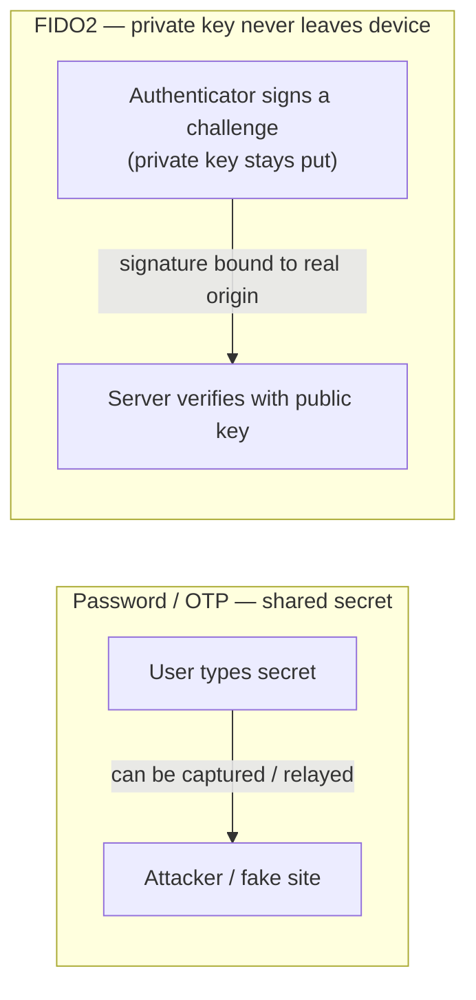
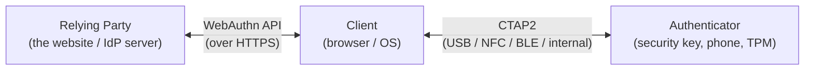
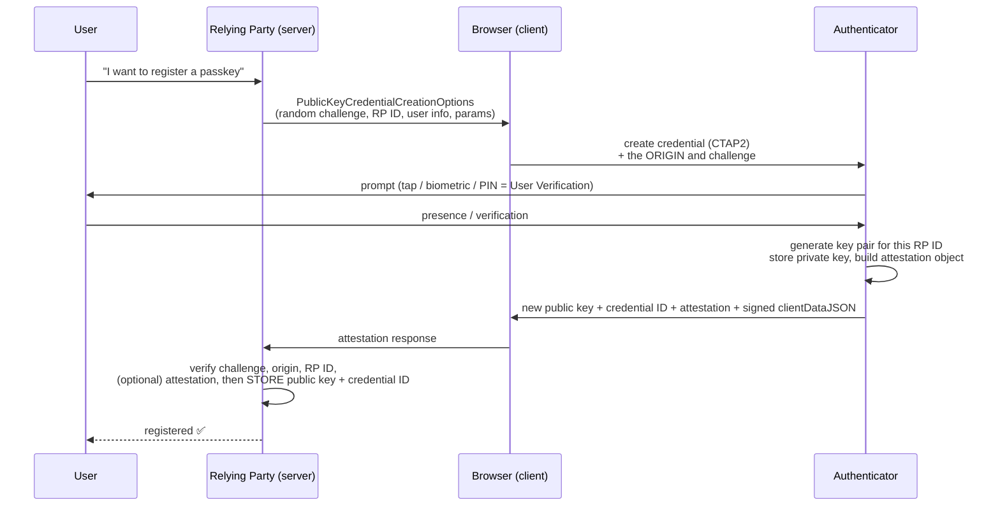
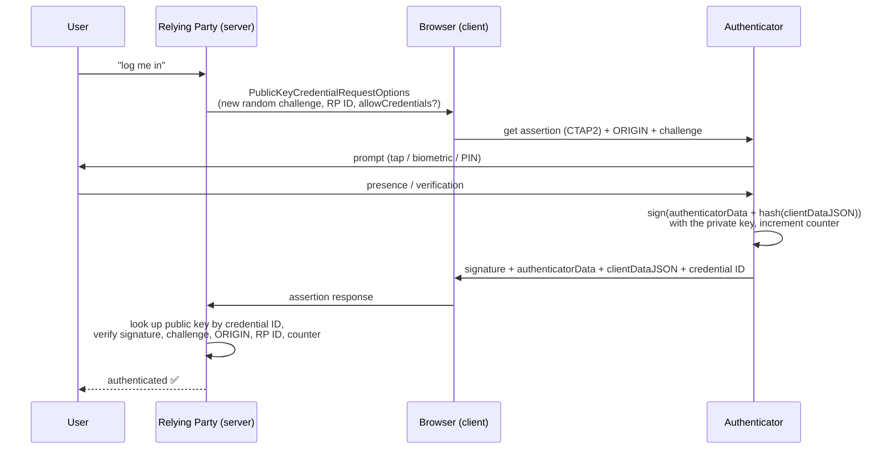
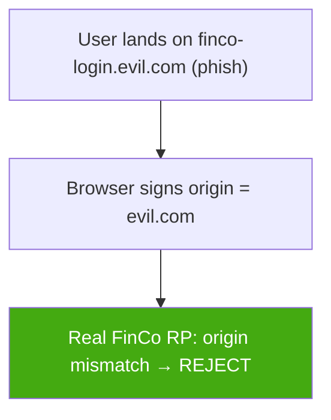
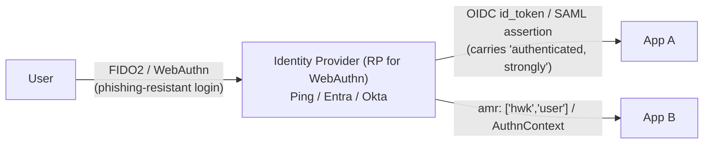

# FIDO2, WebAuthn & Passkeys — the complete reference

> **Janus's reference ⭐.** Farhaan asked for **everything you need to know about FIDO2** in one place. This is the phishing-resistant authentication standard behind **passkeys**, security keys, Windows Hello, and Face ID login — and it's *core IAM*, your day job at FinCo. This doc **derives why FIDO2 exists** (from the password's fatal flaw), walks the two ceremonies wire-by-wire, and lands on **how you'd actually deploy it in a fintech** and what it does — and doesn't — protect against.
>
> **Prereqs:** you should know **public-key crypto** (private key signs, public key verifies) — skim [`04-cryptography`](../../04-cryptography/) if that's rusty — and how login federation works ([OAuth/OIDC reference](21-oauth2-complete-reference.md), [SAML deep dive](02-saml-deep-dive.md)). **Level:** medium → advanced.
>
> **One-line pitch:** FIDO2 replaces "a secret you both know" (password/OTP) with "a signature only your device can make, bound to the real website" — which makes **phishing structurally impossible**, not just harder.

---

## TL;DR (read this first)

- **FIDO2 = WebAuthn + CTAP2.** WebAuthn (a **W3C** browser API) is how the *website talks to the browser*; CTAP2 (a **FIDO Alliance** protocol) is how the *browser talks to the authenticator* (security key / phone / laptop TPM).
- The model is **public-key challenge-response.** Your authenticator makes a **key pair per website**; the private key **never leaves** the device; the site stores only the **public key**. To log in, the site sends a random **challenge**, the device **signs** it, the site **verifies** with the public key.
- **Phishing dies because of origin binding.** The browser signs *which website asked* (the real origin). A fake `finco-login.evil.com` gets a signature bound to the wrong origin — useless. There is **no shared secret to phish, no code to relay**.
- A **passkey** is just the friendly name for a **FIDO2 discoverable credential**. Two flavours: **synced** (backed up to iCloud/Google/1Password — survives device loss) and **device-bound** (lives only on that hardware — e.g. a YubiKey).
- **Two "how sure are we it's you" levels:** **User Presence** (a tap — "someone is here") vs **User Verification** (biometric/PIN — "it's *you*"). UV turns one factor into two (device + biometric) → **passwordless MFA**.
- **What it stops:** phishing, credential stuffing, password reuse, replay, server-breach credential theft. **What it doesn't fully solve:** device theft (mitigated by UV), local malware, and **account recovery** — the genuine open problem.
- **In the enterprise:** enable FIDO2 **at the IdP** (Ping/Entra/Okta), then **federate that strong assurance to every app via OIDC/SAML.** FIDO2 is the *authentication*; OIDC/SAML carry the *result*.

---

## 1. Why FIDO2 exists (first principles)

Start with what's broken, because the whole design is a response to it.

### 1.1 The password's fatal flaw: it's a *shared secret*

A password is **something both you and the server know**. That single property causes every password problem:

- **It can be phished.** If you can be tricked into *typing* it, an attacker can capture it. A convincing fake login page is all it takes.
- **It's reused.** Humans reuse passwords, so one breach becomes many (**credential stuffing**).
- **It sits in a database.** Breach the server and you've got (hashes of) everyone's secret.
- **OTPs/SMS don't fix it.** A one-time code is *still a shared secret you type* — so it's still **phishable and relayable** in real time (attacker proxies your code to the real site). This is why NIST and OMB M-22-09 now push **phishing-resistant MFA**, not "any MFA."

**The root cause in one line:** *any secret the user can transmit, an attacker can intercept.*

### 1.2 The fix: stop sharing secrets — prove possession with a signature

What if the user's "secret" **never leaves their device** and is never typed? Instead of *telling* the server a secret, the device **proves it holds a private key** by signing a fresh challenge.

- Nothing to type → **nothing to phish**.
- Server stores only a **public key** → a server breach yields **nothing reusable**.
- The signature is over a **random challenge** → a captured signature can't be **replayed** (next challenge is different).
- The browser adds **which origin asked** into what's signed → a fake site gets a **useless, wrong-origin** signature.

That's FIDO2. It's the same **asymmetric-crypto, challenge-response** idea as SSH keys or TLS client certs, packaged so a browser and a $25 key (or your phone) can do it with a fingerprint tap.

**Why you care at FinCo:** account-takeover via phishing and credential stuffing is the #1 driver of fraud tickets and a top audit concern. FIDO2 is the control that *structurally* removes the attack class — not a detective control (catch the phish) but a **preventive** one (the phish can't work). That's a rare and powerful thing to be able to say to a regulator.

---

## 2. The FIDO2 stack — three names, cleanly separated

People conflate these. Keep them straight and you're ahead of most:

| Term | Who owns it | What it is | Plain words |
|---|---|---|---|
| **FIDO2** | umbrella | WebAuthn **+** CTAP2 together | the whole standard |
| **WebAuthn** | **W3C** | a browser **JavaScript API** (`navigator.credentials`) | how the **website ↔ browser** talk |
| **CTAP2** | **FIDO Alliance** | Client To Authenticator Protocol | how the **browser ↔ authenticator** talk |

- **Relying Party (RP)** — the service you're logging into (at FinCo, usually your **IdP**: PingFederate, Entra, Okta). It generates challenges and stores public keys.
- **Client** — the **browser + OS** (WebAuthn client). It enforces **origin binding** and mediates the ceremony.
- **Authenticator** — the thing holding the private key. Two kinds (next section).

**Key insight ★:** if the authenticator is *inside* the device (Touch ID, Windows Hello, a TPM), the browser talks to it directly — **you may never see CTAP2**. CTAP2 becomes visible when the authenticator is *external* (a YubiKey over USB/NFC, or your **phone over Bluetooth** for cross-device login).

### 2.1 Two authenticator types

| Type | Also called | Examples | Trade-off |
|---|---|---|---|
| **Platform** | internal, "something you are + the device" | Touch ID, Face ID, Windows Hello, Android biometrics | convenient, tied to that device |
| **Roaming** | cross-platform, external | YubiKey, Titan key, **your phone via hybrid transport** | portable across devices, extra hardware/step |

---

## 3. The two ceremonies (this is the heart of it)

FIDO2 has exactly two flows: **Registration** (make a key pair, once) and **Authentication** (sign a challenge, every login). "Ceremony" is the spec's word for "the full round-trip including the human tap."

### 3.1 Registration — "attestation" (create the credential)

**Goal:** the authenticator generates a **new key pair for this site**, keeps the private key, and hands the RP the **public key** + a **credential ID**.

**What the RP stores** (per credential): the **public key**, the **credential ID**, the **signature counter**, and (if used) the **AAGUID** (authenticator model id). **No secret.**

**Attestation** = optional cryptographic proof of the authenticator's **make/model** (via the AAGUID and a vendor-signed certificate). It answers "*is this really a genuine YubiKey 5 / a Windows Hello TPM?*" — which lets an enterprise **enforce policy** ("only allow FIPS-certified keys for admins"). Consumer sites usually skip it (`attestation: "none"`) for privacy; **fintech workforce** often requires it.

### 3.2 Authentication — "assertion" (prove you hold the key)

**Goal:** the RP sends a challenge; the authenticator **signs** it with the stored private key; the RP **verifies** with the public key it saved at registration.

**What gets signed (the crucial bit ★):** the authenticator signs a blob containing **`authenticatorData`** (includes the **RP ID hash**, user-presence/verification flags, and the **signature counter**) concatenated with the **hash of `clientDataJSON`** (which contains the **challenge**, the **origin**, and the request type). So one signature simultaneously proves: *right key* + *right challenge (fresh)* + **right origin** + *user was present/verified*.

---

## 4. Why FIDO2 is phishing-resistant (the three mechanisms)

This is the whole value proposition — be able to explain it cold.

### 4.1 Origin binding — the phishing killer

The browser **itself** writes the page's real **origin** (e.g. `https://login.finco.com`) into `clientDataJSON`, and that gets signed. **Page JavaScript cannot change it.** So:

- User is phished to `https://finco-login.evil.com`.
- The browser signs origin = `finco-login.evil.com`.
- Even if the attacker relays that to the real FinCo server, the RP checks the signed origin, sees the wrong domain, and **rejects it**.

Compare to a password/OTP: the user *types* it into the fake page and the attacker replays it to the real site — works fine. **FIDO2's origin binding is why the same attack can't.** Passkeys are also **scoped to the RP ID** (the domain), so a credential for `finco.com` is simply *not offered* on `evil.com`.

### 4.2 No shared secret

Nothing to type, nothing stored server-side that's reusable. A stolen public key is worthless (it can only *verify*, not *sign*). This kills **credential stuffing** and **server-breach credential theft** in one move.

### 4.3 Replay & clone resistance

- The **challenge is random and single-use** → a captured assertion can't be replayed.
- The **signature counter** increments each use; if the RP ever sees the counter **go backwards or stall**, that's a signal a **credential may have been cloned** — the RP can flag/step-up. (Synced passkeys often report `0`; counters are most meaningful for single-device hardware keys.)

---

## 5. Passkeys — what changed, and the two flavours

**Passkey** is the consumer-friendly rebrand of a **FIDO2 discoverable credential** (a.k.a. **resident key**) — a credential the *authenticator itself remembers*, so it can present *both* who-you-are and the key **without you typing a username**. That's what enables true **usernameless, passwordless** login. (Older **non-discoverable** credentials needed the server to first hand back an `allowCredentials` list — the classic U2F "second factor" model where you still typed a username first.)

The 2022–2026 leap was **syncing**:

| | **Synced passkey** | **Device-bound passkey** |
|---|---|---|
| Lives in | a cloud keychain (iCloud, Google Password Mgr, 1Password) | one piece of hardware only (YubiKey, TPM) |
| Survives device loss? | **Yes** — restored to a new device | **No** — gone with the device |
| `backupEligible`/`backedUp` flags | true | false |
| Best for | consumers, general workforce (usability) | **high-assurance / privileged** access, regulated ops |
| Trade-off | recovery is easy, but assurance = your cloud account's security | strongest binding, but you *must* plan backups/spares |

**How to tell at registration ★:** the WebAuthn response's **`backedUp` (BE)** flag tells you whether the credential will survive device loss. In fintech you often **read these flags and apply policy** — e.g. require a **device-bound, attested** key for admin roles, allow **synced** for standard staff.

### 5.1 Conditional UI (passkey autofill)

**Conditional UI** is the browser feature that makes passkeys feel effortless: focus the username field and the browser offers your passkeys in an **autofill dropdown** (`mediation: "conditional"`). Gotcha ⚠: older Firefox silently ignored it (empty field, no prompt) — always **feature-detect and fall back** to a "Sign in with a passkey" button.

### 5.2 Cross-device (hybrid transport / "caBLE")

Want to log into a **desktop** using the passkey on your **phone**? That's **hybrid transport** (formalized in **CTAP 2.2**, historically nicknamed **caBLE**): the desktop shows a **QR code**, your phone scans it, and a **Bluetooth-LE proximity check** confirms the two devices are physically near each other, then the phone authenticates. The BLE step is deliberate — it's a **local presence proof** that stops a *remote* attacker from completing a QR-relay phish. The phone's passkey **never copies** to the desktop.

---

## 6. Assurance levels — Presence vs Verification (and where MFA comes from)

Two flags in `authenticatorData` describe *how sure* we are:

| Flag | Name | Means | Example |
|---|---|---|---|
| **UP** | **User Presence** | *someone* physically interacted | a tap on a security key |
| **UV** | **User Verification** | *the right someone* — a local factor was checked | fingerprint, face, or device PIN |

**The MFA argument ★:** a FIDO2 credential with **UV** is inherently **multi-factor in one gesture** — *something you have* (the device holding the private key) **+** *something you are/know* (the biometric/PIN that unlocked it). That's why **passwordless FIDO2 counts as strong MFA**, not "just one factor." The RP asks for UV with `userVerification: "required"` (for passwordless) vs `"discouraged"` (for a lightweight second-factor step-up).

---

## 7. Where FIDO2 fits with OIDC/SAML (the federation picture)

FIDO2 does **not** replace OIDC or SAML — it **feeds** them. FIDO2 is *how the user authenticates*; OIDC/SAML are *how that result travels to apps*.

- The **IdP is the WebAuthn Relying Party.** The user does one strong FIDO2 login at the IdP.
- The IdP then issues an **OIDC ID token** (or **SAML assertion**) to each app. The strength is signalled in the token: OIDC's **`amr`** claim (e.g. `["hwk","user"]` — hardware key + user verified) or SAML's **AuthnContextClassRef**.
- Apps **trust the IdP's assertion** — they don't each implement WebAuthn. **Enable FIDO2 once at the IdP, federate the assurance everywhere.** This is *the* enterprise pattern and the fastest path to org-wide phishing-resistant MFA.

**Direct tie to your notes:** the `amr`/AuthnContext story is the same "prove *how* they logged in" mechanism from your [OAuth/OIDC reference](21-oauth2-complete-reference.md) and [SAML deep dive](02-saml-deep-dive.md). FIDO2 is the *strongest possible value* to put in that claim.

---

## 8. Attacks & defenses (Law 9 — pair every threat with a control)

FIDO2 is strong, but "strong crypto" ≠ "no attack surface." Know the honest limits.

| Threat | Does FIDO2 stop it? | Why / the residual risk & mitigation |
|---|---|---|
| **Phishing (fake login page)** | ✅ **Yes** | Origin binding + RP-ID scoping. The core win. |
| **Credential stuffing / password reuse** | ✅ Yes | No password exists. |
| **Server DB breach** | ✅ Yes | Server holds only **public** keys — nothing reusable. |
| **Replay of a captured login** | ✅ Yes | Random single-use challenge. |
| **Real-time MITM proxy (Evilginx-style)** | ✅ Yes | The relayed signature is **origin-bound** to the attacker's domain → rejected. |
| **Device theft** | ⚠️ Partial | Mitigated by **User Verification** (thief lacks your biometric/PIN). Enforce `userVerification: required`. |
| **Local malware / compromised endpoint** | ⚠️ Partial | Malware can't extract the private key, but could ride an *already-unlocked* session. Defense: device trust/EDR, short sessions, re-auth for sensitive actions. |
| **Cross-device QR-relay phishing** | ⚠️ Mostly | The **BLE proximity** check in hybrid transport blocks *remote* relay; user-education still matters. |
| **Synced-passkey cloud-account takeover** | ⚠️ Depends | A synced passkey is only as strong as the **iCloud/Google account** it syncs through — secure *that* with FIDO2 too. Use **device-bound + attested** keys for privileged roles. |
| **Account RECOVERY abuse** | ❌ **The open problem** | If "lost my key" falls back to SMS/email/help-desk, you've **reintroduced the phishable path**. See §9. |
| **Downgrade to a weaker method** | ❌ If misconfigured | If the login page still offers "use a password/OTP instead," attackers just pick that. **Remove weaker fallbacks** for high-assurance flows. |

**Detection angle (for Heimdall/SOC):** monitor for **signature-counter regressions** (possible clone), sudden **authenticator/AAGUID changes**, spikes in **recovery-flow** usage, and logins that **downgraded** away from FIDO2. These are your telemetry that the crypto is being *bypassed* rather than broken.

---

## 9. Account recovery — the honest hard part

The cryptography is airtight; the **weakest link is "what happens when the key is lost."** Get this wrong and every strength above is undone by a help-desk phone call.

**Consumer answer:** **synced passkeys** — the cloud keychain restores to a new device, so "loss" is rare. Recovery ≈ recovering the Apple/Google account.

**Enterprise answer (what you'd design at FinCo):**

1. **Register ≥2 authenticators** per user up front (e.g. a platform passkey **+** a backup hardware key). Loss of one isn't lockout.
2. **Recovery must not undo the assurance.** Don't let "lost key" drop to SMS/email OTP for privileged accounts — that's the bypass attackers hunt for.
3. **High-assurance re-enrollment:** identity-proof in person / via a manager approval + a **pre-issued backup key** kept in a safe, rather than a self-service reset.
4. **Break-glass accounts** with hardware keys in a vault, tightly logged.
5. **Log and alert on every recovery** — treat it as a privileged, exceptional event (ties to your PAM thinking in [`11-pam-deep-dive.md`](11-pam-deep-dive.md)).

---

## 10. Deploying FIDO2 in a fintech (putting it together)

A pragmatic rollout for FinCo:

1. **Make the IdP the RP.** Turn on WebAuthn/passkeys in Ping/Entra/Okta; federate to apps via **OIDC/SAML** (§7). One integration, org-wide reach.
2. **Tier the authenticators by risk** (the standard guidance):
   - **Privileged / admin / production access** → **device-bound, attested, FIPS** hardware keys; `userVerification: required`; **no** password fallback.
   - **Corporate-managed devices** → device-bound platform passkeys (Windows Hello / managed biometrics).
   - **General workforce** → **synced** passkeys for usability.
3. **Enforce attestation policy** where it matters (allow-list AAGUIDs for admin roles).
4. **Kill the downgrade path** for sensitive apps — remove OTP/password alternatives once enrolled.
5. **Plan recovery first** (§9), not as an afterthought.
6. **Signal strength downstream** via `amr`/AuthnContext so apps can require step-up for risky actions (a payment, a limit change).
7. **Monitor** counter regressions, recovery usage, and downgrades (§8).

**Compliance payoff (for Tyr/GRC):** FIDO2 satisfies **"phishing-resistant MFA"** under **NIST SP 800-63B** (AAL2/AAL3) and **OMB M-22-09**, and is a strong story for **PCI-DSS** strong-authentication requirements on admin/CDE access. "We use phishing-resistant, hardware-backed MFA for privileged access" is a sentence auditors love.

---

## 11. See it yourself (empirical check, Law 12)

You don't need a security key to watch a ceremony — your laptop/phone is a platform authenticator.

1. Open **https://webauthn.io** (an open demo RP) in Chrome/Edge/Safari.
2. Register a passkey with a username → approve with your device biometric/PIN.
3. **Open DevTools → Network**, then log in, and inspect the WebAuthn calls: you'll see the **challenge** go out and the **assertion** (signature + `clientDataJSON`) come back.
4. Base64url-decode `clientDataJSON` — you'll literally see `"type"`, `"challenge"`, and **`"origin": "https://webauthn.io"`**. That origin field is the phishing-resistance mechanism, in plain sight.

✅ **Checkpoint:** the `origin` in the signed `clientDataJSON` exactly matches the site you're on. Now imagine it said `evil.com` — that's why the phish fails.

**Bonus (Chrome):** DevTools → **⋮ → More tools → WebAuthn** lets you add a **virtual authenticator** to test registration/auth flows with no hardware at all — perfect for a lab.

---

## 12. Glossary (quick lookups)

| Term | Meaning |
|---|---|
| **Relying Party (RP)** | the service being logged into (your IdP); stores public keys, issues challenges |
| **RP ID** | the domain a credential is scoped to (e.g. `finco.com`) — enforces origin scoping |
| **Authenticator** | the device holding the private key (platform or roaming) |
| **AAGUID** | 128-bit id of the authenticator's **make/model** (used in attestation policy) |
| **Attestation** | cryptographic proof of the authenticator's model (registration only) |
| **Assertion** | the signed response proving key possession (authentication) |
| **Credential ID** | handle the RP uses to reference a specific key pair |
| **Discoverable credential / resident key** | key the authenticator remembers → usernameless login = **passkey** |
| **clientDataJSON** | browser-built, signed blob containing challenge + **origin** + type |
| **authenticatorData** | signed blob with RP-ID hash, UP/UV flags, signature counter |
| **UP / UV** | User Presence (a tap) / User Verification (biometric or PIN) |
| **Signature counter** | increments per use; regression hints at cloning |
| **Passkey** | friendly name for a FIDO2 discoverable credential (synced or device-bound) |
| **Hybrid transport / caBLE** | phone-authenticates-desktop via QR + Bluetooth proximity |
| **Conditional UI** | passkey autofill in the username field |
| **CTAP2 / CTAP 2.2** | browser↔authenticator protocol; 2.2 adds hybrid transport, richer PIN policy |
| **amr / AuthnContext** | OIDC/SAML claim signalling *how* the user authenticated |

---

## What you learned

- **FIDO2 = WebAuthn (W3C, site↔browser) + CTAP2 (FIDO, browser↔authenticator)** — a public-key challenge-response scheme where **the private key never leaves your device**.
- Two ceremonies: **registration** (create key pair + optional **attestation**) and **authentication** (**sign a challenge**; RP verifies with the stored public key).
- **Phishing dies from origin binding** — the browser signs the *real* origin, so a fake site's signature is worthless; plus **no shared secret** and **replay/clone resistance**.
- **Passkeys** are discoverable credentials, **synced** (survive device loss, best UX) or **device-bound** (strongest, for privileged access); **UV** makes passwordless FIDO2 genuine **MFA**.
- FIDO2 **feeds OIDC/SAML** — authenticate strongly once at the **IdP**, federate the assurance to every app via `amr`/AuthnContext.
- The honest limits are **device theft (→UV), endpoint malware, downgrade paths, and account recovery** — recovery is *the* open problem, so **design it first**.

## Next

- **Tie-backs:** [OAuth 2.0 + OIDC reference](21-oauth2-complete-reference.md) & [SAML deep dive](02-saml-deep-dive.md) (how FIDO2 assurance federates) · [PAM deep dive](11-pam-deep-dive.md) (privileged access + break-glass recovery) · [PCI-DSS & IAM](09-pci-dss-and-iam.md) (phishing-resistant MFA for compliance) · [`04-cryptography`](../../04-cryptography/) (the asymmetric-crypto foundation).
- **Hands-on:** run the webauthn.io walkthrough (§11), then add a **virtual authenticator** in Chrome DevTools and register/authenticate against it — or extend [`../labs/01-keycloak-idp/`](../labs/01-keycloak-idp/), since **Keycloak supports WebAuthn** natively, to make your own lab IdP a FIDO2 Relying Party.

---

### Sources & further reading

- [Yubico — Quick overview of WebAuthn, FIDO2 and CTAP](https://developers.yubico.com/Passkeys/Quick_overview_of_WebAuthn_FIDO2_and_CTAP.html) · [WebAuthn Developer Guide](https://developers.yubico.com/WebAuthn/WebAuthn_Developer_Guide/) · [CTAP 2.2 features](https://developers.yubico.com/CTAP/CTAP2.2.html)
- [Ping Identity — FIDO, WebAuthn & CTAP2 explained](https://www.pingidentity.com/en/resources/identity-fundamentals/authentication/passwordless-authentication/fido.html)
- [WorkOS — Cryptographic origin binding: how passkeys make phishing structurally impossible](https://workos.com/blog/cryptographic-origin-binding)
- [Teleport — WebAuthn explained](https://goteleport.com/blog/webauthn-explained/) · [passkeys.dev — terminology](https://passkeys.dev/docs/reference/terms/)
- [Corbado — WebAuthn Conditional UI (passkey autofill)](https://www.corbado.com/blog/webauthn-conditional-ui-passkeys-autofill) · [MojoAuth — passkey glossary (AAGUID, RP ID, discoverable credentials)](https://mojoauth.com/blog/passkey-glossary-webauthn-fido2-aaguid-explained)
- [Microsoft Entra — FIDO2 security key attestation for vendors](https://learn.microsoft.com/en-us/entra/identity/authentication/concept-fido2-hardware-vendor) · [WWPASS — Phishing-resistant MFA & NIST SP 800-63-4 / OMB M-22-09](https://www.wwpass.com/blog/phishing-resistant-mfa-in-2025-buyer-s-guide-to-nist-sp-800-63-4-omb-m-22-09/)

*Curated with Janus ⭐ and Lefler ⚙️ — beginner-first, derive-the-why, tied back to IAM at FinCo.*
