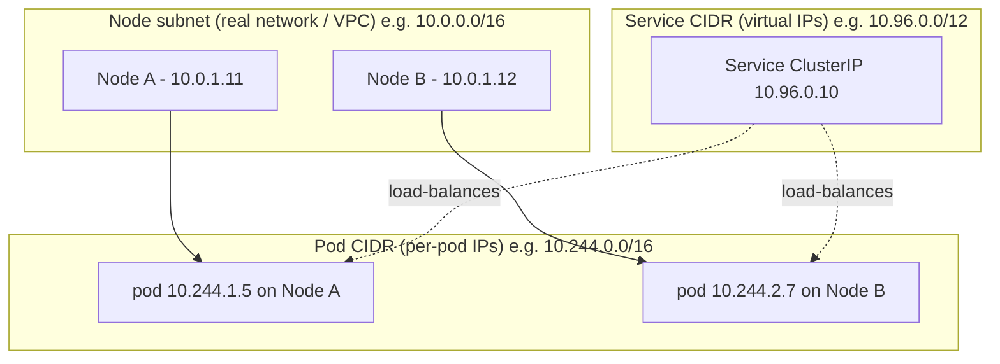
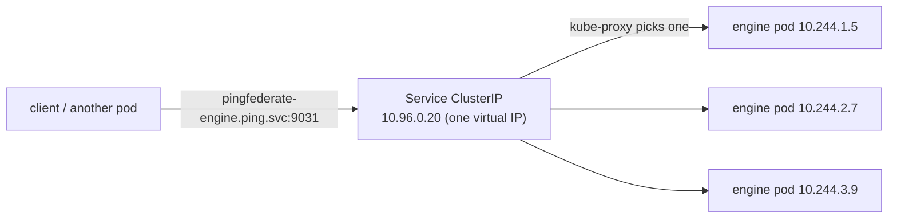
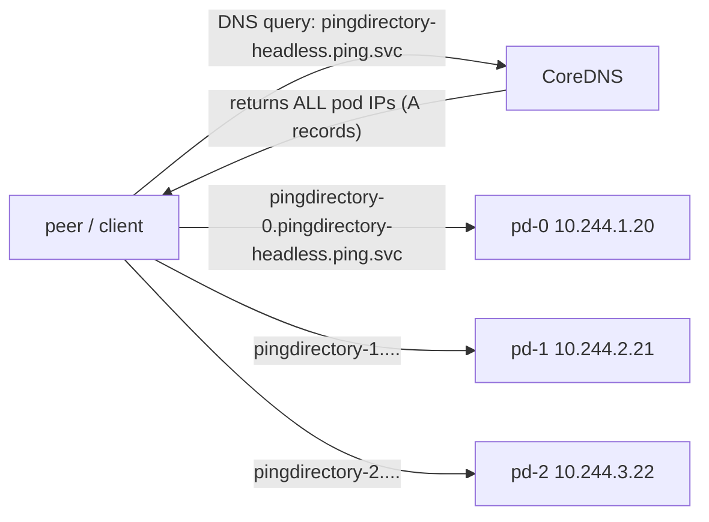
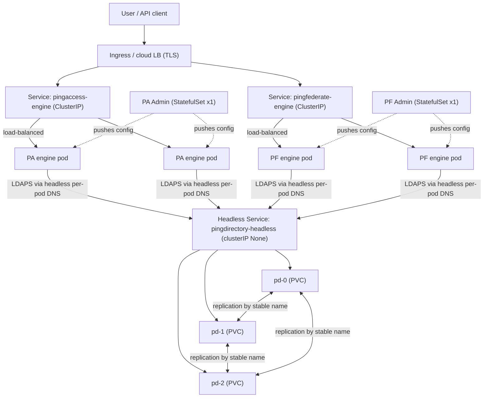
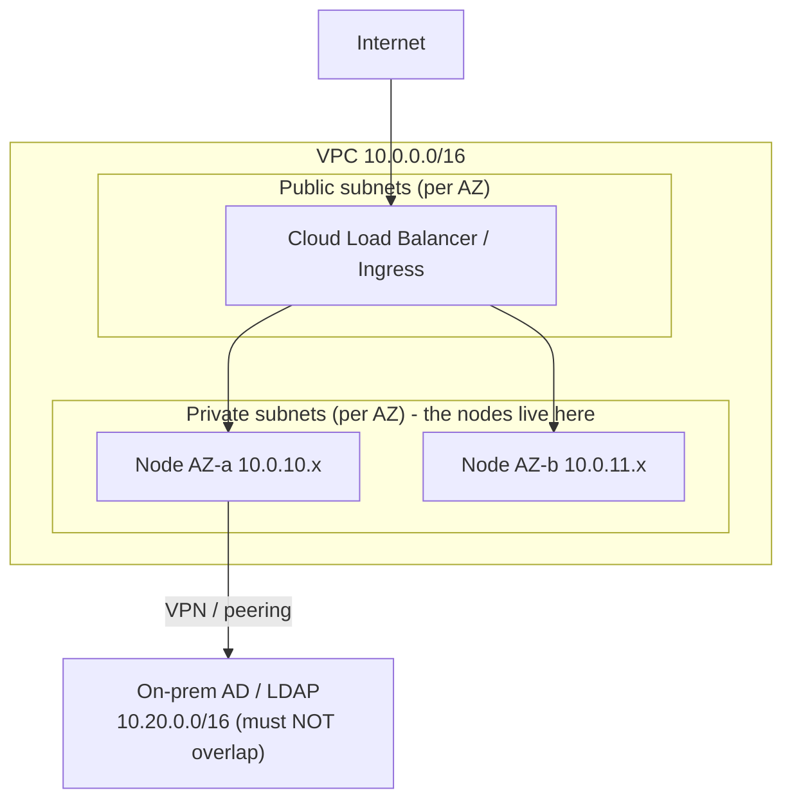
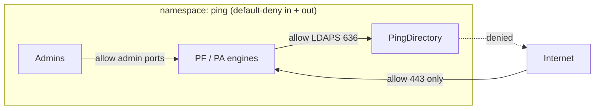

# Subnets & Kubernetes networking — for the Ping stack (and IAM)

> **Janus + Lefler note ⭐⚙️.** Farhaan asked: *"give me everything I need on subnets and networking, in the context of K8s and IAM — and align it to how we run the **Ping stack** on Kubernetes."* He also brought two specific beliefs to check:
>
> 1. *"Ping stack apps have pods, and each can be reached via the service for that node — is that correct?"*
> 2. *"For data-store apps like **PingDirectory**, each pod can have a service to reach, to maintain data consistency."*
>
> **Short answers up front (details in §7):** claim **#1 needs a tweak** — it's **one Service load-balancing across many pods of an app**, *not* "a service per node." Claim **#2 is essentially right** — PingDirectory is a **StatefulSet behind a *headless* Service** that gives **each pod its own stable DNS name**, which is exactly what replication/consistency needs.
>
> **Prereqs:** the [Kubernetes reference](27-kubernetes-complete-reference.md) (§4 networking especially) and the [Docker reference](26-docker-complete-reference.md). **Level:** medium → advanced.

---

## TL;DR (read this first)

- A **subnet** is just "a block of IP addresses" written in **CIDR** like `10.0.1.0/24`. The `/24` says how many bits are fixed (the network) vs free (the hosts). Bigger the `/number`, **smaller** the block.
- A Kubernetes cluster juggles **three separate IP worlds** that must not overlap: the **Node subnet** (real VMs), the **Pod CIDR** (every pod's IP), and the **Service CIDR** (the *virtual* IPs of Services).
- A **Service** is a **stable front door** for a set of pods. Two kinds matter here:
  - **ClusterIP** (normal) — one virtual IP that **load-balances** across all matching pods. This is how your **stateless Ping engines** (PingFederate, PingAccess) are reached. *One Service → many pods.*
  - **Headless** (`clusterIP: None`) — **no** virtual IP; DNS returns **each pod's own IP**, and with a **StatefulSet** each pod gets a **stable name** (`pingdirectory-0`, `-1`, `-2`). This is how **PingDirectory** replicates and stays consistent.
- **Rule of thumb:** *stateless + interchangeable → load-balanced ClusterIP; stateful + must-address-each-peer → headless + StatefulSet.*
- **For IAM/fintech**, the network layer is a **segmentation control**: `NetworkPolicy` default-deny + explicit allows is how you keep the CDE (cardholder-data) and directory tiers isolated — the same least-privilege thinking you apply to identities, applied to traffic.

---

## 1. Subnet fundamentals (from scratch — CIDR, masks, host math)

You can't reason about K8s networking without being comfortable with **CIDR**. Two minutes here pays off everywhere.

### 1.1 What an IP + subnet actually is

An IPv4 address is **32 bits**, written as four 8-bit numbers: `10.0.1.37`. A **subnet** splits that 32 bits into a **network part** (fixed — "which neighbourhood") and a **host part** (free — "which house").

**CIDR notation** `10.0.1.0/24` means *"the first **24** bits are the network; the remaining **8** are hosts."*

```
10 . 0 . 1 . 0    /24
└───network (24 bits)──┘ └host (8 bits)┘
```

- **Hosts in the block** = 2^(32 − prefix) − 2 (minus the network address and the broadcast address).
- `/24` → 2^8 = 256 addresses → **254 usable**. `/16` → 65,534 usable. `/28` → 14 usable.

**The one rule to memorise ★:** a **bigger prefix number = a smaller block.** `/24` is small (a room), `/16` is large (a building), `/8` is huge (a city). Every "we ran out of pod IPs" incident is someone who picked a prefix that was too big a number (too small a block).

| CIDR | Addresses | Usable hosts | Feels like |
|---|---|---|---|
| `/30` | 4 | 2 | a point-to-point link |
| `/28` | 16 | 14 | a tiny service block |
| `/24` | 256 | 254 | one node's pods (common) |
| `/20` | 4,096 | 4,094 | a mid VPC subnet |
| `/16` | 65,536 | 65,534 | a whole cluster's pod range |

### 1.2 Private ranges (RFC 1918)

Internal networks use these reserved, non-internet-routable blocks — you'll see them everywhere in clusters:

- `10.0.0.0/8` (10.x.x.x) — the big one, common for pods/services/VPCs
- `172.16.0.0/12` (172.16–31.x.x) — Docker's default bridge lives here (`172.17.0.0/16`)
- `192.168.0.0/16` — home/lab networks

**Why you care:** if your **Pod CIDR** or **Service CIDR** overlaps your **corporate/on-prem** `10.x` range, routing to on-prem LDAP/AD or a partner breaks in confusing ways. Overlap is the #1 cluster-networking design mistake — and in IAM you're *always* routing to identity sources off-cluster.

---

## 2. The three IP worlds of a Kubernetes cluster

This is the mental model everything else hangs on. A cluster has **three independent IP ranges that must never overlap**:



| IP world | What lives here | Real or virtual? | Example |
|---|---|---|---|
| **Node subnet** | the actual VMs/hosts (the cloud **VPC subnet**) | **real** NICs | `10.0.1.11` |
| **Pod CIDR** | every pod's IP (one per pod) | **real** (routable inside the cluster) | `10.244.1.5` |
| **Service CIDR** | **ClusterIP** virtual addresses | **virtual** (no NIC owns it) | `10.96.0.10` |

**The key insight most people miss ★:** a **Service ClusterIP is not a real interface anywhere.** No machine answers `10.96.0.10`. It's a **rule** that `kube-proxy` (iptables/IPVS/eBPF) programs on every node: *"packets to 10.96.0.10 → pick a healthy backing pod IP and rewrite the destination."* That's why a Service survives even though the pods behind it come and go with new Pod-CIDR IPs.

---

## 3. How a pod actually gets its IP (node CIDR + CNI)

You picked one big **Pod CIDR** (say `10.244.0.0/16`) at cluster build. Kubernetes then **slices it per node**:

- The **node IPAM controller** carves the Pod CIDR into per-node chunks using the **node CIDR mask** (e.g. `/24`). So **Node A gets `10.244.1.0/24`**, **Node B gets `10.244.2.0/24`**, etc. — 254 pods per node.
- The **CNI plugin** (Calico, Cilium, cloud CNI) hands each new pod an IP from *its node's* chunk and wires up the virtual interface + routes.
- The four rules from the [K8s reference §4](27-kubernetes-complete-reference.md) hold: every pod gets a unique IP, and any pod can reach any pod **without NAT**.

**The sizing trap (real, and it bites fintech clusters) ⚠:** with a `/16` pod CIDR and `/24` per node, you cap at **256 nodes** and **254 pods/node**. Cloud CNIs that draw pod IPs **directly from the VPC subnet** (e.g. AWS VPC-CNI, Azure CNI pod-subnet) exhaust *VPC* IPs fast — a busy Ping cluster with many short-lived engine pods can starve the subnet. **Plan the Pod CIDR for peak pods, not today's.** See §10.

---

## 4. Services, properly — ClusterIP vs Headless (the heart of your question)

A **Service** gives a stable way to reach pods that are otherwise mortal (new IP on every restart). *How* it does that splits into two modes — and this split **is** the answer to your Ping question.

### 4.1 ClusterIP (normal) — one virtual IP, load-balanced



- **One** stable DNS name + **one** virtual IP.
- Every call is **load-balanced** to *some* healthy pod — the caller doesn't know or care which.
- Perfect for **stateless, interchangeable** replicas. **This is your PingFederate / PingAccess engines.**

### 4.2 Headless (`clusterIP: None`) — no virtual IP, per-pod DNS



- **No** virtual IP, **no** load-balancing. DNS returns the **actual pod IPs**.
- Paired with a **StatefulSet**, each pod gets a **stable, ordinal DNS name**:
  `pingdirectory-0.pingdirectory-headless.ping.svc.cluster.local` → always pod `pd-0`, even after a restart/reschedule.
- Perfect for **stateful peers that must address each other directly** — replication, quorum, sharding. **This is your PingDirectory.**

| | **ClusterIP (load-balanced)** | **Headless (`clusterIP: None`)** |
|---|---|---|
| Virtual IP? | **Yes**, one | **No** |
| DNS returns | the one virtual IP | **every** pod's real IP (+ per-pod names with a StatefulSet) |
| Traffic | **load-balanced** to any pod | **you pick** the exact pod by name |
| Pods are | interchangeable **cattle** | uniquely-identified **pets** |
| Ping fit | **PingFederate / PingAccess engines** | **PingDirectory** (replication) |

---

## 5. DNS — the naming that ties it together

Kubernetes runs **CoreDNS**. Every Service gets a name; the shape depends on the type.

- **Normal Service FQDN:** `‹service›.‹namespace›.svc.cluster.local` → resolves to the **ClusterIP**.
  - e.g. `pingfederate-engine.ping.svc.cluster.local` → `10.96.0.20`.
- **Headless per-pod FQDN:** `‹pod›.‹headless-service›.‹namespace›.svc.cluster.local` → resolves to **that pod's IP**.
  - e.g. `pingdirectory-0.pingdirectory-headless.ping.svc.cluster.local` → `10.244.1.20`.
- **Short names work within the same namespace** (`pingfederate-engine`), because the pod's `resolv.conf` search list appends `‹ns›.svc.cluster.local`. Cross-namespace needs at least `‹service›.‹namespace›`.

**Gotcha ⚠:** a Service that *resolves* but *refuses connections* almost always means **zero endpoints** — a **label-selector mismatch** or all pods failing readiness — **not** a DNS problem. `kubectl get endpointslices` is your truth check (this is a recurring incident from the [question bank](28-docker-kubernetes-question-bank.md) QE.6).

---

## 6. Your Ping stack on Kubernetes — mapped end to end

Now the payoff: your two claims, corrected and confirmed, then the whole stack in one picture.

### 6.1 Claim #1, checked — "each pod reached via the service **for that node**"

**Close, but the framing is off.** The Service is **per app (workload), not per node.** For a **stateless Ping engine** you run **N pods** (spread across nodes), and **one ClusterIP Service** sits in front and **load-balances across all of them**. The caller uses **one** name (`pingaccess-engine.ping.svc`) and lands on *some* healthy pod — possibly on a different node each time.

- ✅ Right: "each app has pods, reached through a Service."
- ❌ To fix: it's **not** "the service for that node." Nodes don't get their own app Services. It's **one Service → many pods of that app**, load-balanced. (A pod's *node* is an implementation detail the Service hides.)

> **Why it's designed this way:** stateless engines are **cattle** — any replica can serve any request (they validate tokens, enforce policy, terminate sessions statelessly, pulling shared state from PingDirectory/DB). So you *want* a single load-balanced door. If you addressed a specific node's pod, you'd lose the resilience the whole exercise is for.

### 6.2 The admin nodes — single-writer, so not load-balanced

One nuance worth knowing: the **admin consoles** (PingFederate Admin, PingAccess Admin) are **single-writer** — you don't horizontally scale them like engines. They're deployed as **StatefulSets with 1 replica** (stable identity + persistent config), each with its own Service. Engines pull their config from the admin, then serve traffic independently. So the stack is a mix: **admin = 1 stable pet, engines = many cattle behind a load-balanced Service.**

### 6.3 Claim #2, confirmed — "PingDirectory: each pod a service to reach, for consistency"

**Yes — essentially correct, with the precise mechanism worth nailing.** PingDirectory is a **StatefulSet** behind a **headless Service**. That combination gives **each directory pod a stable DNS name** (`pingdirectory-0…-1…-2`). PingDirectory **replication requires every instance to reach every other instance by a stable hostname** — the ordinal name must survive restarts, and all peers must be individually addressable. A load-balanced ClusterIP would be *wrong* here: replication can't "reach a random pod," it must reach **pd-1 specifically**.

- ✅ Right: each PingDirectory pod is **individually addressable** to maintain data consistency/replication.
- 🔧 Precision: it's usually **one headless Service** that yields **per-pod DNS names** (not a separate Service object per pod). You *may* additionally add per-pod Services for **external/LDAPS ingress**, but the internal replication mesh runs on the headless per-pod names.

> **Why it's designed this way:** a directory is **stateful and consistency-critical** — each replica holds data and gossips changes to named peers. Stable identity (`pd-0` is always `pd-0`, with the same PersistentVolume) is what lets replication re-converge after a pod restarts. That's the textbook **StatefulSet + headless** pattern, and PingDirectory is a poster child for it.

### 6.4 The whole stack, one diagram



**Read it as three tiers:** load-balanced **stateless engines** (ClusterIP), **single-writer admins** (1-replica StatefulSet), and a **replicated directory** (StatefulSet + headless per-pod DNS). Traffic ingresses through a LoadBalancer/Ingress with TLS; engines reach the directory over **LDAPS** using its per-pod names.

---

## 7. Where cloud subnets (VPC) come in

Everything above is *inside* the cluster. The **Node subnet** lives in a cloud **VPC**, typically split into **public** and **private** subnets across availability zones:



- **Nodes sit in private subnets** (no public IPs); only the **load balancer** is public. A `Service type=LoadBalancer` or an **Ingress** provisions that public entry and forwards to node ports → Services → pods.
- **Spread nodes across ≥2 AZs** (each AZ = its own subnet) so a zone failure doesn't take the whole Ping stack — pair with pod **anti-affinity/topology spread** (K8s ref §6).
- **The overlap rule returns:** your VPC/pod/service CIDRs must not collide with **on-prem AD/LDAP** ranges you reach over VPN/peering — or IAM traffic to your identity sources breaks. This is the concrete reason an IAM engineer must care about CIDR planning.

---

## 8. NetworkPolicy — segmentation is an IAM control

By default **any pod can talk to any pod** cluster-wide (K8s ref §9.3). For a fintech Ping stack that's unacceptable — the **directory tier** holds identity data and belongs behind a wall. Apply **default-deny**, then explicit allows:



- **Directory pods:** allow **inbound LDAPS only from the engine pods** (by label), allow **inbound replication from sibling directory pods**, **deny everything else** — and deny **egress to the internet** entirely (a directory should never phone home).
- **Engines:** allow inbound `443` from the ingress, egress to the directory's LDAPS, nothing lateral.

This is **micro-segmentation** — the traffic-layer twin of least-privilege identity. It's how you evidence **PCI-DSS network separation** for the tier holding credentials (ties to [`09-pci-dss-and-iam.md`](09-pci-dss-and-iam.md)). Needs a policy-capable CNI (Calico/Cilium); a plain overlay won't enforce it (question-bank QS.2).

---

## 9. IP planning & exhaustion (don't skip — it causes outages)

Three ranges, sized for **peak**, **non-overlapping**:

| Range | Size for | Typical | Watch out |
|---|---|---|---|
| **Node subnet (VPC)** | max nodes **+ headroom** | `/20`–`/22` per AZ | cloud CNIs also draw **pod** IPs here → exhausts fast |
| **Pod CIDR** | peak **pods** (nodes × pods/node) | `/16` cluster, `/24` per node | `/16` + `/24`-per-node caps at 256 nodes |
| **Service CIDR** | total **Services** ever | `/16` (default `10.96.0.0/12`) | rarely the bottleneck, but can't overlap the others |

**The exhaustion story that pages people ⚠:** Ping **engine** pods can be numerous and churny (autoscaling, rolling deploys spin up surge pods). With a VPC-IP-per-pod CNI, a rolling update can momentarily **double** pod count and **drain the subnet**, so *new pods can't get an IP* → `Pending` / failed scheduling. Mitigations: size the pod range generously up front (you usually **can't grow it in place**), use **prefix delegation**, or an **overlay** CNI that keeps pod IPs off the VPC subnet.

---

## 10. See it yourself (empirical checks, Law 12)

Run these against any cluster (your lab, or read-only against a Ping cluster):

```bash
# The three IP worlds
kubectl get nodes -o wide                      # Node subnet: real node IPs
kubectl get pods -A -o wide                     # Pod CIDR: each pod's IP + its node
kubectl get svc -A                              # Service CIDR: CLUSTER-IP column (or None = headless!)

# Prove ClusterIP vs Headless
kubectl get svc pingfederate-engine -n ping     # has a CLUSTER-IP (load-balanced)
kubectl get svc pingdirectory-headless -n ping  # CLUSTER-IP shows "None"  <-- headless

# Per-pod DNS for the StatefulSet (the consistency mechanism)
kubectl run tmp --rm -it --image=busybox -n ping -- \
  nslookup pingdirectory-0.pingdirectory-headless.ping.svc.cluster.local
# -> resolves to pd-0's exact pod IP

# Who actually backs a Service? (the "resolves but refused" truth check)
kubectl get endpointslices -n ping | grep pingfederate

# What CIDRs is the cluster using?
kubectl cluster-info dump | grep -m2 -E "cluster-cidr|service-cluster-ip-range"
kubectl get node <node> -o jsonpath='{.spec.podCIDR}'   # this node's pod chunk
```

✅ **Checkpoints:** the engine Service shows a real **CLUSTER-IP**; the directory headless Service shows **None**; and `pingdirectory-0.…` resolves to a **single, specific** pod IP. That last one *is* claim #2 working in front of you.

---

## 11. Glossary

| Term | Meaning |
|---|---|
| **CIDR** | `a.b.c.d/prefix` — block of IPs; bigger prefix = smaller block |
| **Subnet mask** | the "how many network bits" (e.g. `/24` = `255.255.255.0`) |
| **Node subnet** | the real VPC network the K8s nodes sit on |
| **Pod CIDR** | range all pod IPs come from (sliced per node) |
| **Service CIDR** | range of **virtual** ClusterIP addresses |
| **ClusterIP** | a Service's virtual IP; load-balances to matching pods |
| **Headless Service** | `clusterIP: None`; DNS returns pod IPs directly (per-pod names with a StatefulSet) |
| **StatefulSet** | controller giving pods **stable ordinal identity + own PVC** |
| **EndpointSlice** | the live list of healthy pod IPs behind a Service |
| **CoreDNS** | the cluster DNS server resolving Service/pod names |
| **NetworkPolicy** | firewall rules between pods (needs Calico/Cilium) |
| **VPC / AZ** | cloud virtual network / availability zone (a failure domain = its own subnet) |

---

## What you learned

- **Subnets are CIDR blocks**; a cluster runs **three non-overlapping IP worlds** — **Node subnet** (real), **Pod CIDR** (real, per-pod), **Service CIDR** (virtual ClusterIPs).
- A **Service is a stable front door**: **ClusterIP** load-balances across interchangeable pods; **headless** exposes each pod directly and, with a **StatefulSet**, gives stable per-pod DNS names.
- **Your Ping stack maps cleanly:** stateless **engines → ClusterIP (load-balanced)** — so claim #1 is "one Service across many pods," *not* per-node; **admins → single-writer StatefulSets**; **PingDirectory → StatefulSet + headless per-pod DNS** — so claim #2 is right: each pod is individually addressable for replication/consistency.
- **CIDR planning and NetworkPolicy are IAM concerns:** avoid overlap with on-prem AD/LDAP, size pod ranges for peak, and **default-deny + segment** the directory tier as a PCI-grade control.

## Next

- **Tie-backs:** [Kubernetes reference](27-kubernetes-complete-reference.md) (§4 networking, §5 storage, §9 security) · [Docker reference](26-docker-complete-reference.md) (§6 networking) · [question bank](28-docker-kubernetes-question-bank.md) (QE.6 DNS, QS.2 segmentation) · [PCI-DSS & IAM](09-pci-dss-and-iam.md) (segmentation evidence) · [LDAP/AD/Entra](04-ldap-ad-entra.md) (what PingDirectory speaks).
- **Hands-on:** run the §10 checks against your lab; then map your real FinCo Ping topology onto the §6.4 diagram — label which Services are ClusterIP vs headless, and write the default-deny NetworkPolicy for the directory tier.

---

### Sources & further reading

- [Ping Identity DevOps — Kubernetes basics](https://developer.pingidentity.com/devops/reference/k8sBasics.html) · [Deploy PingDirectory across multiple Kubernetes clusters](https://developer.pingidentity.com/devops/deployment/deployPDMultiRegion.html) · [Ping Helm charts — workload config](https://helm.pingidentity.com/config/workload/)
- [Kubernetes headless Services for StatefulSet discovery](https://oneuptime.com/blog/post/2026-02-20-kubernetes-headless-services/view) · [What is a headless Service (plural.sh)](https://www.plural.sh/blog/what-is-headless-service/)
- [Subnetting for Kubernetes — sizing Pod, Service & Node CIDRs](https://www.techwrix.com/subnetting-for-kubernetes-how-to-size-pod-service-and-node-cidrs-and-never-run-out-of-ips/) · [Configure pod network CIDR per node](https://oneuptime.com/blog/post/2026-02-09-pod-network-cidr-per-node/view)
- [Azure CNI pod-subnet networking concepts](https://learn.microsoft.com/en-us/azure/aks/concepts-network-azure-cni-pod-subnet) · [Alibaba Cloud — details of the Kubernetes cluster network](https://www.alibabacloud.com/blog/from-confused-to-proficient-details-of-the-kubernetes-cluster-network_595656)

*Curated with Janus ⭐ and Lefler ⚙️ — beginner-first, derive-the-why, tied to the Ping stack at FinCo.*
