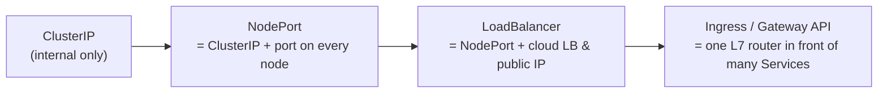
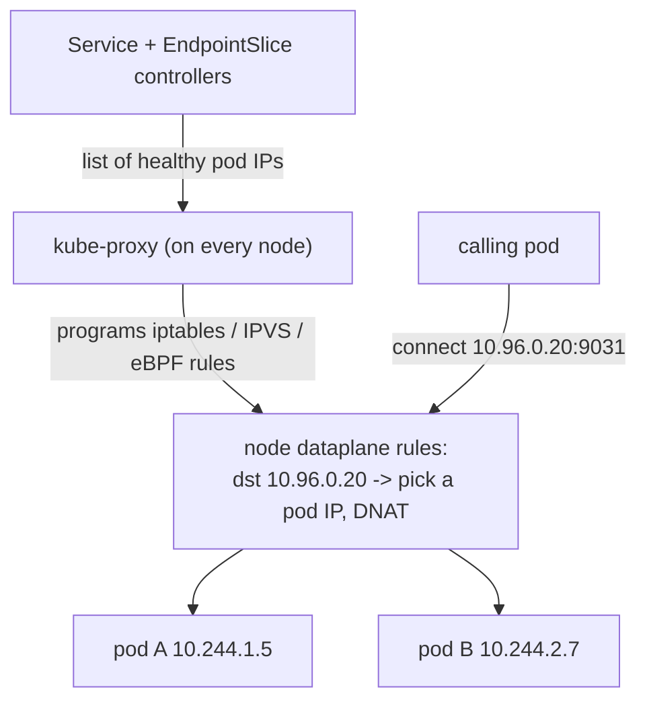
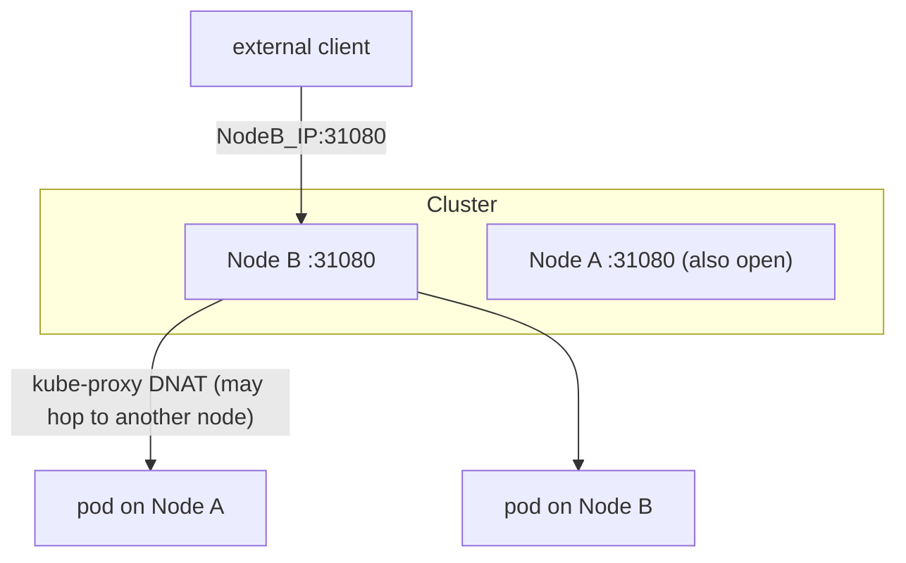
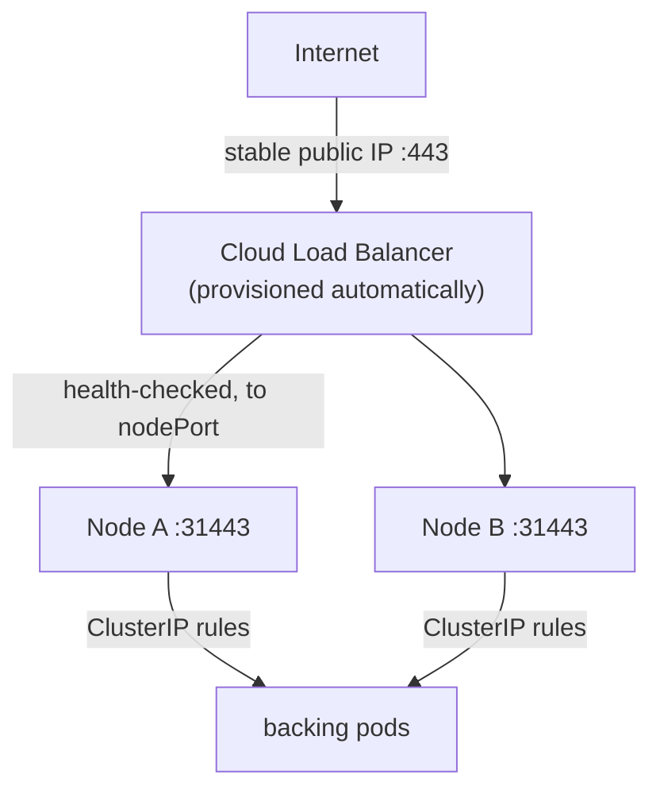
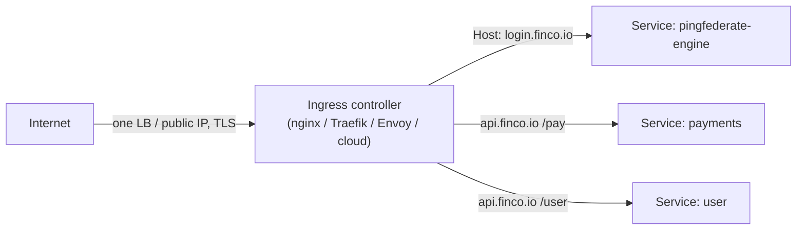
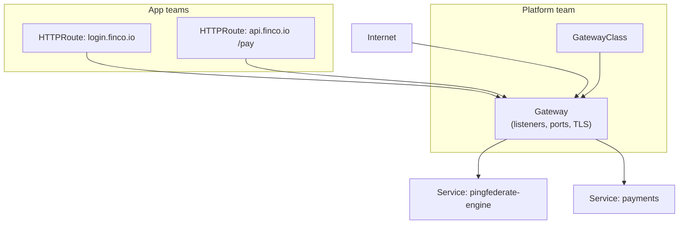

# Kubernetes Services & Ingress — the complete deep dive

> **Janus + Lefler note ⭐⚙️.** Farhaan wanted a **complete read** on the three Service types — **ClusterIP, NodePort, LoadBalancer** — **plus Ingress**. Notes [27](27-kubernetes-complete-reference.md) and [30](30-subnets-and-k8s-networking-for-ping.md) introduced them; **this note goes deep**: how each works under the hood, exactly what problem it solves, when to use it, its traps, and how they **stack on top of each other**. Ends on **Ingress** (and its successor, the **Gateway API**) with a security callout that matters for fintech.
>
> **Prereqs:** [K8s reference §4](27-kubernetes-complete-reference.md) and [subnets & networking note](30-subnets-and-k8s-networking-for-ping.md) (the three IP worlds, ClusterIP vs headless). **Level:** medium → advanced.

---

## TL;DR (read this first)

- The four ways to reach pods form a **ladder — each rung builds on the one below**:
  **ClusterIP** (inside-only) → **NodePort** (opens a port on every node) → **LoadBalancer** (puts a cloud LB in front of that) → **Ingress** (one smart L7 router in front of many Services).
- **ClusterIP** = a stable **virtual IP + DNS name** that **load-balances inside the cluster**. The default. Everything else is built on it.
- **NodePort** = ClusterIP **plus** a high port (`30000–32767`) opened on **every node's real IP**. Crude external access; the building block clouds use.
- **LoadBalancer** = NodePort **plus** an **external cloud load balancer** with its own public IP, auto-provisioned. Production external access — but **one LB (and bill) per Service**.
- **Ingress** = **one** entry point that does **L7 HTTP routing** (by host/path), **TLS termination**, and fan-out to **many** Services — so you don't buy an LB per app. It's a **resource + a controller** you must install.
- **2026 reality ⚠:** the Ingress *API* is **feature-frozen** (stable, not going away), the popular **`ingress-nginx` controller hit End-of-Life on 2026-03-24 (no more CVE patches)**, and the **Gateway API** is the **GA successor**. For a new fintech build, plan on **Gateway API**.



---

## 1. First principles — why four different things exist

Each type exists because the previous one **couldn't do one specific job.** Follow the ladder and you'll never confuse them again.

1. **Pods are mortal and get new IPs.** So you need a **stable indirection** → **ClusterIP**. But it's reachable **only inside** the cluster.
2. **Something outside the cluster needs in** (a test client, an on-prem LB). ClusterIP can't help → **NodePort** opens a real, reachable port on every node. But it's ugly: weird high ports, node IPs that change, no health-aware front door.
3. **You want a real, stable, production public endpoint.** NodePort alone is too raw → **LoadBalancer** puts a managed cloud LB with a fixed public IP in front. But it's **L4 (TCP/UDP)** and you get **one LB per Service** — expensive and dumb about HTTP.
4. **You have many HTTP apps and want one entry, path/host routing, and TLS in one place** → **Ingress** (L7). One LB, many apps, smart routing.

**The mental model to keep ★:** *ClusterIP is the foundation; NodePort and LoadBalancer are progressively bigger "doors" to it; Ingress is a smart receptionist standing in front of many doors.*

---

## 2. ClusterIP — the foundation (internal, load-balanced)

**What it is:** a **stable virtual IP** (from the Service CIDR) + a **DNS name**, that **load-balances across the matching pods**. Reachable **only from inside the cluster**. It's the **default** Service type.

### 2.1 How it actually works (under the hood)

There is **no process** listening on a ClusterIP — it's not a real interface (see [note 30 §2](30-subnets-and-k8s-networking-for-ping.md)). It's a set of **rules** that **kube-proxy** programs on **every node**:



1. You define a Service with a **label selector**.
2. The **EndpointSlice controller** keeps a live list of **healthy** (ready) pod IPs matching that selector.
3. **kube-proxy** turns that list into dataplane rules (**iptables** or **IPVS**, or **eBPF** with Cilium replacing kube-proxy).
4. A packet to the ClusterIP is **DNAT'd** (destination rewritten) to one chosen pod IP. Load-balancing is basically **random/round-robin** per connection.

**Consequence ★:** because it's rules on every node keyed to a live endpoint list, the Service "just works" as pods come and go — and if **no pod is ready, there are zero endpoints** and the connection is refused (the classic "resolves but refused" — a **label mismatch or failed readiness**, not DNS).

### 2.2 Things worth knowing

- **Multi-port:** one Service can expose several named ports (e.g. `https` 443 and `admin` 9999).
- **Session affinity:** `sessionAffinity: ClientIP` pins a client to the same pod (crude stickiness; prefer stateless apps + shared session store — your Ping engines do this).
- **Headless variant** (`clusterIP: None`): **no** virtual IP; DNS returns pod IPs directly — for StatefulSets that need per-pod addressing (PingDirectory; [note 30 §4.2](30-subnets-and-k8s-networking-for-ping.md)).
- **`ExternalName`:** a special Service that's **just a DNS CNAME** to an external host (e.g. `ldap.corp.example`) — no proxying, no selector. Handy to give an **off-cluster on-prem AD/LDAP** a stable in-cluster name.

**Use it for:** all **east-west** traffic — service-to-service, engines → directory, app → cache/DB. **90% of your Services are ClusterIP.**

---

## 3. NodePort — the crude external door

**What it is:** a **ClusterIP** (still created!) **plus** a **static high port** opened on **every node's real IP**, in the range **`30000–32767`**. Hit `‹any-node-IP›:‹nodePort›` from outside and traffic is forwarded to the Service's pods.

### 3.1 How it works



- kube-proxy opens the **same nodePort on every node** and wires it to the ClusterIP rules underneath. So you can hit **any** node, even one **not** running a backing pod — kube-proxy will **forward** to a node that is.
- Underneath, it's still the ClusterIP machinery — NodePort just adds the "reachable from the node's real NIC" layer.

### 3.2 Traps (this is where NodePort bites)

- **Ugly & unstable:** clients must know node IPs and a weird port; nodes come and go (autoscaling), so you need something stable in front anyway.
- **Source-IP loss (important ⚠):** by default (`externalTrafficPolicy: Cluster`) a node that receives the packet may **forward to a pod on another node**, applying **SNAT** — so the pod sees the **node's IP, not the real client IP**. That breaks IP allowlists, geo, and audit logging — a real problem for fintech access controls. Fix: **`externalTrafficPolicy: Local`** keeps traffic on the receiving node (no SNAT → real client IP preserved) — but **drops** traffic if that node has **no local pod**, so you need pods spread + LB health checks. (Full treatment in §7.)
- **Port range friction:** `30000–32767` only; you can't serve `:443` directly.

**Use it for:** quick demos, on-prem where an **external LB** (F5, etc.) points at nodePorts, bare-metal building block, or a debug entry. **Rarely the final answer** for production apps — it's the plumbing that LoadBalancer and (often) Ingress sit on.

---

## 4. LoadBalancer — the production external door

**What it is:** a **NodePort** (still created underneath) **plus** an **external load balancer** — with its **own stable public IP** — **auto-provisioned by your cloud**. This is the standard way to expose a Service to the internet on a managed cloud.

### 4.1 How it works



1. You create `type: LoadBalancer`. The **cloud-controller-manager** calls the cloud API and provisions an **ELB/NLB (AWS), a forwarding rule (GCP), or an Azure LB**.
2. The cloud LB gets a **public IP** and **health-checks the nodes**, forwarding to the **nodePort** underneath → ClusterIP → pods.
3. On **bare metal** there's no cloud to call — use **MetalLB** (or **kube-vip**) to hand out real IPs from a pool.

### 4.2 Nuances & traps

- **One LB per Service = cost & sprawl.** Ten internet-facing Services = ten cloud LBs and ten bills. This is the pain **Ingress** removes.
- **It's L4** — it moves TCP/UDP, it doesn't understand HTTP host/paths, can't route `/login` vs `/api`, and TLS is either passthrough or handled by the LB with limited smarts.
- **Annotations are the control surface:** cloud-specific behavior (internal vs internet-facing, NLB vs ALB, SSL policy, allowlists) is set via `metadata.annotations` — read your provider's docs; it's not portable.
- **Source IP:** same `externalTrafficPolicy` story as NodePort (§7).

**Use it for:** a single production external endpoint, or — most commonly — **the one LB that sits in front of your Ingress controller** (so all HTTP apps share it).

---

## 5. The ladder, in one comparison

| | **ClusterIP** | **NodePort** | **LoadBalancer** |
|---|---|---|---|
| Reachable from | inside cluster only | outside via `node:port` | outside via public IP |
| Adds on top of | — | ClusterIP | NodePort |
| OSI layer | L4 | L4 | L4 |
| External IP | none | node IPs | **dedicated public IP** |
| Port | any | `30000–32767` | any (LB frontend) |
| Cost | free | free | **one cloud LB each** |
| Typical use | east-west, the default | debug / on-prem building block | prod endpoint / front the Ingress |
| Source client IP | n/a (internal) | lost by default (SNAT) | lost by default (SNAT) |

**One-liner to remember ★:** *ClusterIP is internal; NodePort exposes it on nodes; LoadBalancer fronts that with a cloud LB. All three are L4.* For smart **HTTP** you go up a layer → **Ingress**.

---

## 6. Ingress — one smart L7 router for many apps

### 6.1 The problem it solves

You have `login.finco.io`, `api.finco.io/pay`, `api.finco.io/user`. With LoadBalancer you'd buy **three** LBs and still couldn't route by **path**. **Ingress** gives you **one** entry point that inspects **HTTP** and routes by **host and path**, terminates **TLS** once, and fans out to the right **ClusterIP Service**.



### 6.2 The two-part model (the thing people miss ★)

Ingress is **two separate things**:

1. **The Ingress *resource*** — a YAML object with your **routing rules** (host/path → Service) and **TLS** config (a Secret holding the cert). It does **nothing by itself.**
2. **The Ingress *controller*** — a **pod actually running a reverse proxy** (NGINX, Traefik, HAProxy, Envoy, or a cloud one) that **watches** Ingress resources and **implements** them. **No controller installed → your Ingress does nothing.** This trips up everyone once.

You pick a controller per Ingress via **`IngressClass`** (e.g. `ingressClassName: nginx`), so multiple controllers can coexist.

### 6.3 What Ingress does for you

- **Host-based routing** (`login.finco.io` vs `api.finco.io`) and **path-based routing** (`/pay` vs `/user`).
- **TLS termination:** reference a Secret with the cert/key; the controller terminates HTTPS at the edge. Pair with **cert-manager** to auto-issue/renew (Let's Encrypt or an internal CA) — no more expired-cert outages.
- **One LB, many apps** — the controller sits behind a single `LoadBalancer` Service, so all HTTP apps share it. **This is the cost win.**
- **Middleware** (controller-specific, via **annotations**): rate limiting, auth, redirects, header rewrites, sticky sessions.

### 6.4 Limits & the annotation problem ⚠

- Ingress is **HTTP(S)-centric** (some controllers bolt on TCP/UDP, non-standard). For raw L4, you're back to LoadBalancer.
- Everything beyond basic host/path routing is done via **controller-specific annotations** — so an `ingress-nginx` config **doesn't port** to Traefik. This **annotation sprawl** is exactly what the Gateway API fixes (§8).

---

## 7. Deep nuance — source IP & `externalTrafficPolicy`

This bites real fintech deployments (IP allowlists, fraud geo, audit), so know it cold.

When external traffic enters via NodePort/LoadBalancer, **who does the pod think the client is?**

| Setting | Behaviour | Client IP seen by pod | Cost |
|---|---|---|---|
| **`Cluster`** (default) | any node accepts, may hop to a pod on another node → **SNAT** | **node IP** (real client IP **lost**) | even load spreading |
| **`Local`** | only forward to a pod **on the receiving node**, **no SNAT** | **real client IP preserved** | traffic **dropped** if node has no local pod |

- Choose **`Local`** when you need the **true client IP** (allowlists, geo, logging) — and ensure pods are **well spread** (DaemonSet or topology spread) and the LB **health-checks** so it only sends to nodes with pods.
- For HTTP behind an **Ingress/L7 LB**, the client IP is usually carried in the **`X-Forwarded-For`** header instead — so you read it there rather than from the socket.

**IAM relevance:** if a FinCo control says "admin console only from the corp IP range," a default `Cluster` policy silently makes **every** request look like it came from a node IP — your allowlist breaks or, worse, passes everything. This is a genuine audit-and-incident trap.

---

## 8. Ingress vs the Gateway API — the 2026 picture (read this before designing)

The ecosystem moved. Get this right for a new build:

- **The Ingress API is *feature-frozen*, not removed.** It's stable and keeps working, but **no new features** land in it — innovation moved to the Gateway API.
- **`ingress-nginx` reached End-of-Life on 2026-03-24.** The repo is **read-only: no bug fixes, and — critically for fintech — no more CVE patches.** Running it in production is now a **standing vulnerability-management finding.** Migrate off it (a controller like Traefik/HAProxy/Envoy Gateway/cloud, or Gateway API).
- **The Gateway API is GA and the successor** (v1.4 GA Oct 2025; v1.5 Feb 2026 promoting features to Stable; 20+ conformant controllers, incl. GA AWS/GKE controllers).

**Why the Gateway API exists — role separation (the key idea ★):** Ingress crammed infra concerns and app routing into one annotated object. Gateway API splits them into **role-oriented resources**:

| Gateway API resource | Owned by | Job |
|---|---|---|
| **GatewayClass** | platform/infra team | which implementation (like an IngressClass) |
| **Gateway** | cluster operator | the actual listener: ports, protocols, **TLS** |
| **HTTPRoute** (/TCPRoute/GRPCRoute) | app team | routing rules → Services |

So the **platform team owns the Gateway + TLS**, and **app teams own their Routes** — cleaner multi-tenancy, less annotation sprawl, portable across implementations, and richer routing (header/method/weight, traffic splitting for canaries) **without** vendor annotations. Tooling like **`ingress2gateway`** converts existing Ingress objects.



**Practical stance for FinCo:** keep existing Ingress running, but for **new** work adopt the **Gateway API**, and treat **migrating off `ingress-nginx`** as a security task, not a nice-to-have.

---

## 9. Decision guide — which do I use?

| I need to… | Use |
|---|---|
| Let pods talk to each other (engines → directory, app → DB) | **ClusterIP** |
| Give a StatefulSet per-pod addressing (PingDirectory replication) | **Headless** ClusterIP |
| Reference an off-cluster host (on-prem AD/LDAP) by a cluster name | **ExternalName** |
| Quick/dirty external access, or a building block for an on-prem LB | **NodePort** |
| A single production **non-HTTP** (raw TCP/UDP) public endpoint | **LoadBalancer** |
| Expose **many HTTP apps** behind one IP, with host/path routing + TLS | **Ingress** (or **Gateway API**) |
| Build **new** L7 routing in 2026 with clean role separation | **Gateway API** |

---

## 10. Mapping to your Ping stack

- **East-west everywhere** (PF/PA engines → PingDirectory over LDAPS, engine → DB/cache): **ClusterIP**. PingDirectory itself: **headless** ClusterIP for per-pod replication ([note 30 §6](30-subnets-and-k8s-networking-for-ping.md)).
- **On-prem AD/LDAP** the engines must reach: an **`ExternalName`** Service gives it a stable in-cluster name.
- **Public runtime endpoints** (`login.finco.io` for PingFederate/PingAccess): **one Ingress/Gateway** in front of the engine **ClusterIP** Services, terminating **TLS** (cert-manager), routing by host — not one LoadBalancer per app.
- **Admin consoles** (PF Admin, PA Admin): expose narrowly — often an **internal** LB or an Ingress restricted by IP/`externalTrafficPolicy: Local` so you can enforce "corp-network only," plus mTLS. This is where the source-IP nuance (§7) directly enforces an IAM control.
- **Security posture:** front everything with the L7 tier for TLS + WAF-style middleware, keep the directory tier internal-only (no LoadBalancer/Ingress on it), and get **off `ingress-nginx`**.

---

## 11. See it yourself (empirical checks, Law 12)

```bash
# See the type + external exposure of every Service
kubectl get svc -A            # TYPE column: ClusterIP / NodePort / LoadBalancer; EXTERNAL-IP
kubectl get svc mysvc -o yaml | grep -E "type:|nodePort:|clusterIP:|externalTrafficPolicy:"

# ClusterIP: reach it only from inside
kubectl run t --rm -it --image=busybox -- wget -qO- pingfederate-engine.ping.svc:9031/health

# NodePort: find the port, hit a node
kubectl get svc mysvc -o jsonpath='{.spec.ports[0].nodePort}{"\n"}'
# then: curl http://<any-node-ip>:<nodePort>

# LoadBalancer: watch the cloud assign a public IP
kubectl get svc mysvc -w     # EXTERNAL-IP goes <pending> -> a real IP

# Ingress: rules, class, and the controller behind it
kubectl get ingress -A
kubectl describe ingress login -n ping        # hosts, paths, TLS secret, backing Services
kubectl get ingressclass
kubectl get pods -n ingress-nginx             # the controller actually doing the work

# Who backs a Service? (the "resolves but refused" truth check)
kubectl get endpointslices -n ping | grep pingfederate
```

✅ **Checkpoints:** a ClusterIP Service has a `CLUSTER-IP` but **no** `EXTERNAL-IP`; a LoadBalancer eventually shows a real `EXTERNAL-IP`; an Ingress lists host/path rules and needs a **running controller** to work.

---

## 12. Glossary

| Term | Meaning |
|---|---|
| **ClusterIP** | virtual IP; load-balances to pods; internal only (the default) |
| **NodePort** | static port `30000–32767` on every node; adds external reach to a ClusterIP |
| **LoadBalancer** | cloud LB + public IP in front of a NodePort |
| **Ingress (resource)** | L7 HTTP routing/TLS rules — inert without a controller |
| **Ingress controller** | the reverse-proxy pod (nginx/Traefik/Envoy/cloud) that implements Ingress |
| **IngressClass** | selects which controller handles an Ingress |
| **Gateway API** | GA successor to Ingress: GatewayClass / Gateway / HTTPRoute (role-separated) |
| **externalTrafficPolicy** | `Cluster` (spread, SNAT, loses client IP) vs `Local` (preserves client IP) |
| **kube-proxy** | programs iptables/IPVS rules that make Services work |
| **cert-manager** | auto-issues/renews TLS certs for Ingress/Gateway |
| **ExternalName** | Service that's just a DNS CNAME to an external host |

---

## What you learned

- The four exposure options are a **ladder**: **ClusterIP** (internal, load-balanced, the foundation) → **NodePort** (a port on every node) → **LoadBalancer** (cloud LB + public IP) → **Ingress/Gateway** (one L7 router for many apps). NodePort and LoadBalancer are L4; Ingress/Gateway are L7.
- **ClusterIP** is rules kube-proxy programs against a live endpoint list; **NodePort/LoadBalancer** add external reach but **lose the client IP by default** (`externalTrafficPolicy: Local` fixes it, with a spread-pods caveat).
- **Ingress = resource + controller**; it gives host/path routing, TLS termination, and **one LB for many apps** — but its power lives in **controller-specific annotations**.
- **2026:** Ingress API is **frozen**, **`ingress-nginx` is EOL (no CVE patches — a security finding)**, and the **Gateway API is the GA, role-separated successor** — the right default for new builds.
- **For your Ping stack:** ClusterIP/headless east-west, ExternalName to on-prem LDAP, one Ingress/Gateway (TLS) in front of engines, admin consoles locked down with source-IP-aware policy.

## Next

- **Tie-backs:** [subnets & networking](30-subnets-and-k8s-networking-for-ping.md) (the IP worlds these ride on) · [K8s reference §4/§9](27-kubernetes-complete-reference.md) (Services, security) · [question bank](28-docker-kubernetes-question-bank.md) (Q2.4–2.5, QE.6 DNS) · [TLS/mTLS](06-tls-https-mtls.md) (edge termination + mesh) · [PCI-DSS & IAM](09-pci-dss-and-iam.md) (exposure = attack surface).
- **Hands-on:** in your lab, expose one app four ways in turn — ClusterIP, NodePort, LoadBalancer (MetalLB), then an Ingress with cert-manager TLS — and watch `kubectl get svc`/`get ingress` change. Then draft the Gateway API (`Gateway` + `HTTPRoute`) equivalent of the Ingress.

---

### Sources & further reading

- [Kubernetes docs — Service](https://kubernetes.io/docs/concepts/services-networking/service/) · [Sysdig — ClusterIP, NodePort, LoadBalancer](https://www.sysdig.com/blog/kubernetes-services-clusterip-nodeport-loadbalancer) · [Services explained (Jorijn)](https://jorijn.com/en/knowledge-base/kubernetes/networking/kubernetes-services-explained/)
- [externalTrafficPolicy Local to preserve source IP](https://oneuptime.com/blog/post/2026-02-09-external-traffic-policy-preserve-source-ip/view) · [Impact of externalTrafficPolicy](https://medium.com/@zghanem/understanding-the-impact-of-externaltrafficpolicy-on-kubernetes-services-4f4426cb1246)
- [Gateway API v1.4 (GA)](https://kubernetes.io/blog/2025/11/06/gateway-api-v1-4/) · [Gateway API v1.5 — features to Stable](https://kubernetes.io/blog/2026/04/21/gateway-api-v1-5/) · [Ingress vs Gateway API in 2026](https://oneuptime.com/blog/post/2026-02-20-kubernetes-ingress-vs-gateway-api/view)
- [ingress-nginx End-of-Life (2026) — migration](https://www.okteto.com/blog/ingress-nginx-controller-deprecation-your-migration-guide-to-kubernetes-gateway-api/) · [Datadog — migrate to Gateway API](https://www.datadoghq.com/blog/migrate-to-gateway-api/) · [Migrating from Ingress (official)](https://gateway-api.sigs.k8s.io/guides/getting-started/migrating-from-ingress/)

*Curated with Janus ⭐ and Lefler ⚙️ — beginner-first, derive-the-why, tied to the Ping stack at FinCo.*
