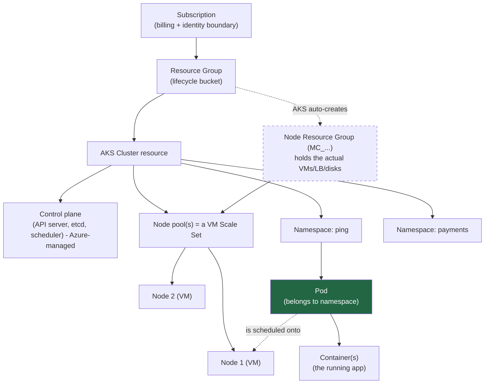
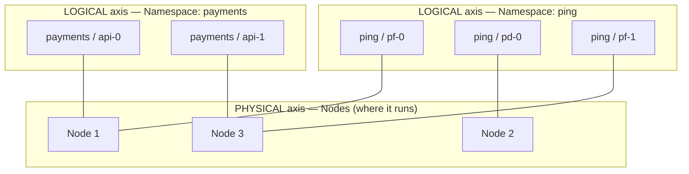
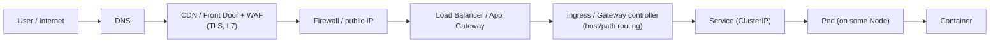
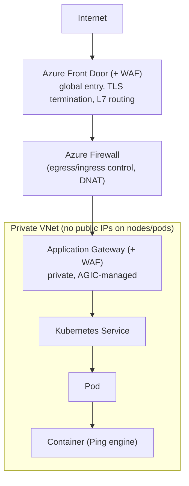

# From Subscription to Container — how it all nests, and how to reach each layer

> **Janus + Lefler note ⭐⚙️.** Farhaan asked: *"how do **Pod, Cluster, Node, Container, Resource Group, Subscription, Namespace** fit together — who's under whom, what's the significance, how do I reach each, and what sits between them and the internet?"*
>
> The single most important thing to get right: **this is not one clean tree — it's *two* hierarchies that cross at the Pod.** One is the **cloud/infrastructure** stack (who owns and bills the machines); the other is the **Kubernetes logical** stack (how workloads are organised). Miss that and it never quite makes sense. Get it and everything clicks.
>
> **Note on terms:** *Resource Group* and *Subscription* are **Azure** words — so this note frames the cloud layers as **Azure / AKS** (Ping-on-Azure is a common FinCo shape), with an **AWS/GCP equivalents** table so it transfers. **Prereqs:** [K8s reference](27-kubernetes-complete-reference.md), [subnets note](30-subnets-and-k8s-networking-for-ping.md), [Services & Ingress](31-kubernetes-services-and-ingress-deep-dive.md). **Level:** beginner-friendly → advanced.

---

## TL;DR (read this first)

- **Two axes, one meeting point.** The **infra axis** nests by *ownership of machines*: **Subscription → Resource Group → Cluster → Node pool → Node**. The **Kubernetes axis** nests by *logical grouping*: **Cluster → Namespace → Pod → Container**. They **meet at the Pod**: a Pod **belongs to a Namespace** (logical) *and* **runs on a Node** (physical).
- **Node vs Namespace are orthogonal.** A Node is "*which machine*"; a Namespace is "*which team/tier*". Pods of one Namespace scatter across many Nodes; one Node hosts Pods from many Namespaces. Neither is "under" the other.
- **Significance in one line each:** *Subscription* = billing + identity boundary · *Resource Group* = lifecycle bucket · *Cluster* = the Kubernetes system · *Node* = a worker VM · *Namespace* = a virtual sub-cluster for isolation/quota/RBAC · *Pod* = the smallest deployable unit · *Container* = the running app.
- **Reaching them splits into two planes.** The **management plane** (how you *administer* them): `az`/portal for Subscription→Cluster; `kubectl` (the API server) for Namespace→Container. The **data plane** (how *user traffic* arrives): **Internet → DNS → CDN/WAF → Firewall → Load Balancer → Ingress/Gateway → Service → Pod → Container.**
- **Between the workload and the internet** sits a whole edge stack (Front Door/CDN, WAF, Firewall, App Gateway/LB, Ingress controller, Service) — the workload itself is **private**; only the edge is public.

---

## 1. The big picture (both axes in one diagram)



Read it as: **Subscription → Resource Group → Cluster**, then the cluster forks into **the physical side** (node pool → nodes, living in the auto-created `MC_` resource group) and **the logical side** (namespaces → pods → containers). The green **Pod** is where the two sides meet — it *lives in* a namespace but *runs on* a node.

---

## 2. Layer by layer — what each is, what's under it, why it matters

Top (biggest) to bottom (smallest). For each: **what it is → what sits under it → significance → how you reach it** (reachability collected again in §4).

### 2.1 Subscription (Azure) — the billing & identity boundary

- **What:** the top-level container that **everything you deploy is billed to and governed under.** Tied to an **Entra ID (Azure AD) tenant** for identity, and the unit where **quotas, policies, and cost** apply. (Above it, optionally, are *Management Groups* grouping many subscriptions.)
- **Under it:** Resource Groups.
- **Significance:** the **blast-radius and access boundary at the cloud level.** FinCo typically separates **prod / non-prod** (and sometimes per-business-unit) into **different subscriptions** so billing, quota exhaustion, and a compromised credential don't cross between them. This is an IAM control — subscription-level RBAC decides who can even *see* the cluster.
- **Reach:** Azure Portal / `az account` / ARM API. Never on the data path — it's pure management plane.

### 2.2 Resource Group — the lifecycle bucket

- **What:** a **logical folder for related Azure resources** (the cluster, its public IPs, its managed identity) that **share a lifecycle** — delete the RG, delete everything in it.
- **Under it:** the resources — including your **AKS Cluster** object.
- **The AKS gotcha you must know ★:** an AKS deployment spans **two** resource groups. **You** create one (holds the *AKS cluster resource*). AKS **auto-creates a second**, the **node resource group** named `MC_<rg>_<cluster>_<region>`, holding the **real infrastructure** — the node **VM Scale Sets**, load balancers, disks. **AKS owns that `MC_` group; don't hand-edit it** (your changes get reverted, and it's deleted with the cluster).
- **Significance:** the unit of **grouped access control and teardown.** RBAC and Azure Policy are commonly scoped here.
- **Reach:** `az group ...` / Portal.

### 2.3 Cluster (AKS) — the Kubernetes system itself

- **What:** the Kubernetes **control plane + worker nodes** as one managed unit. In AKS the **control plane (API server, etcd, scheduler, controllers) is managed by Azure** (you don't see those VMs); you own the **worker nodes**.
- **Under it:** on the physical axis, **node pools → nodes**; on the logical axis, **namespaces → pods → containers**.
- **Significance:** the **boundary of "one Kubernetes."** One API server, one etcd, one flat pod network ([subnets note](30-subnets-and-k8s-networking-for-ping.md)). Everything inside can potentially talk to everything inside (until NetworkPolicy says otherwise). Cluster = the largest thing `kubectl` addresses.
- **Reach:** `az aks get-credentials` writes a kubeconfig; then **`kubectl` talks to the cluster's API server** (the one door — [K8s ref §2](27-kubernetes-complete-reference.md)). In hardened FinCo setups the API server is a **private endpoint** (private cluster), reachable only from the VNet/VPN.

### 2.4 Node pool & Node — the worker machines

- **What:** a **Node** is a **worker VM** that actually runs pods (it runs the **kubelet**, a **container runtime**, and **kube-proxy**). A **Node pool** is a **group of identical nodes** managed together — in Azure, backed by a **VM Scale Set**. You'll have a **system** pool (cluster add-ons) and one or more **user** pools (your workloads).
- **Under it:** the **Pods** the scheduler places there, and their containers.
- **Significance:** nodes are the **capacity and failure unit.** Requests/limits are scheduled against node capacity; a node dying reschedules its pods elsewhere; node pools let you offer different hardware (e.g. a **dedicated pool, taint-isolated, for the directory/CDE tier** — a PCI segmentation pattern). Nodes live in the **`MC_` resource group** on a **VNet subnet** (the *node subnet* from [note 30](30-subnets-and-k8s-networking-for-ping.md)).
- **Reach:** `kubectl get nodes` to list/inspect; nodes have **private VNet IPs** (usually **no public IP**); direct SSH is rare and locked down (`kubectl debug node/...` or a bastion).

### 2.5 Namespace — the virtual sub-cluster (the logical axis)

- **What:** a **logical partition *inside* the cluster** — a "virtual cluster" for a team, app, or environment. It scopes **names**, **RBAC**, **resource quotas**, **NetworkPolicy**, and **Pod Security Admission**.
- **Under it:** Pods (and the Services, ConfigMaps, Secrets, etc. that belong to that namespace).
- **Significance ★:** this is the **primary multi-tenancy and isolation boundary in Kubernetes.** Put the Ping stack in a `ping` namespace, payments in `payments`, and you can: grant a team RBAC **only** in their namespace, cap their CPU/memory with a **ResourceQuota**, enforce **default-deny NetworkPolicy** per namespace, and apply **Pod Security `restricted`**. Namespaces are the K8s twin of least-privilege identity design.
- **Crucial subtlety:** a Namespace is **not** a machine and does **not** contain nodes. It's a **label/scope** on objects. Its pods are **spread across many nodes**. (See §3.)
- **Reach:** it's a scope on the API server — `kubectl get pods -n ping`, `kubectl config set-context --current --namespace=ping`. You don't "connect to" a namespace; you **scope commands** to it.

### 2.6 Pod — the smallest deployable unit (where the axes meet)

- **What:** **one or more containers that share a network identity** (one pod IP, same `localhost`) and can share volumes ([K8s ref §3.1](27-kubernetes-complete-reference.md)). The smallest thing Kubernetes schedules.
- **Under it:** its **container(s)**.
- **Significance:** the **atom of scheduling and networking.** It **belongs to exactly one Namespace** (logical) and is **placed on exactly one Node** (physical) — the meeting point of the two hierarchies. Pods are **mortal**: killed/rescheduled freely, getting a new IP each time — which is *why* Services exist ([Services note](31-kubernetes-services-and-ingress-deep-dive.md)).
- **Reach:** internally by **pod IP** (ephemeral) or, properly, via a **Service**; for admin, `kubectl exec -it <pod> -n <ns> -- sh`, `kubectl logs`, `kubectl port-forward`.

### 2.7 Container — the running app

- **What:** the **actual running process(es)** from an **image**, isolated by namespaces/cgroups ([Docker reference §2](26-docker-complete-reference.md)). The real unit of work.
- **Under it:** nothing (this is the bottom) — just the process and its image layers.
- **Significance:** where your code executes; the unit you build, scan, sign, and harden (non-root, drop caps, read-only FS).
- **Reach:** `kubectl exec -it <pod> -c <container> -n <ns> -- sh` (the `-c` picks the container in a multi-container pod).

### 2.8 Cloud equivalents (so it transfers)

| Concept | **Azure** | **AWS** | **GCP** |
|---|---|---|---|
| Billing/identity boundary | **Subscription** | Account | Project |
| Lifecycle bucket | **Resource Group** | (Tags / CloudFormation stack) | (loosely, the Project) |
| Managed Kubernetes | **AKS** | **EKS** | **GKE** |
| Group of worker VMs | **Node pool** (VMSS) | Managed **node group** (ASG) | **Node pool** (MIG) |
| Auto-created infra bucket | **`MC_` node resource group** | (resources tagged to the cluster) | (project-scoped) |

**Universal below the cloud line:** **Cluster → Namespace → Pod → Container** are **identical across all three clouds** — that's the whole point of Kubernetes. Only the *cloud wrapper* (Subscription/RG vs Account vs Project) changes.

---

## 3. Node vs Namespace — the orthogonality (the part that confuses everyone)

Both "contain" pods, but along **different axes**. A Node is **physical** ("which machine runs it"); a Namespace is **logical** ("which team/tier owns it"). A single Pod has **both** properties at once.



Notice: the **`ping` namespace** (pf-0, pd-0, pf-1) is **spread across Nodes 1, 2, and 3**; **Node 1** simultaneously hosts pods from **both** `ping` and `payments`. So:

- ✅ "This pod is **in** the `ping` namespace **and on** Node 1." (both true)
- ❌ "Namespaces contain nodes" / "Nodes belong to a namespace." (neither is true)

**Why it's built this way ★:** the scheduler needs freedom to place pods **wherever there's capacity** (physical), while humans need to organise workloads by **ownership and policy** (logical). Forcing one to nest inside the other would break either bin-packing or governance. Keeping them orthogonal gives you both — spread for resilience, namespaces for isolation. (You *can* pin pods to specific nodes with `nodeSelector`/affinity/taints when you *want* to couple the axes — e.g. directory pods onto a dedicated PCI node pool.)

---

## 4. How to reach each layer — two planes

Reaching a layer means two very different things depending on *why*: to **administer** it (management plane) or to **serve user traffic** to it (data plane).

### 4.1 Management plane — how you administer each

| Layer | Tool / entry point | Example |
|---|---|---|
| **Subscription** | Azure Portal / `az` / ARM API (Entra-authenticated) | `az account show` |
| **Resource Group** | `az` / Portal | `az group show -n rg-ping-prod` |
| **Cluster (as an Azure resource)** | `az aks` | `az aks show -g rg-ping-prod -n aks-ping` |
| **Cluster internals** | **kubeconfig → `kubectl` → API server** | `az aks get-credentials ...` then `kubectl ...` |
| **Node** | `kubectl` (private VNet IP; SSH via bastion, rarely) | `kubectl get nodes -o wide` |
| **Namespace** | `kubectl -n` scope | `kubectl get all -n ping` |
| **Pod** | `kubectl` exec/logs/port-forward | `kubectl exec -it pf-0 -n ping -- sh` |
| **Container** | `kubectl exec -c` | `kubectl exec -it pf-0 -c server -n ping -- sh` |

**The dividing line ★:** everything from **Subscription down to the Cluster *resource*** is reached through the **Azure/ARM control plane** (identity = Entra ID). Everything **inside** the cluster (**Namespace/Pod/Container**) is reached through the **Kubernetes API server** (identity = kubeconfig, often federated back to Entra). Two control planes, two identity systems, stitched together — a very IAM-flavoured boundary.

### 4.2 Data plane — how user traffic reaches a container

User traffic never "connects to a namespace" or SSHes a node. It flows **down through indirections** until it lands in a container:



Each hop is an **indirection that hides the mortality below it**: DNS hides the edge IP, the LB hides the nodes, the **Service hides the pods**, the pod hides the containers. That's why you can restart pods, drain nodes, and autoscale without users noticing. (Details of the Service/Ingress hops are in [note 31](31-kubernetes-services-and-ingress-deep-dive.md).)

---

## 5. What sits between the workload and the internet (the edge stack)

The pods/containers are **private** — no public IP. Only a **chain of edge components** is exposed, each adding a protection. A hardened Azure/AKS path (enterprise pattern) looks like this:



| Component | Sits where | What it does / why it's there |
|---|---|---|
| **DNS** | first hop | resolves your hostname to the edge IP |
| **CDN / Azure Front Door** | global, public | anycast entry, **TLS termination**, caching, **L7 routing**; keeps the origin private |
| **WAF** | on Front Door / App Gateway | inspects HTTP for attacks (OWASP: SQLi, XSS) — filters *before* traffic reaches you |
| **Firewall (Azure Firewall) / NSG** | VNet edge | allow/deny by IP/port, DNAT; **NSGs** are subnet/NIC-level rules |
| **Load Balancer / Application Gateway** | VNet | L4 LB or L7 App Gateway; **AGIC** programs the App Gateway from your Ingress and can hit **pod IPs directly** |
| **Ingress / Gateway controller** | in-cluster | host/path routing, TLS, one entry for many apps ([note 31](31-kubernetes-services-and-ingress-deep-dive.md)) |
| **Service (ClusterIP)** | in-cluster | stable virtual IP, load-balances to healthy pods |
| **Pod → Container** | on a node | the actual workload |

**Two more boundaries worth knowing:**

- **Private cluster / API server VNet integration:** the **management** entry (the API server) is *also* made private, so even `kubectl` only works from inside the VNet/VPN. Now **both planes are private** — nothing about the cluster is on the public internet except the deliberate app edge.
- **`externalTrafficPolicy` / `X-Forwarded-For`:** after all these hops, the pod sees a proxy IP, not the user — the real client IP rides in **`X-Forwarded-For`** (or is preserved via `externalTrafficPolicy: Local`), which matters for IAM allowlists and audit ([note 31 §7](31-kubernetes-services-and-ingress-deep-dive.md)).

---

## 6. Mapping to your Ping-on-Azure world

- **Subscription:** likely **separate prod / non-prod** subscriptions — the top access & billing boundary; Entra ID governs who administers each.
- **Resource Group:** `rg-ping-prod` holds the **AKS resource**; AKS auto-creates **`MC_rg-ping-prod_aks-ping_<region>`** with the node VMSS, LB, disks — **don't touch it by hand**.
- **Cluster:** one AKS cluster runs the Ping stack; **API server private** (VNet integration) so admin is VPN-only.
- **Node pools:** a **system** pool for add-ons + **user** pool(s) for Ping; consider a **dedicated, taint-isolated pool** for **PingDirectory / CDE** workloads (PCI segmentation).
- **Namespace:** a `ping` namespace with **RBAC**, **ResourceQuota**, **default-deny NetworkPolicy**, and **Pod Security `restricted`** — the isolation boundary for the identity stack.
- **Pods/containers:** PF/PA **engines** (many pods, ClusterIP), PingDirectory (StatefulSet + headless), admins (single-writer) — from [note 30 §6](30-subnets-and-k8s-networking-for-ping.md).
- **Edge:** **Front Door + WAF → Firewall → App Gateway (AGIC) → Service → engine pods**, TLS at the edge, directory tier never exposed. That's your internet-to-Ping path end to end.

---

## 7. See it yourself (empirical checks, Law 12)

```bash
# --- Cloud/infra axis (Azure management plane) ---
az account show -o table                              # the Subscription you're in
az group list -o table                                # Resource Groups
az aks show -g rg-ping-prod -n aks-ping -o table       # the Cluster resource
az aks show -g rg-ping-prod -n aks-ping \
  --query nodeResourceGroup -o tsv                     # -> MC_rg-ping-prod_aks-ping_<region>
az vmss list -g MC_rg-ping-prod_aks-ping_eastus -o table  # the node pools = VM Scale Sets

# --- Enter the cluster ---
az aks get-credentials -g rg-ping-prod -n aks-ping     # writes kubeconfig

# --- Kubernetes logical axis (API-server plane) ---
kubectl get nodes -o wide                              # Nodes (physical) + their private IPs
kubectl get namespaces                                 # Namespaces (logical)
kubectl get pods -n ping -o wide                       # Pods in a namespace + which NODE each is on
kubectl get pod pf-0 -n ping \
  -o jsonpath='{.spec.containers[*].name}{"\n"}'        # Containers inside a pod

# --- Prove the orthogonality ---
kubectl get pods -A -o wide --sort-by=.spec.nodeName    # see many namespaces sharing nodes

# --- Reach a container ---
kubectl exec -it pf-0 -c server -n ping -- sh           # into a specific container
kubectl port-forward -n ping svc/pingfederate-engine 9031:9031   # tunnel a Service locally
```

✅ **Checkpoints:** `nodeResourceGroup` reveals the hidden **`MC_`** group; `get pods -A -o wide` shows **one node hosting multiple namespaces' pods** (orthogonality, live); and `-c server` proves the container sits **inside** the pod.

---

## 8. Glossary

| Term | One-liner | Axis |
|---|---|---|
| **Subscription** | cloud billing + identity boundary | infra (top) |
| **Resource Group** | lifecycle bucket for related resources | infra |
| **Node Resource Group (`MC_`)** | AKS-owned RG holding the real node infra | infra |
| **Cluster** | one Kubernetes (control plane + nodes) | both meet below here |
| **Node pool / Node** | group of / a single worker VM | infra (physical) |
| **Namespace** | virtual sub-cluster: RBAC/quota/policy scope | Kubernetes (logical) |
| **Pod** | smallest deployable unit; in a ns, on a node | the meeting point |
| **Container** | the running app process from an image | Kubernetes (bottom) |
| **Management plane** | how you *administer* (az / kubectl) | — |
| **Data plane** | how *user traffic* reaches the app | — |
| **Edge stack** | Front Door/WAF → Firewall → LB/AppGW → Ingress → Service | between app & internet |

---

## What you learned

- It's **two hierarchies**, not one: **infra** (Subscription → Resource Group → Cluster → Node pool → Node) and **Kubernetes** (Cluster → Namespace → Pod → Container) — **crossing at the Pod**, which lives in a **Namespace** and runs on a **Node**.
- **Node (physical) and Namespace (logical) are orthogonal** — both group pods, along different axes; neither nests in the other.
- Each layer has a distinct **significance** (billing/identity → lifecycle → the K8s system → capacity/failure → isolation/policy → scheduling atom → running app) and a distinct **way to reach it**.
- **Reachability has two planes:** the **management plane** (Azure/ARM for Subscription→Cluster, the K8s API server for Namespace→Container — two identity systems) and the **data plane** (Internet → DNS → CDN/WAF → Firewall → LB/App Gateway → Ingress → Service → Pod → Container).
- The workload is **private**; a chain of **edge components** (each adding protection) is all that faces the internet — and in a hardened build even the **API server is private** too.

## Next

- **Tie-backs:** [K8s reference](27-kubernetes-complete-reference.md) (control plane vs nodes) · [subnets & networking](30-subnets-and-k8s-networking-for-ping.md) (the IP worlds these ride on) · [Services & Ingress](31-kubernetes-services-and-ingress-deep-dive.md) (the data-plane hops) · [PCI-DSS & IAM](09-pci-dss-and-iam.md) (subscription/namespace/node segmentation as compliance evidence).
- **Hands-on:** run the §7 commands against your cluster; draw *your* real FinCo topology onto the §1 and §5 diagrams — label the two resource groups, the node pools, the `ping` namespace, and every edge component in front of the Ping engines.

---

### Sources & further reading

- [Microsoft Learn — AKS core concepts](https://learn.microsoft.com/en-us/azure/aks/cluster-configuration/) · [AKS node resource group (`MC_`) FAQ](https://learn.microsoft.com/en-us/azure/aks/faq) · [Don't modify the AKS node resource group](https://medium.com/@yizhang4321/do-not-make-custom-changes-to-the-aks-node-resource-group-54df5ded7f89)
- [AKS node pools & VM Scale Sets](https://learn.microsoft.com/en-us/azure/architecture/aws-professional/eks-to-aks/node-pools) · [System vs user node pools](https://learn.microsoft.com/en-us/azure/aks/use-system-pools)
- [Application Gateway Ingress Controller (AGIC) overview](https://learn.microsoft.com/en-us/azure/application-gateway/ingress-controller-overview) · [AKS network topology & connectivity](https://learn.microsoft.com/en-us/azure/cloud-adoption-framework/scenarios/app-platform/aks/network-topology-and-connectivity) · [Secure AKS ingress with Front Door + Firewall + private AGIC](https://techcommunity.microsoft.com/blog/azurearchitectureblog/secure-http%E2%80%91only-aks-ingress-with-azure-front-door-premium-firewall-dnat-and-pri/4508167) · [Use Azure Firewall to protect AKS](https://learn.microsoft.com/en-us/azure/architecture/guide/aks/aks-firewall)

*Curated with Janus ⭐ and Lefler ⚙️ — beginner-first, derive-the-why, tied to Ping-on-Azure at FinCo.*
