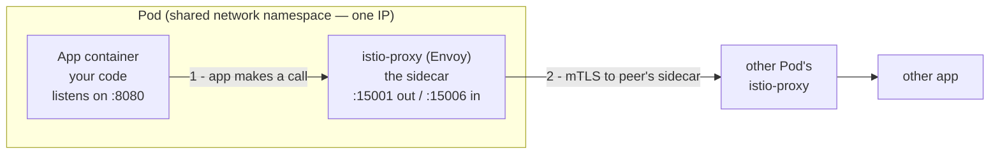
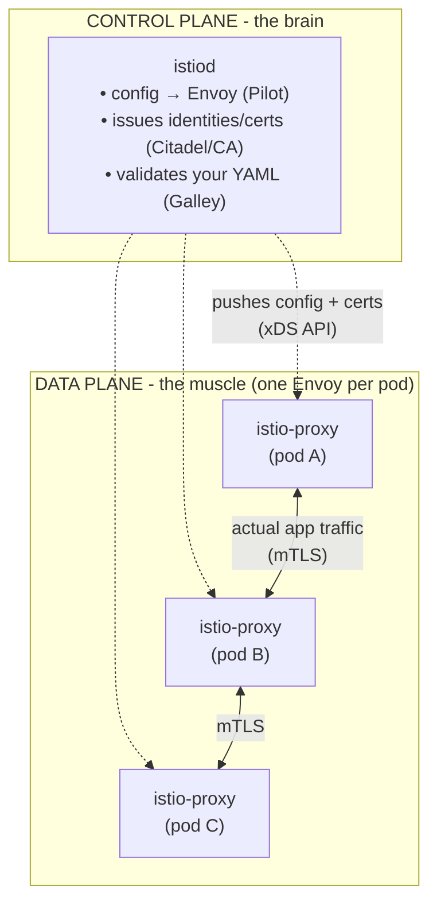
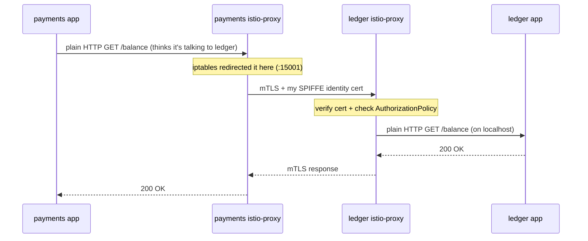
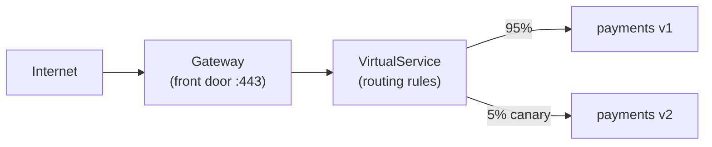
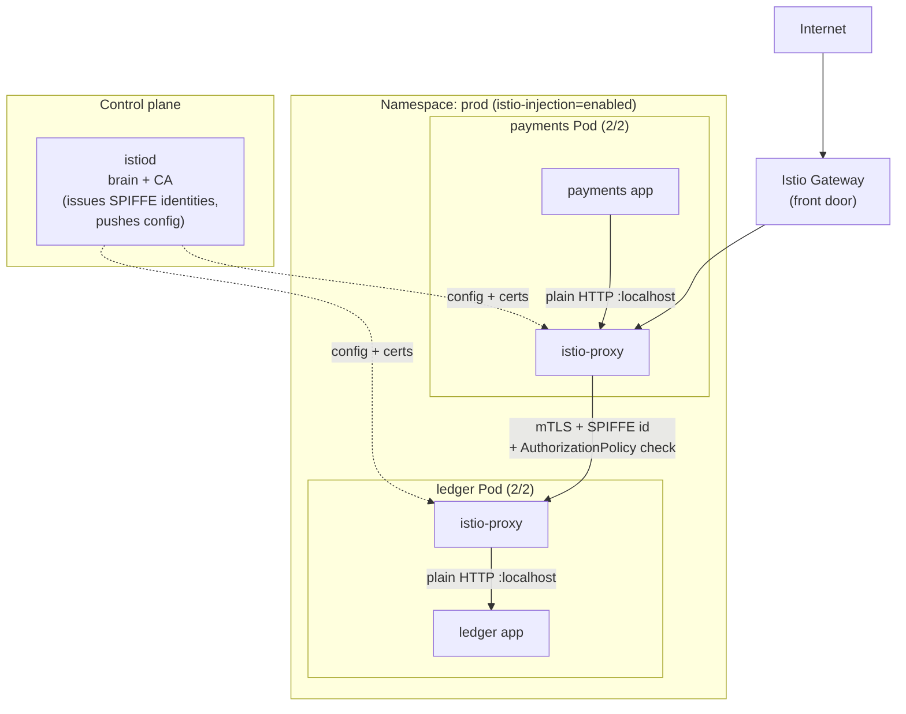

# Istio & the Service Mesh — the two-container pod, explained from scratch

> **Janus + Lefler note ⭐⚙️.** Farhaan asked: *"Give me a complete read on Istio and how it sits inside Kubernetes. I saw a pod with an application container **and** an `istio-proxy` container — tell me how all of this works."*
>
> That two-container pod is the whole story in miniature. This note derives **why the second container must exist** (first principles), shows **exactly what it does to your traffic**, and lands on the part that is *your job*: Istio turns every service into an **identity** and every call into an **authenticated, encrypted, authorised** transaction — a **Zero Trust** network for machines. That's IAM for workloads.
>
> **Prereqs:** [K8s reference](27-kubernetes-complete-reference.md), [Services & Ingress](31-kubernetes-services-and-ingress-deep-dive.md), [cloud-to-container hierarchy](32-cloud-to-container-hierarchy-and-reachability.md), and [TLS/mTLS](06-tls-https-mtls.md). **Level:** beginner-friendly → advanced. **Note on the name:** *Istio* (Greek for "sail") pairs with *Kubernetes* ("helmsman") — the helmsman steers, the sail moves the traffic.

---

## TL;DR (read this first)

- A **service mesh** is a layer that handles **service-to-service networking** — encryption, retries, routing, and access control — **without changing your app's code.** Istio is the most common one.
- It does this with the **sidecar pattern**: into every Pod, Istio injects a **second container — `istio-proxy` (an Envoy proxy)** — that **intercepts *all* traffic in and out of your app container.** Your app thinks it's talking plain HTTP to a peer; really it's talking to its own sidecar, which does the hard work.
- That's the pod you saw: **container 1 = your application; container 2 = `istio-proxy`**, the sidecar. They share the Pod's network, so the proxy can hijack the app's traffic transparently.
- Istio has **two planes**: the **data plane** (all those Envoy sidecars, moving the bytes) and the **control plane** (**`istiod`**, one brain that configures every sidecar).
- **The IAM crown jewel:** Istio gives every workload a cryptographic **identity** (a **SPIFFE** ID baked into an mTLS certificate), so services **prove who they are** to each other and you can write rules like *"only `payments` may call `ledger`."* That is **authentication + authorisation for machines** — squarely your domain at FinCo.
- **Cost:** more moving parts, added latency (~ms), and a new thing to secure. Newer **ambient mode** removes the per-pod sidecar to cut that cost (§12).

---

## 1. Why a service mesh must exist (first principles)

Start from the problem, not the product. You broke your monolith into **microservices** (K8s reference §1). Now `orders` calls `payments` calls `ledger` calls `fraud-check`. Dozens of services, thousands of calls per second, all over the network.

Every one of those calls needs the same boring, critical things:

| Need | Question it answers | Who used to handle it |
|---|---|---|
| **Encryption** | Is this call private on the wire? | Each app, with its own TLS code |
| **Identity** | *Who* is calling me — really? | Nobody, usually (trust the network 😬) |
| **Authorisation** | Is this caller *allowed* to call me? | Bespoke app code, if at all |
| **Retries / timeouts** | What if the callee is briefly down? | Each app's HTTP client |
| **Load balancing** | Which replica do I hit? | Client library / kube-proxy |
| **Observability** | How slow/error-prone is this call? | Hand-rolled logging per app |

**The naive fix — put it in every app — fails for three reasons:**

1. **Duplication.** You reimplement TLS, retries, and mTLS in Java *and* Go *and* Python *and* Node. Ten teams, ten subtly-different, subtly-broken versions.
2. **Drift.** A CVE drops in a TLS library. Now you must patch and redeploy **every service**, on their schedules. In fintech that's an audit nightmare.
3. **It's not the app's job.** Your `payments` team should write payment logic, not maintain a certificate-rotation loop.

**First-principles conclusion:** these concerns are **identical for every service** and **orthogonal to business logic.** The textbook move is to **factor the common thing out** — pull networking, security, and telemetry **out of the app** and into a shared layer that sits *beside* every service and handles it uniformly.

That shared layer is the **service mesh.** And the cleanest way to put it "beside every service" in Kubernetes is the **sidecar** — which is exactly the second container you saw.

> **The one-line why:** a mesh exists so that **encryption, identity, and access control between services become infrastructure you configure once — not code every team rewrites.**

---

## 2. The sidecar pattern — that second container

**Plain words first.** A **sidecar** is a helper container that rides along in the **same Pod** as your app — like a motorcycle sidecar bolted to the bike. Same Pod means they **share the same network namespace**: same IP, same `localhost`, same set of ports (K8s reference — Pods share a network identity).

That shared network is the trick. Because the sidecar shares your app's network, it can **stand in the middle of every connection** without your app knowing.



**What the sidecar (Envoy) actually is:** **Envoy** is a high-performance, programmable network proxy (a separate CNCF project Istio adopted). It's the muscle — it moves the bytes and enforces the rules. `istiod` is the brain that tells it what to do (§4).

**Why a whole second container and not a library?** Because a sidecar is **language-agnostic and independently upgradable.** Patch Envoy once → every service in the mesh is patched, no app redeploy, no code change. That directly kills the "drift" and "duplication" problems from §1.

> **This is the answer to your question.** The pod you saw wasn't broken or weird. Istio **injected** the `istio-proxy` sidecar next to your app. Container 1 runs your service; container 2 silently owns its network so it can encrypt, identify, and police every call.

---

## 3. How injection happens (why the container appeared)

You never wrote that second container into your YAML — so how did it get there? Two ways:

1. **Automatic injection (the normal way).** You label a namespace `istio-injection=enabled`. When a Pod is created, a Kubernetes **mutating admission webhook** (K8s reference §11 — admission controllers) intercepts the Pod *before* it's stored and **rewrites its spec** to add the `istio-proxy` container plus an `istio-init` setup container.
2. **Manual injection.** `istioctl kube-inject -f deploy.yaml` rewrites the YAML yourself, for when you don't want the webhook.

**See it for yourself** — the empirical check (Law 12):

```bash
# 1. Is the namespace meshed?
kubectl get namespace -L istio-injection
# EXPECTED: your namespace shows  istio-injection   enabled

# 2. How many containers are really in that "one app" pod?
kubectl get pod <pod> -o jsonpath='{.spec.containers[*].name}'
# EXPECTED:  my-app istio-proxy      <-- two names, the sidecar is the second

# 3. Prove nobody wrote it by hand — it was injected:
kubectl get pod <pod> -o yaml | grep -A2 "istio-proxy"
```

✅ **Checkpoint:** if you see `istio-proxy` in the container list but **not** in your source Deployment YAML, injection is working.

**Gotcha:** the pod shows `2/2` in `kubectl get pods` (2 containers ready) once meshed. If it's stuck at `1/2`, the sidecar isn't ready — a very common "why won't my pod start" mesh issue.

---

## 4. Istio's two planes — data plane vs control plane

Everything in Istio is one of two roles. Get this split and the whole product clicks.



- **Data plane = all the `istio-proxy` (Envoy) sidecars.** They carry **every byte** of real traffic and enforce policy at the point of the call. If the data plane is down, traffic stops.
- **Control plane = `istiod`, a single deployment.** It **never touches app traffic.** It (a) translates your high-level YAML into low-level Envoy config and pushes it to every sidecar over the **xDS** API, (b) runs the **Certificate Authority** that mints each workload's identity cert, and (c) validates your configuration.

> **Analogy:** `istiod` is **air-traffic control** (issues instructions and credentials, sees everything, flies nothing); the Envoy sidecars are the **pilots** (do the actual flying, follow the instructions).

**Historical note (you'll see the old names):** `istiod` merged what used to be separate components — **Pilot** (config), **Citadel** (certs/CA), **Galley** (validation). Modern Istio = one binary, `istiod`.

---

## 5. What actually happens to a request (the interception)

This is the part people find magical. How does the sidecar "intercept everything" when the app just opens a normal socket? **iptables**, set up once at pod start by the `istio-init` container.

**Outbound — app calls `http://ledger:8080`:**

1. Your app opens a plain connection to `ledger` — **no TLS, no mesh awareness.** As far as it knows, it's 2005 and the network is friendly.
2. `istio-init` earlier installed iptables rules in the pod that **redirect all outbound traffic to Envoy's port `15001`.** So the connection is silently rerouted to the *local* sidecar.
3. The local Envoy looks up where `ledger` really is, opens an **mTLS** connection to `ledger`'s sidecar, presents **this pod's identity certificate**, and forwards the request.
4. `ledger`'s inbound Envoy (port `15006`) verifies the caller's certificate, checks **authorisation policy** ("is `payments` allowed to call me?"), then hands the plain request to the `ledger` app on `localhost`.



**The profound part:** your application code sent **plain HTTP** and received **plain HTTP**. Between the two sidecars it was **mutually-authenticated, encrypted, and access-controlled** — and the app has **no idea.** Security became infrastructure. That's the entire value proposition in one round-trip.

**Reserved ports to recognise** (all on `istio-proxy`): `15001` outbound, `15006` inbound, `15021` health, `15090` Envoy metrics, `15000` Envoy admin. Seeing these in a pod = it's meshed.

---

## 6. mTLS & workload identity — your lane ⭐

This is where a service mesh **is** IAM. Everything above was plumbing to make *this* possible.

**Plain words first.** Normal TLS (HTTPS) proves the **server's** identity to the **client** — one-way. **Mutual TLS (mTLS)** makes **both sides** present certificates: the client proves who it is too. (Full mechanics: [TLS/mTLS note](06-tls-https-mtls.md).) In a mesh, **every** service-to-service call is mTLS. Nobody talks anonymously.

**Where does a service's identity come from?** Istio implements **SPIFFE** (Secure Production Identity Framework For Everyone) — an open standard for **giving workloads verifiable identities.** The identity is a URI baked into the certificate's SAN field:

```
spiffe://<trust-domain>/ns/<namespace>/sa/<service-account>
# e.g. spiffe://cluster.local/ns/prod/sa/payments
```

Read that: *"the workload running as **ServiceAccount `payments`** in **namespace `prod`**."* The identity is **tied to the Kubernetes ServiceAccount** — which is why K8s ServiceAccounts and RBAC (K8s reference §12) matter so much: they're the root of workload identity.

**How the cert gets there, and why it's safe:**

1. Each sidecar generates a private key **that never leaves the pod** and sends a CSR (certificate signing request) to `istiod`'s CA.
2. `istiod` verifies the pod's ServiceAccount token against the K8s API, then issues a short-lived SPIFFE cert (often ~24h, auto-rotated).
3. The sidecar uses that cert for every mTLS handshake. **Rotation is automatic** — no human touches a cert, no midnight "the cert expired and SSO/payments is down" incident.

> **Why you care (FinCo):** this is **non-human identity at scale** — the biggest identity story in modern infra and *exactly* your domain. Auditors ask "prove service A can't read service B's data." With SPIFFE + policy you *can* prove it, cryptographically, per call. Short-lived auto-rotated certs also satisfy the "no long-lived credentials" control that long-lived K8s Secrets or static keys fail.

**Two policy objects you'll write:**

- **`PeerAuthentication`** — *do I require mTLS?* Set it to `STRICT` in a namespace and the sidecars **refuse any plaintext** call. This is how you enforce "encrypted everywhere."
  ```yaml
  apiVersion: security.istio.io/v1
  kind: PeerAuthentication
  metadata: { name: default, namespace: prod }
  spec:
    mtls: { mode: STRICT }   # reject all non-mTLS traffic in prod
  ```
- **`AuthorizationPolicy`** — *who may call whom, on what path?* This is **RBAC/ABAC for service calls** ([IAM foundations §RBAC/ABAC](07-iam-foundations.md)):
  ```yaml
  apiVersion: security.istio.io/v1
  kind: AuthorizationPolicy
  metadata: { name: ledger-allow-payments, namespace: prod }
  spec:
    selector: { matchLabels: { app: ledger } }
    action: ALLOW
    rules:
    - from: [{ source: { principals: ["cluster.local/ns/prod/sa/payments"] } }]
      to:   [{ operation: { methods: ["GET"], paths: ["/balance"] } }]
  # Only the 'payments' identity may GET /balance on ledger. Everyone else: denied.
  ```

**Verify mTLS is really on** (empirical check):

```bash
# Ask a sidecar what auth its peers use:
istioctl x describe pod <ledger-pod>
# EXPECTED to include:  ... traffic is mTLS ...

# Or inspect the live cert chain a workload is using:
istioctl proxy-config secret <pod> -o json | \
  jq -r '.dynamicActiveSecrets[0].secret.tlsCertificate.certificateChain.inlineBytes' | \
  base64 -d | openssl x509 -noout -text | grep spiffe
# EXPECTED:  URI:spiffe://cluster.local/ns/prod/sa/ledger
```

✅ **Checkpoint:** you can read a service's SPIFFE identity straight out of its live certificate. That URI *is* the workload's IAM identity.

---

## 7. Traffic management — routing without redeploys

Beyond security, the same sidecars give you **programmable routing.** Three objects:

| Object | Plain-English job | Example |
|---|---|---|
| **`Gateway`** | The mesh's front door — how **outside** traffic gets **in** (or out) | "Accept HTTPS for `api.finco.com` on :443" |
| **`VirtualService`** | Routing rules — *which requests go where* | "Send 5% of traffic to v2 (canary); route `/admin` to the admin service" |
| **`DestinationRule`** | What to do **after** routing — pools, subsets, load-balancing, retries | "Define `v1`/`v2` subsets; use least-connection LB; retry 3×" |

**Why this matters:** a **canary release** ("send 1% of users to the new payments build, watch error rates, then ramp") is one `VirtualService` edit — **no code change, no redeploy.** For a fintech shipping to a regulated payments path, that controlled, reversible rollout is a real risk-reduction control, not a nicety.



> **Ingress vs Istio Gateway:** you already met the [Ingress controller](31-kubernetes-services-and-ingress-deep-dive.md). Istio's `Gateway` + `VirtualService` is Istio's richer take on the same edge job, and modern Istio also implements the standard **Kubernetes Gateway API**. Same idea — get outside traffic into the mesh — with mesh-grade routing and policy attached.

---

## 8. Request authentication — end-user JWTs (OAuth/OIDC meets the mesh) ⭐

§6 was **peer** authentication — *which service* is calling. Istio also does **request** authentication — *which end user* is behind the call, via **JWT** validation. This is where your [OAuth2/OIDC](03-oauth-oidc-deep-dive.md) knowledge plugs straight in.

- **`RequestAuthentication`** — "accept JWTs signed by this issuer (`jwksUri`)." The sidecar validates the token's signature and claims **at the edge of the service**, before your app sees it.
- Pair it with an **`AuthorizationPolicy`** that requires a valid principal or scope (e.g. `requestPrincipals: ["*"]`, or a specific `iss/sub`, or a scope claim).

```yaml
apiVersion: security.istio.io/v1
kind: RequestAuthentication
metadata: { name: jwt-on-api, namespace: prod }
spec:
  selector: { matchLabels: { app: api-gateway } }
  jwtRules:
  - issuer: "https://login.finco.com"
    jwksUri: "https://login.finco.com/.well-known/jwks.json"
```

> **Why you care:** the mesh can enforce *"valid OIDC token required"* **uniformly**, so ten teams don't each hand-roll (and mis-roll) JWT validation. That's the same "factor the security out of the app" principle from §1 — applied to **end-user** identity this time. Note the division of labour: **`PeerAuthentication` = machine identity (mTLS)**; **`RequestAuthentication` = human/end-user identity (JWT)**. Real systems use both at once.

---

## 9. Observability — the free side effect

Because **every** call passes through a sidecar, Istio sees all of it and emits, with no app changes:

- **Metrics** — request rate, error rate, latency (the "golden signals") per service pair → Prometheus/Grafana.
- **Distributed traces** — follow one request across ten services → Jaeger/Tempo (apps must forward trace headers to link spans).
- **A live service graph** — Kiali draws who-calls-whom in real time.

> **Blue-team tie-in (Law 9 setup):** that same total visibility is a **detection** goldmine. A sudden spike of `403`s from one sidecar = someone hitting authorisation denials = possible lateral-movement attempt. Hand this to **Heimdall** for SIEM alerting on Istio access logs.

---

## 10. Attacks & defenses — the mesh cuts both ways

A service mesh is a **security control**, but it's also **new attack surface.** Never teach the shiny part without this part (Law 9).

| Attack / risk | How it works | Detection & mitigation |
|---|---|---|
| **Sidecar bypass** | Attacker in a pod sends traffic straight to another pod's app port, dodging the proxy — or runs in a **non-meshed** namespace. | Enforce **`STRICT` mTLS** so destinations refuse non-mTLS; use **`NetworkPolicy`** (K8s ref §12) to allow pod ingress **only** from the sidecar; audit for un-injected namespaces. Mesh policy and NetworkPolicy are **layers**, not either/or. |
| **Over-broad `AuthorizationPolicy`** | An `ALLOW` with empty rules, or a stray `action: ALLOW` matching everything, silently opens a service. A missing policy may default-allow. | Prefer **default-deny** (an empty `ALLOW` policy on a workload denies all, then allow explicitly); review policies in code review; test with `istioctl x authz check`. |
| **Compromised `istiod` / CA** | The control plane **is** the CA — own it and you can mint **any** workload identity. | Lock down `istiod` RBAC hard, restrict who can create Istio CRDs, monitor cert issuance, consider an external/intermediate CA so the mesh CA isn't a root. |
| **Envoy CVEs** | Sidecars are internet-adjacent C++ proxies; a parsing bug = RCE in the data plane. | Keep Istio/Envoy patched — but note the **upside**: patch the sidecar **once** and the whole fleet is fixed, vs patching every app (§1). |
| **Exposed sidecar admin (`:15000`)** | Envoy's admin port can leak config, certs, and drain listeners if reachable. | It binds to `localhost` by default — keep it that way; never expose `15000` via a Service; alert if it's reachable. |
| **Policy that fails open** | Misconfigured JWT/authz that errors into "allow." | Test the **negative** path: confirm a bad token / wrong identity is **rejected**, not just that the happy path works. |

> **Governance angle (Tyr):** for **PCI-DSS**, a mesh is a strong story for **Req 4** (encrypt cardholder data in transit — mTLS everywhere) and **Req 1/7** (network segmentation + least-privilege service access via AuthorizationPolicy). But the mesh config itself becomes **in-scope** and auditable. Loop in **Tyr** when this touches the CDE (cardholder data environment).

---

## 11. When you do *not* need a mesh

Law-1 honesty: a mesh is not free. Skip it if:

- You have a **handful of services** — the operational cost outweighs the benefit; plain K8s Services + `NetworkPolicy` + app-level TLS may be enough.
- Your team can't own **another distributed system** (upgrades, debugging Envoy, cert issues). A half-run mesh is worse than none.
- You only need **one** feature (say, just ingress TLS) — use a smaller tool for it.

**Reach for a mesh when** you have many services, a **Zero Trust / "encrypt and authenticate everything"** mandate (common in fintech), or a compliance need to *prove* service-to-service controls. That last one is usually what tips a FinCo over the line.

---

## 12. Ambient mode — the sidecar-less future (2024+)

Everything above is **sidecar mode** — the classic model, and what your two-container pod is. Its costs: a proxy in every pod (memory × pod count), added latency, and pod restarts to upgrade sidecars.

**Ambient mode** is Istio's newer architecture that **removes the per-pod sidecar**:

- A **per-node `ztunnel`** ("zero-trust tunnel") handles **mTLS + identity (L4)** for all pods on that node — so you get encrypted, identity-based traffic with **no sidecar in your pod.**
- Optional **`waypoint` proxies** add the **L7** features (routing, `AuthorizationPolicy` on paths/methods) **only where you need them.**

> **Why it matters to you:** the **security guarantees are the same** — SPIFFE identity, mTLS, authorisation. The *packaging* changes to cut cost and remove the "restart every pod to upgrade" pain. If you see a mesh with **no `istio-proxy` container** but traffic is still mTLS, it's ambient mode. Sidecar mode isn't going away — know both.

---

## 13. Putting it together — the mental model



Read the whole picture: **`istiod`** gives every workload an **identity** and a **config**; the **sidecars** carry the traffic and enforce **encryption + identity + authorisation** on every hop; your **apps stay dumb** and just speak plain HTTP to `localhost`. Security, routing, and telemetry became **infrastructure you declare**, not code every team rewrites.

---

## What you learned

- A **service mesh** exists because encryption, identity, and access control between services are **identical for every service and orthogonal to business logic** — so you factor them out of the app (§1).
- The pod you saw has **two containers on purpose**: your app + the injected **`istio-proxy` (Envoy) sidecar**, which shares the pod's network and **intercepts all traffic via iptables** (§2, §3, §5).
- Istio splits into a **data plane** (the sidecars, moving bytes) and a **control plane** (**`istiod`**, the brain + CA) (§4).
- The IAM heart of it: every workload gets a **SPIFFE identity** in an auto-rotated mTLS cert tied to its **ServiceAccount**, and you write **`PeerAuthentication`** (require mTLS) and **`AuthorizationPolicy`** (who-may-call-whom) — **authentication and authorisation for machines** (§6). End-user **JWTs** are enforced with **`RequestAuthentication`** (§8).
- A mesh is also **new attack surface** — sidecar bypass, over-broad policies, a CA that mints any identity — each with a concrete defense (§10), and **ambient mode** is the sidecar-less evolution (§12).

## Next

- **See it live:** ask **Lefler** to spin up a `kind`/minikube cluster, install Istio demo profile, deploy Bookinfo, and *watch* an `AuthorizationPolicy` block a call — then run the §6 commands to read a live SPIFFE cert.
- **Deepen the identity angle:** revisit [TLS/mTLS](06-tls-https-mtls.md) for the handshake mechanics behind mesh mTLS, and [OAuth/OIDC](03-oauth-oidc-deep-dive.md) for the JWT side (§8).
- **Detection:** hand Istio access logs to **Heimdall** and build a "spike in 403s = possible lateral movement" alert.
- **Compliance:** work with **Tyr** on how mesh mTLS + AuthorizationPolicy map to **PCI-DSS** Req 1/4/7 when the mesh touches the CDE.

---

*Written to [Lefler's Laws](../../LEFLER-LAWS.md). Pairs with the [K8s reference](27-kubernetes-complete-reference.md), [Services & Ingress](31-kubernetes-services-and-ingress-deep-dive.md), and [cloud-to-container hierarchy](32-cloud-to-container-hierarchy-and-reachability.md).*
